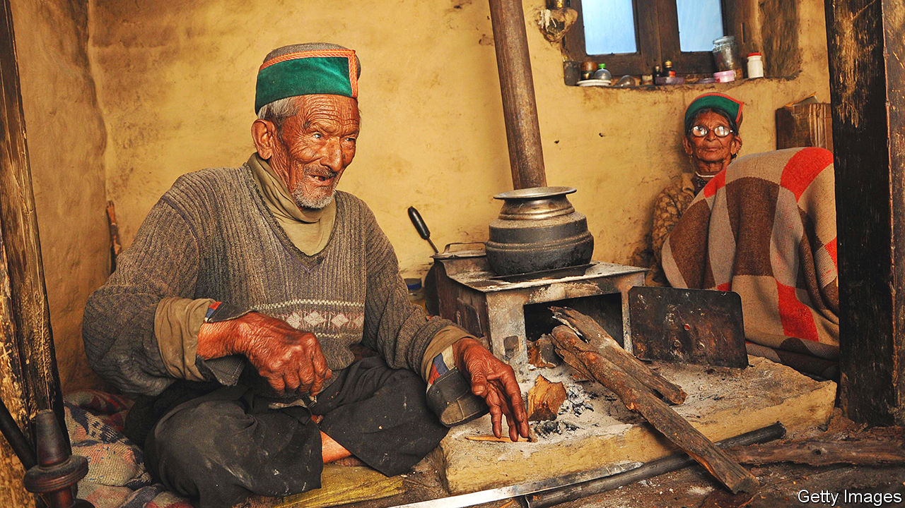

###### The joy of voting

# Shyam Saran Negi never failed in his democratic duty 

##### India’s first and most enthusiastic voter died on November 5th, aged 105 

 

> Nov 10th 2022 

As the video began, snow was falling. It fell on the orchards, the pine-nut forests and the huddled wooden houses of the village of Kalpa, high in the Himalayas. In one of those houses, an ancient man picked up his watch from beside his mala beads and boiled up a kettle on the stove for a glass of tea. He smiled as he sipped it. It was early morning on a very special day. 

 In front of the long mirror he put on his necessary layers: sweater, jerkin, heavy woollen coat. Carefully, he adjusted his woollen cap over his ears. Even in summer, in Kalpa, he had to wear much of this. The weather had shrunk and wizened him like an apple, but as he stepped out into the snow, staff in hand, his stride was firm. His destination was the polling station. 

 Through the narrow lanes, already drifted over, he made his way. He climbed steps slippery with ice, where he had to hang on to the wall. But as he reached the village square and saw the long queues already forming, his face lit up with happiness. People ran forward to greet him with , place a white scarf round his neck and propel him into the voting place. When he had dropped his ballot in the box and his index fingernail was painted with indigo, he triumphantly held it up for the camera to see. 

 The video was made in 2014, a general election year, for India’s #PledgeToVote campaign. It went viral, drawing three times as many views as one that featured a superstar actor, a glamorous model and a famous cricketer. The old man, Shyam Saran Negi, then 97 and quite forgotten, became a household name. For he was not only very old, but the first person who had ever cast a vote in independent India. And since then he had not missed a single election, whether for the Lok Sabha (the lower house of Parliament), the state legislative assembly or the district . People, he continually said, had a duty to exercise their franchise. The way to help India develop was to vote out the bad and vote in the best, and he would joyfully set the example. 

 He was not an especially educated man, and had barely left Kalpa in his life—staying there, he said, like a frog in a well, content with his work, a good marriage and nine children. It took him to the age of 20 to pass the 9th Standard exam, and the classes he taught for 23 years at Kalpa’s Lower Middle School were junior basic level. But he was well-informed, constantly listening to the news, alone in his room, holding his heavy transistor radio up close to his ear. Nor was Kalpa completely out of the way of the world; it lay close to the border with Tibet, and therefore in the shadow of China. After India’s humiliation in the war of 1962 the government built a proper border road, and encouraged commercial apple growing, to give the area a boost. He too could give it a boost, by promoting democracy. Back in his school after retirement he continued to instruct the children, crowding wonderingly round him in their bright-blue uniforms, on how to make their voices count. When India’s Election Commission needed a brand ambassador to get the young to vote, he was the natural choice. 

 A series of happy accidents had made him the first voter. The first general election after the end of the British Raj was set for February-March 1952, but in Himachal, which was under snow for half the year, the poll was advanced to the end of October. It was a busy preparation time, just before the Lavi fair in Rampur when mountain folk bartered their dried fruit, cognac, apples and woollen goods for winter stocks of ghee and grains. That year the celebratory spirit also spread to voting.

 Mr Negi was ready. He had no love for the British Raj and its bullying henchmen. When he was drafted in to conduct the electoral process, as he carefully put it, he went eagerly, though it meant taking the ballot boxes by mule to other villages in the mountains, Moorang, Purvani, Nesong, which took him and his team ten days. His only worry was that he needed to vote in Kalpa before he set out; so he asked for permission to do so as early as possible, at 6.30am, half an hour before the official opening time. This was his, and India’s, new dawn. His thrill at his fresh-inked finger was so intense that he spent the next month, well beyond the call of duty, encouraging people round the region to do as he had done. That pride never left him for the rest of his life. 

Once he was famous, every political party hoped to claim him. They had little luck. In 1951 he had voted for Jawaharlal Nehru and Congress, who won in a landslide. He maintained that Lal Bahadur Shastri, who briefly became prime minister in the mid-1960s, was his ideal leader, because he had improved food production. When Congress sank into scandals and failed to eradicate poverty he began to lean towards the BJP, but complained loudly in 2019 when his name and photo were used without permission in their local publicity. He had a good pension of 15,000 rupees a year (as a teacher, he had earned a mere 700 a month), but that did not lead him to favour the government of the day. He did not belong to any side. Too many politicians wasted the precious time of Parliament by creating a ruckus rather than having serious debates. They should serve the public interest by rooting out corruption, holding down prices and, especially, educating girls. His Himachali cap-band was neither all green, for Congress, nor all maroon, for the BJP. He wore it as he liked it and as the local fashion was. 

 After he reached 100 in 2017, his every appearance at the polling station was a festival. Red carpet was laid down, goatskin drums beat out a dance and trumpets sounded; he was decked with scarves, garlands and caps adorned with flowers. This was as he felt voting should be, a religious rite, with the polling station the temple and the ballot box the shrine. 

 Election officials gently suggested this year that, being 105 and part-blind, with his legs immobile and his knees aching, he might prefer to cast his 34th vote, for the assembly, at home. He was given a 12D form for postal voting, but sent it back; he would go to the polling station, as he had always done. In the end, he was too ill on November 2nd to make that journey. But he did not neglect his duty; the ballot box, instead, was brought to him. ■

