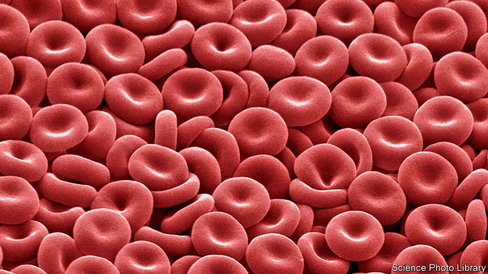

###### Growing transfusable blood cells

# Blood cells made in a lab have been infused into people 

##### The result will be a boon for patients with rare blood types 

 

> Nov 9th 2022 

Until the 1940s, blood transfusions often went wrong because some of the main blood-group systems, such as the Rhesus factor, had yet to be discovered. This hit or miss approach to matching donors with recipients is now a thing of the past, as tests for all sorts of characteristics of an individual’s blood have become available. But finding a well-matched donor can still be difficult. Some patients have blood types so rare that there may be but a handful of appropriate donors in the country where they live.

On November 7th a consortium of researchers at several British institutions, co-ordinated by NHS Blood and Transplant, a government health authority, and Bristol University, announced a step towards solving this problem. They have successfully transfused into two healthy volunteers red blood cells grown from appropriate stem cells donated by others. 

Until now, such manufactured red cells had been given only to those whose own stem cells had been the source. The stem cells used for this experiment, however, were extracted from blood donated in the normal way. The researchers mixed into this donated blood magnetic beads armed with proteins that stick specifically to the stem cells in question, binding them to the bead. The beads, replete with their cellular cargo, are then easily collected.

That done, the harvested stem cells were grown and multiplied in a nutrient solution for between 18 and 21 days, which served to turn them into young versions of red blood cells known as reticulocytes. Once transfused, reticulocytes quickly develop into the real McCoy. This approach would increase the value of batches of rare blood—which could, once plundered of stem cells, also be used in the normal way. Moreover, being newly minted, lab-made red blood cells would be expected to last longer in a recipient’s body than those from a normal transfusion, since transfused blood inevitably contains a fair proportion of cells that are on their last legs. 

The next step is to measure just how long the manufactured cells actually do last. To that end, they have been tagged with a special radioactive dye commonly used in medicine to track things around the body. If they do indeed outlive conventionally transfused cells, as the researchers hope and preclinical studies suggest they will, then recipients will not need such frequent transfusions. 

That will help a lot. At the moment, patients with blood disorders such as sickle-cell disease and thalassaemia may require a transfusion as often as every four to six weeks. As a consequence, some develop iron overload, which causes severe complications. Others end up forming antibodies against many blood types, which makes finding a matching donor harder. 

If all goes well, the trial will be extended to include at least ten healthy volunteers. But that is only the beginning. Larger tests, including tests on actual patients, will be needed before this approach can be put into practice. That will take time, for it normally requires between five and 15 years to introduce a new medical treatment. 

Even then, the technique will probably be reserved for a favoured few—those possessing extremely rare blood types being at the head of the queue. Unless some unforeseen breakthrough occurs, making the cells in quantity will be challenging. 

At the moment, harvested stem cells eventually exhaust themselves, so the number of red cells a donation can yield is limited. And manufacturing is a cottage industry. Producing a batch of reticulocytes requires 24 litres of nutrient solution to generate a tablespoon or two of product. The cost of scaling this up is unknown, but will probably be far more than the £145 ($166) that a normal blood donation currently costs in Britain. It may eventually be possible to make the stuff in bulk. But for now, human blood donors will continue to be extremely welcome. ■


