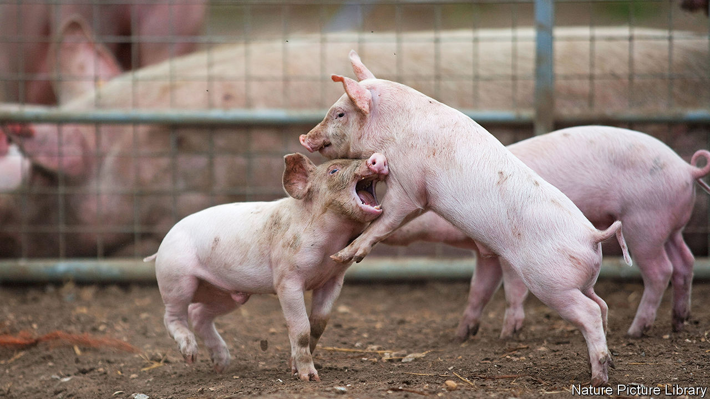

###### Brawling pigs

# How pigs reconcile after fighting confirms their intelligence 

##### Bystanders offer consolation to losers 

 

> Nov 9th 2022 

“I like pigs,” Winston Churchill supposedly once said. “Dogs look up at us, cats look down on us, but pigs treat us as equals.” Whether Churchill’s contemporary George Orwell also liked pigs is less clear. But he, too, surely saw something in them that was lacking in other domestic beasts, for it was they who ended up running the show in his allegorical novel, “Animal Farm”. Pigs, then, are intelligent social creatures. 

And, like all animals, they sometimes fight. A study just published in  by Ivan Norscia, a biological anthropologist at the University of Turin, in Italy, and his colleagues, looked at how a group of 104 domestic pigs went about resolving such incidents. In total, Dr Norscia and his team studied the details of 216 porcine conflicts over the course of six months. 

Some pigs tend to be aggressors; others tend to be victims. Who is what depends largely on weight, for, among pigs (as, indeed, among many animals), pounds mean power. The aggressor might bite, kick, bump or lift the victim (or string together a sequence of those actions). Most conflicts ended in seconds, but some lasted a minute or two. 

In most animal species that would be that. However, many of the porcine conflicts Dr Norscia observed had interested parties beyond the protagonists. He therefore wanted to understand the role of these bystanders in resolving fights—and what this says about pigs’ cognitive abilities. 

Since there was usually not enough time for a bystander pig to intervene during the heat of a conflict (though this did occur), he and his colleagues looked at what happened in the three minutes directly following an aggressive interaction. Sometimes, they found, the protagonists made up on their own—for instance, by touching noses. The more distantly related the combatants were, the more frequently this happened. Dr Norscia speculates that relations between close relatives are more secure to start with, so rapid and explicit reconciliation is less necessary for them than for those who are not close kin. 

On other occasions, though, a third pig stepped in. Sometimes this bystander acted as a peacemaker, engaging with the aggressor and reducing the number of subsequent attacks compared with what might otherwise have been expected. Sometimes, by contrast, the bystander engaged with the victim. This appeared to calm the victim down, for it reduced anxiety-related behaviour such as shaking and scratching. 

Welcome to the club

Offering such consolation to the downtrodden adds pigs to a small and exclusive club. Some primates, including human beings, do it. So do certain canids and crows. And elephants, cetaceans, parrots and some rodents are suspected of it, though so far the evidence concerning them is anecdotal. This list is familiar to zoologists as comprising groups of species known to have developed, independently of one another, high levels of intelligence, both individual and social. 

Social intelligence need not, though, be entirely altruistic. Pigs were more likely to intervene after a conflict if they were closely related to either the aggressor or the victim. This is probably an example of kin selection, which favours the evolution of behaviour that assists the collateral passage of an individual’s genes alongside the more normal route of direct descent.

People engage in kin-selected behaviour all the time, of course. It is known as nepotism. Which also helps to explain the number of people with the surname “Churchill” who have sat in Britain’s Parliament. It takes one to know one. ■


