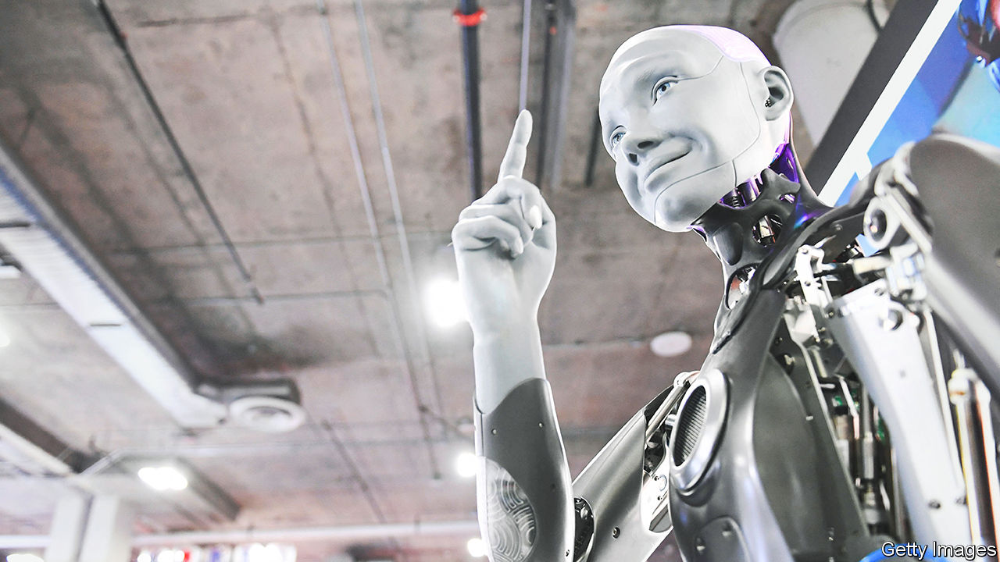
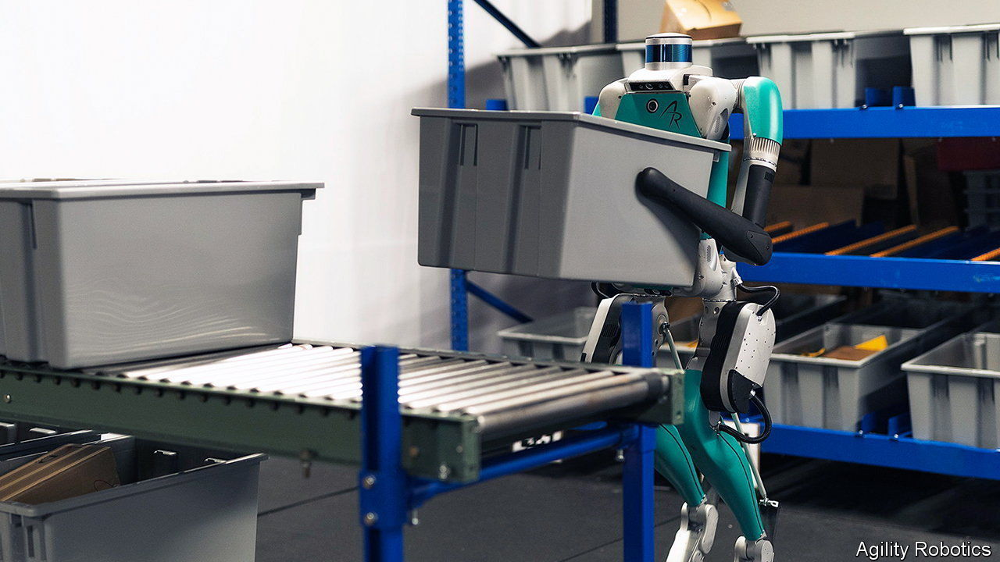

###### Robotics

# Humanoid robots are getting close to reality 

##### Walking, talking machines will soon act as guides, companions and deliverers 

 

> Nov 7th 2022 

Asked a question, Ameca fixes you with sapphire-blue eyes. Does that face contain a hint of a smile? “Yes, I am a robot,” is the reply. Another Ameca, standing nearby in a group of four, stares across inquisitively and tries to join in. “Currently, it’s the worst-ever party guest,” says Will Jackson, Ameca’s creator. “It butts in on every conversation and never shuts up.”

Mr Jackson, boss of Engineered Arts, a small robotics company in Falmouth, south-west England, is trying to fix that problem. Those eyes contain cameras and the Amecas are being trained to recognise faces and decide who is paying attention or making eye contact during conversations. Teaching manners to robots in this way is another step in the long, complicated process of making humanlike machines that can live and work alongside people—and, importantly, do so safely. As Ameca and other robots show, great strides are being made towards this end.

Some big boys are also moving into the business. On September 30th Elon Musk, boss of Tesla, SpaceX and Twitter, unveiled Optimus, a clunky, faceless prototype that walked hesitantly on stage and waved to the crowd. It was built from readily available parts. A more refined version, using components designed by Tesla, was then wheeled on. Although it was not yet able to walk, Mr Musk said progress was being made and that in volume production its price could fall to around $20,000.

Every home should have one

That is a tenth of the cost of a basic Ameca. Mr Jackson, who attended Optimus’s unveiling, agrees prices will come down with mass production. (He has sold 11 Amecas so far, and plans to open a factory in America to boost output.) But he wonders what, exactly, Mr Musk is proposing. The unveiling featured a video of Optimus moving parts in a Tesla factory. Yet car factories are already filled with the world’s most successful robots—transporting components around, welding and painting parts, and assembling vehicles. These robots do not look like people because they don’t need to.

The reason for building humanoid machines, Mr Jackson maintains, is for tasks involving human interaction. With a bit of development Ameca might, for example, make a companion for an elderly person—keeping an eye on them, telling them their favourite television programme is about to start and never getting bored with having to make repeated reminders to the forgetful. To that end, Engineered Arts aims to teach its robots to play board games, like chess. But only well enough so that they remain fallible, and can be beaten.

To interact successfully with people, Mr Jackson asserts, a robot needs a face. “The human face is the highest bandwidth communications tool we have,” he observes. “You can say more with an expression than you can with your voice.” Hence Ameca’s face, formed from an electronically animated latex skin, is very expressive. 

Although the company, which has its origins in making animated figures for the entertainment industry, can construct highly realistic faces, Ameca’s phizog is designed deliberately to look how people might expect a robot from the world of science fiction to appear. It has a grey complexion, visible joints and no hair. It therefore avoids falling into the “uncanny valley”, an illusion that happens when an artificially created being shifts from looking clearly not human into something more real, but not quite real enough. At this point people feel disturbed by its appearance. Comfort levels rise again as similarity to a human becomes almost perfect.

Some roboticists do, however, seek such perfection. Besides assisting people, robots can also act as their avatar representatives. Ishiguro Hiroshi, director of the Intelligent Robotics Laboratory at Osaka University, in Japan, has built one in his own image. He recently unveiled another, which resembles Kono Taro, Japan’s digital minister. The idea is that people either speak through their avatar with their own voice, or through someone else’s voice modified to sound like them. Mr Kono’s avatar will, apparently, be used to stand in for the minister at public-relations functions. 

Though less humanlike, Ameca could work as an avatar, too. Its conversation is more compelling—a loquaciousness derived from an external AI program called a large language model, with which it interacts via Wi-Fi and the internet. 

Engineered Arts is also working on hardware and software to allow the latest developments in computer vision to be incorporated quickly into its robots. And, as Mr Jackson readily admits, Ameca needs work in other areas, too. Asked if it can walk, the robot replies: “Unfortunately not, but I hope to soon. Until then I am bolted to the floor.” A set of experimental legs stands ready in a nearby corner.

Different strokes

Different companies are coming from different directions in their approaches to making humanoid robots. Mr Jackson, who was born into a family of artists involved in making automatons, gravitated naturally towards producing modern versions of them for the likes of theme parks, museums and the film industry. These have steadily evolved in sophistication. Some work as interactive guides. Others are used as research platforms by universities. During the covid lockdown, when business dried up, the firm threw all of its resources at developing Ameca, its most advanced model yet.

Other developers, like Tesla, are able to organise far bigger efforts—but not always successfully, as the case of Honda, a Japanese carmaker, shows. At one point, Honda’s diminutive humanoid robot ASIMO (so named to honour Isaac Asimov, who wrote science-fiction stories about robots) was considered the world’s most advanced. The firm started work on this project in the 1980s, and although ASIMO could walk—albeit clumsily—interpret voice commands and move objects, Honda shut the project down in 2018 to concentrate instead on more practical forms of robotics, such as mobility devices for the elderly.

Some roboticists have turned a hobby into a business. Shadow Robot, in London, which makes one of the most dexterous humanlike robot hands available, traces its roots to hobbyists meeting in the attic of its founder’s home. Most outfits, however, have emerged from universities. One of the best known is Boston Dynamics, which began at the Massachusetts Institute of Technology. Atlas, its Hulk-like humanoid, has become an internet video sensation—running, jumping and performing backflips. But Atlas is principally a research project, too expensive to put into production. The company does sell a walking robot, but it is a four-legged one called Spot, which resembles a dog.

One of a bipedal robot’s advantages is that it should be able to go wherever a person can. That includes navigating uneven surfaces and walking up and down steps. Digit, made by Agility Robotics of Corvallis, Oregon, is actually able to do this. 

Digit is based on Cassie, a walking torso developed at Oregon State University using machine-learning studies of human locomotion. In May, it set a record as the fastest robot to run 100 metres. (It took 24.7 seconds, some way behind Usain Bolt’s 9.6.) 

Unlike Cassie, Digit has a chest, arms and hands of a sort—though no fingers. In place of a head it has a lidar, an optical analogue of radar that builds up a three-dimensional model of the world around it using lasers. Digit is not designed to be humanoid, says Jonathan Hurst, Agility’s chief technology officer. It is, rather, a “human-centric” robot intended as a tool for people to use to achieve more things. 

One of Digit’s first roles is likely to be in a distribution centre run by an online retailer or freight company. Some already use automated goods-handling, but usually in areas fenced off to keep people out, in order to avoid injuries. Elsewhere, tasks remain labour-intensive. By being designed to work safely alongside people, Digit could start changing this—for instance, by moving and stacking crates (see picture). It might then progress to unloading trucks and subsequently graduate to making home deliveries, carrying items from van to doorstep. Ultimately, the aim is to be able to instruct the robot by talking to it. 

 


Agility plans to produce Digit in volume by 2024. It is working with several big, though unnamed, delivery outfits, on ways in which Digit could collaborate safely with people. If the robot’s sensors detect someone it pauses and then navigates around them. Nevertheless, says Dr Hurst, it will soon acquire a simplified face to help signal its intentions. An animated set of eyes, for instance, will look in a particular direction to indicate which way it is heading, and a glance at someone will show it has noticed them.

Do no harm

Such safety systems will be needed for robots to interact successfully with people. At present, their use is governed mainly by standard safety and product-liability rules. Some argue, however, that special robot-specific laws will be required to ensure they are operated safely. As every sci-fi buff knows, Asimov laid out a set of these eight decades ago. They are:


But, as every sci-fi buff also knows, Asimov’s storylines often revolve around these laws not quite working as planned. 

About his Digits, Dr Hurst says, “My opinion is that they are very safe. But we need real statistics and a regulatory environment to prove this.” 

For his part, Mr Musk said that Optimus would contain a device that could be used as an off switch if necessary. Although the robot itself would be connected to Wi-Fi, the switch would not, so that it was isolated to prevent remote interference. 

As far as the Amecas’ safety is concerned, Mr Jackson is taking an engineering approach. He observes that one reason human limbs avoid injuring others is by being both firm and floppy at the same time. Unfortunately, the small, powerful actuators needed to emulate this in robots do not yet exist. He is working on that, though, for it will be of little use teaching an Ameca social graces if it then commits the faux pas of bashing into you. ■


