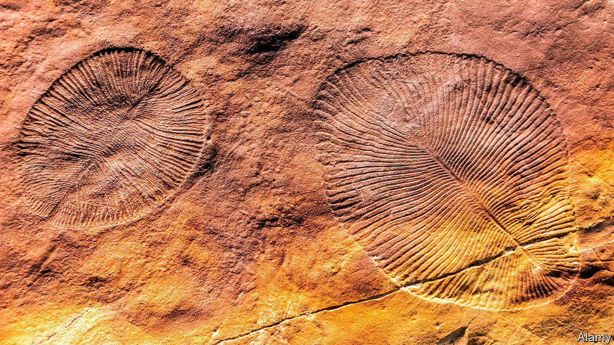

###### Palaeontology

# The oldest known mass extinction 

##### Even before the Cambrian period, biology’s “reset” button was being pushed 

 

> Nov 9th 2022 

Mass extinction is, as it were, a way of life. Earth’s history has seen several. The most famous, 66m years ago at the end of the Cretaceous period, did for most of the dinosaurs (only a few of the feathered variety, now referred to as “birds”, slipped through). The worst was 252m years ago between the Permian and Triassic periods, when 80% of marine species, as well as a lot of terrestrial ones, snuffed it. 

But the oldest? Research just published in the  by Scott Evans, of Virginia Tech, and Mary Droser, of the University of California, Riverside, suggests it happened 550m years ago—a particularly intriguing conclusion because that was during a geological period, the Ediacaran, which predates the explosive diversification of animal life that got under way 539m years ago at the beginning of the Cambrian period.

The Ediacaran itself started 635m years ago. Though a goodly number of animals have now been identified as dating from it, many bore scant resemblance to those which followed and, in particular, precious few had easily preserved hard parts in the form of shells, teeth or bones. This lack caused them to be overlooked by early palaeontologists—and even now means they are known only from sites which had ideal preservation conditions at the time.

The latter part of the Ediacaran, the portion of that period from which most of its fossils derive, is itself divided into three: the Avalon (575m-560m years ago), the White Sea (560m-550m years) and the Nama (550m-539m). Each of these, collections suggest, has a distinctive mix of fossils. Collections also suggest that the Nama fauna is considerably less complex than the White Sea’s. Why this is so has been a matter of debate. Some argue that it reflects a real diminution of diversity. Others suspect a bias introduced by chance differences in the original latitudes and environments of the sites which have been collected from, and the mechanisms by which the fossils there were preserved. Dr Evans and Dr Droser therefore decided to try, once and for all, to tease out the details. 

They first compiled a database that included every known Ediacaran animal species, together with information such as the size of its body, the way it fed and its likely habits—and also each place from which it has been recorded, the nature of the sediment in which it was buried there, that burial site’s latitude at its time of formation, and so on. They ultimately accumulated 307 entries for particular combinations of taxon and site.

With the ability thus acquired to compare sites of different ages but from the same palaeolatitude, the same ancient environment and with the same preservation mechanisms at work, the two researchers and their collaborators were able to demonstrate that the three faunal mixtures are indeed different—with the change between the White Sea and the Nama being much bigger than that between the Avalon and the White Sea.

To avoid arguments that depended on whether particular specimens were of the same species, or merely of related species, they concentrated their analysis on differences at the taxonomic level of the genus (one step up from the species in Linnaeus ’s classification system). Of the 70 animal genera identified at White Sea sites, only 14 made it through to the Nama. In other words, roughly 80% of genera died out in the transition between the two—a mass extinction of Permo-Triassic proportions.

Precisely why this happened is not clear. The database shows that no particular habits or modes of feeding were spared. Post-Cambrian mass extinctions have been attributed, variously, to asteroid impacts, colossal volcanic eruptions, big changes in sea level or even, in one case, a nearby stellar explosion. Dr Evans and Dr Droser speculate that the Ediacaran event may have been caused by a reduction in oceanic oxygen levels, for the 14 genera which survived it had bodies with large surface areas (see picture), which would have helped them absorb oxygen if it was scarce. There is, indeed, some evidence in the rocks for such a fluctuation. Why oxygen levels might have plummeted like that, though, remains a mystery. ■


