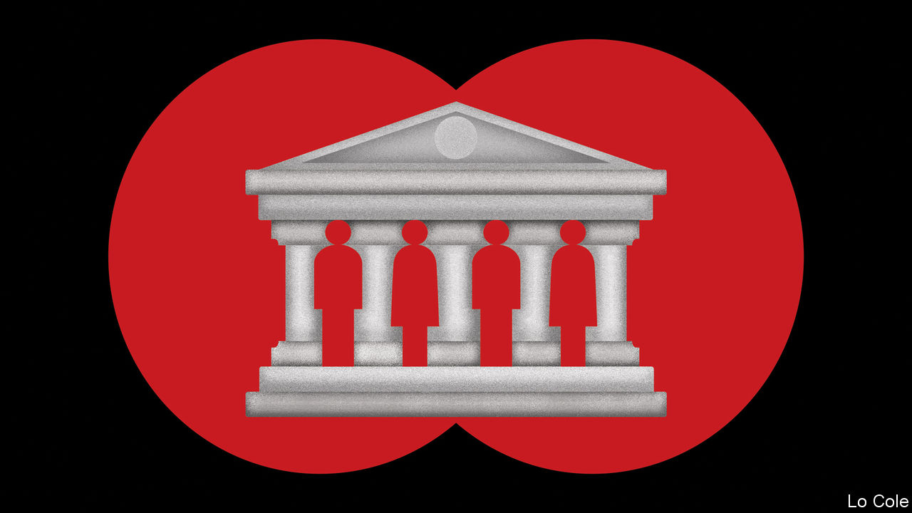

###### Bello

# The race to be Latin America’s next top development banker 

##### Several competent candidates jostle to succeed a sacked Trumpist 

 

> Nov 10th 2022 

When in 2020 the administration of Donald Trump engineered the election of Mauricio Claver-Carone, an official at the National Security Council (NSC), as president of the Inter-American Development Bank (IDB) it broke a gentlemen’s agreement dating back to the bank’s founding in 1959. This held that the top job should go to a Latin American while the United States, the largest shareholder with 30% of the capital, would have the number-two slot and informal vetoes. Mr Claver-Carone vowed to shake up what he claimed was a fossilised institution. Yet his appointment always looked like an accident waiting to happen, especially after Joe Biden won the White House. So it proved.

Born and brought up in Florida, he had little knowledge of Latin America. At the NSC he had repeatedly pushed for the United States to invade Venezuela to topple Nicolás Maduro’s dictatorship, against cooler heads at the Pentagon. At the IDB he alienated the biggest Latin American shareholders by appointing little-known people from small countries to the top jobs. He stressed helping the private sector and trying to block China. He often sounded like a simplistic cheerleader for the United States. 

He was the agent of his own downfall: the IDB’s executive directors voted unanimously to sack him in September, after an investigation found that he had violated the bank’s code of ethics by having an affair with his chief of staff, whose salary he had increased. (He denied the affair; the investigators said he failed to co-operate with them.)

He won the post partly because Jair Bolsonaro’s government in Brazil was an ally of Mr Trump’s, but also because Latin American governments failed to unite behind a plausible alternative. Granted an early opportunity to make amends, this time the region has floated several well-qualified contenders before nominations close on November 11th. Whoever wins faces two big tasks. The first is to pep up the bank’s staff, demoralised under Mr Claver-Carone. The second is to secure shareholder agreement for an overdue increase in the bank’s capital, to enable it to expand its lending.

Many governments said they favoured a woman. Mexico’s president, Andrés Manuel López Obrador, proposed Alicia Bárcena, who ran the UN Economic Commission for Latin America from 2008 until April. In that post she favoured the failed industrial policy of left-wing governments such as that of Rafael Correa in Ecuador, and praised the dictatorships of Cuba and Venezuela. Her candidacy stalled and on November 9th she withdrew. Mexico instead proposed Gerardo Esquivel, the deputy governor of the Central Bank. 

Laura Chinchilla, a former president of Costa Rica, is widely respected except, it seems, by Rodrigo Chaves, the current occupant of that job, who refused to nominate her. Mr Bolsonaro’s government has proposed Ilan Goldfajn, a former head of Brazil’s Central Bank who is currently the IMF’s top official for Latin America. But Luiz Inácio Lula da Silva takes over on January 1st from Mr Bolsonaro. According to a well-placed source, Lula’s people do not oppose Mr Goldfajn. But it is not clear how hard they will lobby for him.

That may favour Chile’s candidate, Nicolás Eyzaguirre, a former finance and education minister who once held Mr Goldfajn’s job at the IMF. He has the advantage of having worked for centre-left governments in his country in a region that currently tilts in that direction. Another potential nominee is Augusto de la Torre, a former boss of Ecuador’s Central Bank and World Bank economist. Argentina is keen to bag the job. It may propose Sergio Massa, who became economy minister in August. A conservative Peronist, he has good connections in Washington. Against him is that Argentina is likely to be a big supplicant for IDB money. He is not easy to replace in his current post. But Bello’s sources say he wants to run.

Mr Claver-Carone was right that the IDB suffers from a degree of cronyism and feather-bedding. But it is still important for Latin America. Its annual lending of around $14bn is almost matched by that of CAF, another development bank. But the IDB can be swift and flexible in its loans, which matters as financing conditions for governments tighten. And it has much expertise in advising governments on projects and policies, such as reforms of tax and spending. Calm, competent and politically astute leadership at one of Latin America’s key institutions would help the region at a difficult juncture. This time there is a good chance of getting that.


