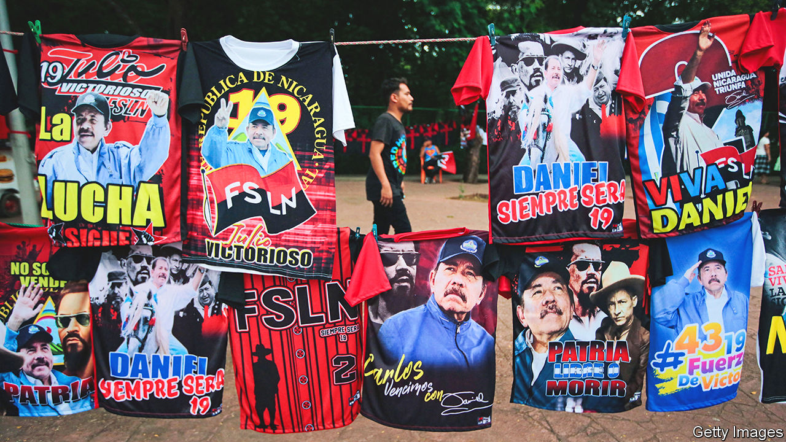

###### Ortega family values

# Under Daniel Ortega, Nicaragua has become a one-party state 

##### In sham elections on November 6th the ruling party won 153 out of 153 municipalities 

 

> Nov 10th 2022 

They were to be a “civic fiesta”, said Brenda Rocha, the boss of Nicaragua’s electoral council. Instead, Nicaragua’s municipal elections on November 6th were a farce. The ruling party, the Sandinista National Liberation Front, took control of all 153 municipalities, after capturing the remaining 12 that were run by other parties. Nicaragua is now, in effect, a one-party state. Some would say one-family.

The election tops off years of creeping authoritarianism in the country, which is run by President Daniel Ortega, a former Marxist guerrilla, and Rosario Murillo, his wife and vice-president. Mr Ortega became president in 1979, after taking part in a revolution against the last of the Somozas, a kleptocratic dynasty with American backing which had ruled for 43 years. Mr Ortega lost an election in 1990 and stepped down. Since coming back to power in 2007, he has vowed not to lose it again. 

On returning to office he cosied up to businessmen and won over the Roman Catholic church with one of the world’s strictest abortion bans. Between 2008 and 2015 Nicaragua bought $4.5bn of Venezuelan oil at discounted prices. The proceeds from selling it were funnelled into banks owned by the ruling party and lavished on Mr Ortega’s supporters. The economy grew on average by 5% a year between 2010 and 2017. The share of people living on less than $3.20 per day fell from 27% in 2005 to 10% by 2017. With potential critics silenced or bought off, Mr Ortega took over all branches of the state. The Supreme Court (widely considered to be controlled by Mr Ortega) abolished term limits and expelled the leader of the opposition and 16 of his supporters from Congress.

More recently the regime has become bloodier and more brazen. When students and pensioners peacefully protested against the government in 2018, police and Sandinista goons killed over 350 people. Before a general election last year, in which Mr Ortega won a fourth consecutive term, all seven opposition presidential candidates were locked up. Some 219 students, journalists and human-rights defenders are behind bars. Many are in El Chipote, a torture prison in Managua, the capital. A former revolutionary commander turned critic died in February after being denied medical help. Many prisoners are in solitary confinement. Some have been starved. 

Mr Ortega and Ms Murillo have even gone after the Catholic church. In the past six months the government has locked up 11 priests who denounced human-rights abuses. One bishop was put under house arrest after Ms Murillo claimed he had committed “crimes against spirituality”.

At least 2,000 NGOs and 50 independent media outlets have been shut down recently. In the week of the municipal elections 31 people were arrested, according to Urnas Abiertas, a civil-society group. It also reckons that over 80% of Nicaraguans did not bother to vote. Instead, they are voting with their feet. In a recent survey by CID-Gallup more than half of Nicaraguans said they wanted to emigrate. Remittances account for 15% of gdp.

The state now looks like a family business. Of the ruling couple’s nine children, eight have posts in government or help run public companies. The only stepdaughter who does not have a plum government job is in exile because she alleges Mr Ortega sexually abused her when she was a child (he denies this). According to , a Nicaraguan newspaper, the family are connected to at least 22 businesses, including oil firms and property companies. The last time the first couple reported their wealth was 20 years ago, when they claimed to have a modest $300,000. 

So far Mr Ortega has appeared impervious to pressure. The United States and the European Union have sanctioned several members of the ruling family as well as dozens of their cronies, including Ms Rocha. In October Joe Biden’s administration announced new sanctions on the gold industry, which exported almost $1bn-worth of the metal last year. Meanwhile the regime can no longer rely so heavily on fellow autocrats who once supported it. Venezuela and Cuba are cash-strapped. Gustavo Petro, Colombia’s new leftist president, was rumoured to be hoping to mediate, but nothing seems to have come of it. The dictatorial couple are “perfectly content to be as isolated as North Korea in order to maintain their rule,” says Benjamin Gedan of the Wilson Centre, an American think-tank. 

There is talk of freezing Nicaragua out of the Central American Free Trade Agreement with the United States. Inexplicably, the Central American Bank for Economic Integration, based in Honduras, has lent more than $1bn to Nicaragua since 2018. Cindy Regidor, a Nicaraguan journalist in Costa Rica, hopes that the recent win in Brazil by Luiz Inácio Lula da Silva, a former president, will lead to a coalition of democratic leftists, together with Mr Petro in Colombia and Gabriel Boric in Chile, that could try to mediate with the regime.

But the Ortegas may bring about their own downfall. Nicaraguans resent Ms Murillo’s ostentatious wasting of their hard-earned cash (for example, on garish electric trees in Managua’s main street.) “[She] is not someone the military takes seriously—the weak link will be in the transition from Ortega to his wife,” says Ryan Berg of the Centre for Strategic and International Studies, a think-tank. The Ortegas have forgotten a lesson from their own revolution. Despotic dynasties don’t last for ever. ■

