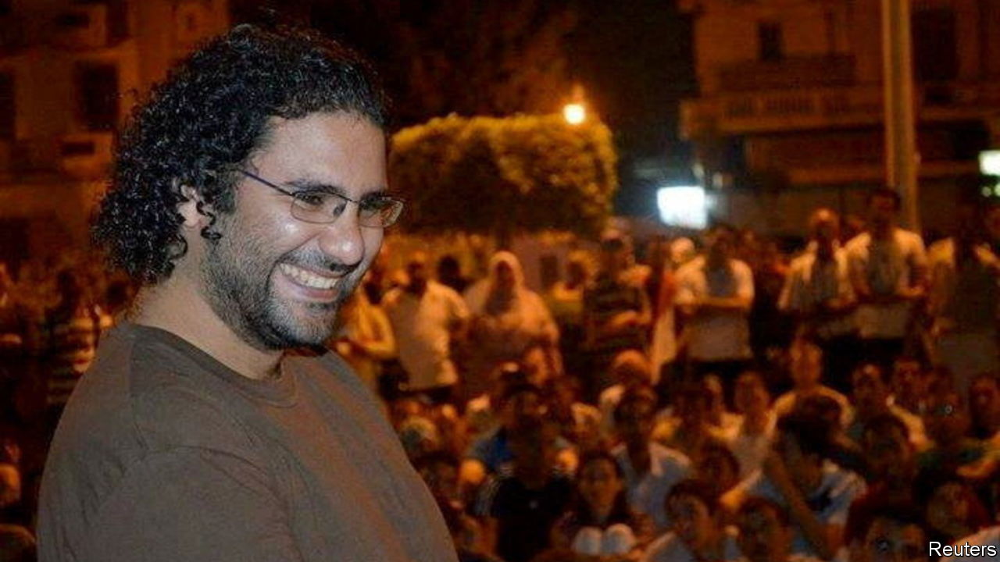

###### The Economist explains

# Who is Alaa Abd el-Fattah? 

##### His challenge to Egypt’s regime has become a matter of life and death 

 

> Nov 9th 2022 

EGYPT’S GOVERNMENT had hoped that COP27, a big UN climate conference taking place in Sharm el-Sheikh, would be a chance to polish its image. Instead it has drawn attention to Egypt’s dismal human-rights record. Alaa Abd el-Fattah, a British-Egyptian activist, is the most high-profile of the country’s estimated 65,000  He was jailed most recently in 2019 for alleged offences ranging from joining a terrorist group to spreading false news on social media. He has been on hunger strike for more than 200 days. Since Sunday, when climate talks began, he has also refused water. Campaigners, celebrities and world leaders have called for his release. Who is Alaa Abd el-Fattah?

Born in 1981, he had an early education in political activism: his parents were members of a small, vocal group of Egyptian intellectuals who had long spoken out against oppressive governments. His first taste of activism came in 2005, when Egyptians protested in the streets against election-rigging by the government of Hosni Mubarak, the dictator who ruled from 1981 to 2011. Mr Abd el-Fattah broke his arm protecting his mother and other women from the blows of regime supporters. Less than a year later he was arrested after demonstrating in solidarity with striking judges. He went on to document online abuses by the Mubarak regime. By 2011, when people across the Middle East rose up against their leaders in the Arab spring, Mr Abd el-Fattah had become one of the leaders of Egypt’s revolution. After Mubarak was deposed, Mr Abd el-Fattah challenged the interim military regime. When Coptic Christian protesters were violently dispersed in 2011, Mr Abd el-Fattah, who was present, wrote an article for an Egyptian newspaper describing state violence. Not long after, he was jailed for two months.

What has made him prominent is his writing and social-media posts. Adept at coding, Mr Abd el-Fattah launched in 2004 a blogging platform for activists across the Middle East. This raised his profile beyond Egypt: in 2011, shortly before his arrest, he was invited to give a speech at RightsCon, a summit in Silicon Valley on human rights in the digital era. His eloquence has made him a persistent threat to the Egyptian regime: Mr Abd el-Fattah has a talent for inspiring hope where it seems to be gone. 

When General Abdel-Fattah al-Sisi came to power in 2013 he cracked down on dissenters. Mr Abd el-Fattah was arrested again, for allegedly organising against a new law banning protests. He has since spent most of his time in prison. Essays he has written from his cell have been smuggled out by family members. In 2021 these, along with previously published works, were aggregated in a book, . 

The Egyptian government denies that Mr Abd el-Fattah is on hunger strike, and refuses to disclose the details of his health to his family. Mr Abd el-Fattah has decided to make his final stand as world leaders gather in Egypt. Rishi Sunak, the British prime minister, spoke to Mr Sisi about the case when he was in the country for the climate summit. Time is running out. As things stand now Mr Sisi’s government faces a choice between setting Mr Abd el-Fattah free or letting him die. On Tuesday his sister said that the Egyptian authorities are happy to do the latter, but not “while the world is watching”. The world is watching now, but for how long? ■

