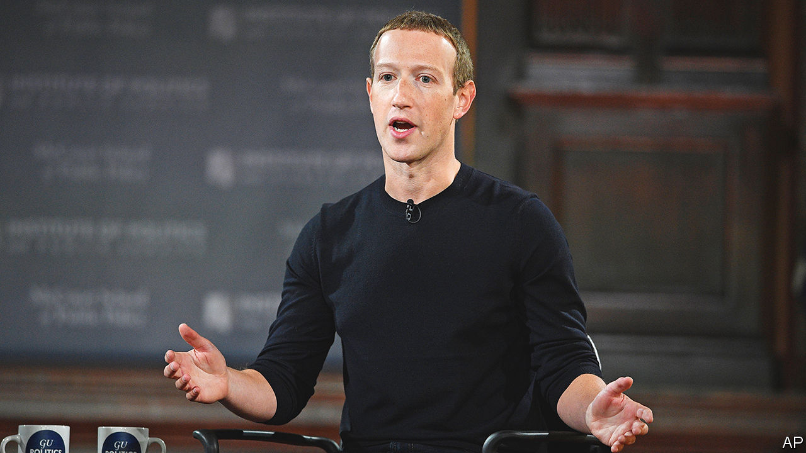

###### The world this week

# Business 

#####  

 

> Nov 10th 2022 

 , or 13% of its workforce, amid falling revenues from advertising and e-commerce. The parent company of Facebook, Instagram and WhatsApp is also considering other cost-cutting measures, and suggested it would close offices. In a separate filing it said it expects losses to grow significantly next year at its Reality Labs division, at a time when investors are already frustrated with Meta’s focus on creating a metaverse at the expense of the rest of the business. Mark Zuckerberg said he took full responsibility. The company’s market value is now around $270bn, down from $1trn in September 2021. 

The great tech shake-out

Meta was not the only big tech company to announce . Stripe, an online payments firm, is letting go of 14% of its workforce, and Lyft, a ride-hailing company, of 13%. Amazon has introduced a freeze on hiring for its corporate jobs. Twitter laid off half its staff following Elon Musk’s takeover, though it has reportedly asked some of them to come back. 

More than 12m people signed up to  in the three months to October 1st, taking the total number of subscribers to 164m. That is a faster rate of growth in users than at Netflix, though Netflix has 223m subscribers. Operating losses at Disney+ have soared, however, causing Disney’s share price to drop by 13%. Following Netflix, it is introducing an ad-supported subscription plan next month to entice consumers and generate new revenue streams. 

Apple issued a rare warning about delays to supplies of the . It now expects fewer shipments of iPhone 14 models, and longer waiting times for customers, because of covid-19 restrictions at the factory that assembles the device in Zhengzhou, China. The plant is operated by Foxconn, which has shifted some of the iPhone’s production to India, and may transfer more if China becomes an unreliable centre for production. 

Advancing its ambitions in the electric-car market,  said it would invest $170m in , a startup that is developing an electric-powered pick-up truck at a factory in Ohio. 

 is rearranging its business around five divisions, including one based on “new mobility, energy and data-based services”. The overhaul accelerates the flotation of its electric-vehicle unit, Ampere, next year. Renault also launched a joint venture with Geely, a Chinese carmaker, to make internal-combustion, hybrid and plug-in hybrid engines. The arrival of electric cars has meant that the industry must shift gears “from soccer to pentathlon”, said Renault’s boss.

In Britain speculation mounted that the government will impose a road tax on  for the first time when it unveils a budget on November 17th. EVs are currently exempt from the tax, but the government is looking at ways to offset a fall in revenues from fuel duties because of the switch away from petrol to electric. 

The global  was shaken by the looming collapse of , one of the biggest exchanges, after a run of customer withdrawals left it facing a liquidity crunch. FTX turned to , an arch-rival, for help. Binance at first said it would take over FTX, but then pulled out of the deal, citing reports that FTX had “mishandled customer funds” and was being investigated by the authorities. Cryptocurrency prices plunged. Bitcoin fell to around $16,000, its lowest level in two years. 

 has developed a new chip that can be exported to China without violating the American government’s ban on selling technology in semiconductors to the Chinese. The ban has hit sales of Nvidia’s high-end microchips for use in artificial intelligence, data centres and supercomputers. 

 affecting manufacturers and their suppliers lay behind a surprise fall in , which dropped by 0.3% in October, year on year. Imports also declined, marking the first simultaneous contraction in both categories of trade since May 2020, in the heat of the pandemic. China, meanwhile, has become  top trading partner, according to the Kiel Institute for the World Economy, after EU sanctions targeted the Russian economy. 

Flights of fancy

 raised its forecast of passenger numbers and said it expected to make an annual profit for the first time since the outbreak of covid. The low-cost airline was in the news recently when its boss, Michael O’Leary, threatened to leave its base in Ireland if the Irish government raises corporate taxes, proclaiming, “We’re proud of being Irish, but I wouldn’t die in a ditch over it.” Ryanair has threatened to quit Ireland in the past. And to pull its business from Britain. And France. And Belgium. In 2018 Mr O’Leary said he would ground flights from Britain to make Britons rethink their decision to leave the EU (he never did). 

