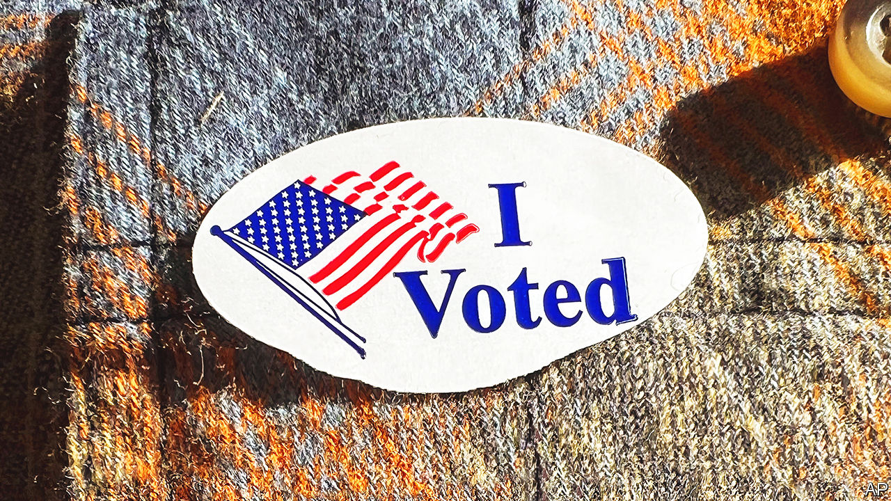

###### The world this week

# Politics 

#####  

 

> Nov 10th 2022 

The Democrats fared better than expected in America’s . The Republicans were on course to capture the , but with just a small majority. It was not clear which party will control the , and may not become so until December, when Georgia holds a run-off. Republicans lost several winnable races after nominating extreme and eccentric candidates favoured by Donald Trump. Joe Biden said it was “a good day…for democracy”. 

In the , Brian Kemp, a Republican, beat Stacey Abrams, a Democrat, in Georgia. Ms Abrams had lost in 2018, too. Then, she denied that she had done so; this time, she admitted defeat. In New York Kathy Hochul, a Democrat, held off a late surge by a Republican candidate who accused her of being soft on crime. Democrats also beat back strong challenges in Michigan and Wisconsin. They gained Maryland and Massachusetts, but Arizona and Nevada were too close to call. 

, a Republican, won re-election as governor of Florida by a whopping margin. He is now well placed to run for the presidency in 2024. Donald Trump warned “Mr DeSanctimonious” to stay out of that race, hinting that he might dish up dirt on him if he challenges Mr Trump for the Republican nomination.

Voters in California, Michigan and Vermont supported changes to their state constitutions to keep abortion legal. A  in Kentucky to specify that the state constitution does not include a right to abortion was defeated. However, abortion remains illegal in Kentucky. Voters in Maryland and Missouri voted to legalise marijuana. Similar measures failed in Arkansas and the Dakotas. 

A humiliating retreat

Russia ordered its troops to withdraw from, the only Ukrainian provincial capital it controls, and pull back to the far side of the Dnieper river. Russian supply chains were failing as Ukrainians blew up their trucks. Ukraine said it would wait for evidence that Russia really is pulling out. If it recaptures Kherson, a city Vladimir Putin vowed six weeks ago would be part of Russia for ever, its forces will find it easier to attack Russian positions in occupied Crimea. 

 its first nasams and Aspide air-defence systems. These will be used to shoot down Russian missiles and drones, which have been targeting Ukraine’s civilian power infrastructure. 

, Britain’s prime minister, faces a winter of discontent. Tax rises and spending cuts are expected. Adding to the gloom, nurses voted to strike. The walkout will affect around half of the country’s hospitals, though emergency care will continue. 

Sir Gavin Williamson resigned as a minister in the , after being accused of bullying. Sir Gavin had previously been forced out as defence secretary, in 2019, after leaking information. As education secretary, he introduced a policy to estimate the results of exams pupils did not sit because of covid-19. It was hugely unpopular and swiftly reversed. He was later sacked from that job, too.

Daniel Ortega cemented de facto one-party rule in . His ruling Sandinista National Liberation Front won 153 out of 153 municipalities in a sham election, after serious opposition parties were banned and hundreds of dissidents were locked up. Over 2,000 ngos and 50 independent media outlets have also been shut down. 

Supporters of Jair Bolsonaro,  right-wing populist president, urged the army to intervene after he lost his re-election bid to Luiz Inácio Lula da Silva, a leftist. They claim the poll was rigged, which it wasn’t. Police cleared hundreds of pro-Bolsonaro roadblocks, but new ones sprang up. In one state,  attacked police who tried to dismantle their barriers. Mr Bolsonaro has not conceded defeat, but does not appear to be blocking the handover of power. 

 Supreme Court overturned the death-penalty convictions of three men for the rape and murder of a 19-year-old woman in 2012, citing sloppiness in the way prosecutors had marshalled evidence. The case had caused national outrage after the victim’s body was found burned and mutilated. Women’s groups complain that the legal system is inept at investigating such horrors.

 


In  supporters of Imran Khan, who was ousted as prime minister in April, tried to block the main roads around Islamabad after he claimed without evidence that the current prime minister, Shehbaz Sharif, and other officials were conspiring to assassinate him. Mr Khan was shot in the leg on November 3rd while leading an anti-government march.

Protesters against military rule in  clashed with security forces. The UN estimates that 117 protesters have been killed and some 7,700 injured since a coup last year. 

 will shut schools before the end of term in an effort to contain an outbreak of Ebola, a virus that is often lethal if not treated quickly. Authorities have confirmed 136 cases and 53 deaths.

The UN’s annual summit on climate change got under way in Sharm el-Sheikh, a resort town in Egypt. Delegates flew in toto discuss what have been termed as reparations to poor countries for the damage caused by greenhouse-gas emissions from rich ones. 

While hosting COP27 the authorities kept  well away from the proceedings. Human-rights campaigners put the spotlight on Alaa Abd el-Fattah, an activist who has been refusing water in prison.

As protests continued in , the commander of the country’s ground forces said that “rioters” would be dealt with if Ayatollah Ali Khamenei, the Islamic Republic’s supreme leader, ordered the army to crack down.

Binyamin Netanyahu, whose Likud party won the most seats in the Knesset,  parliament, in a recent election set about forming a . A bloc of extreme right-wingers is intent on joining it. Liberal voices urged centrist parties to keep out the far right by holding their noses and joining Mr Netanyahu in a more moderate coalition.

Welcome...but not you

An ambassador for  football World Cup, which kicks off on November 20th, said homosexuality was “damage in the mind”. Visiting fans were reminded that gay sex is illegal in the tiny Gulf state.

