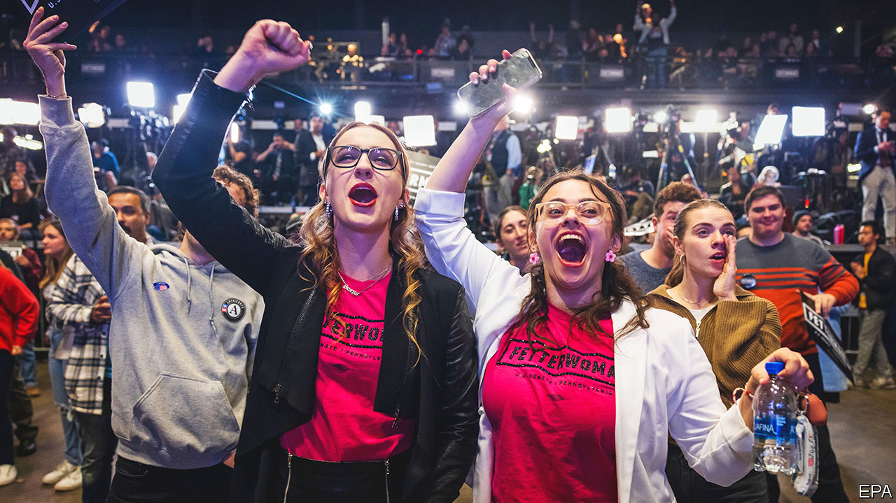
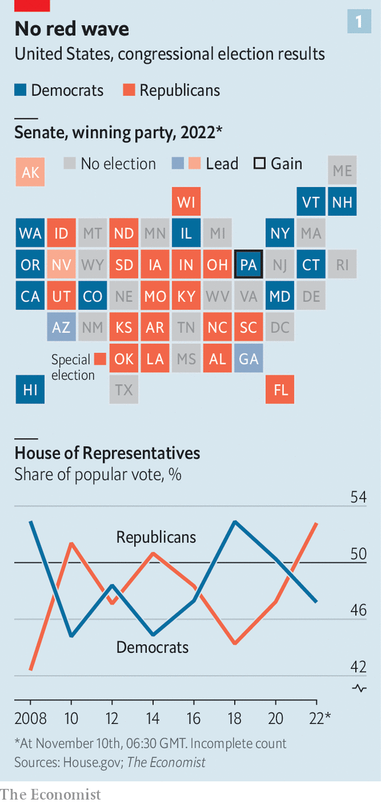
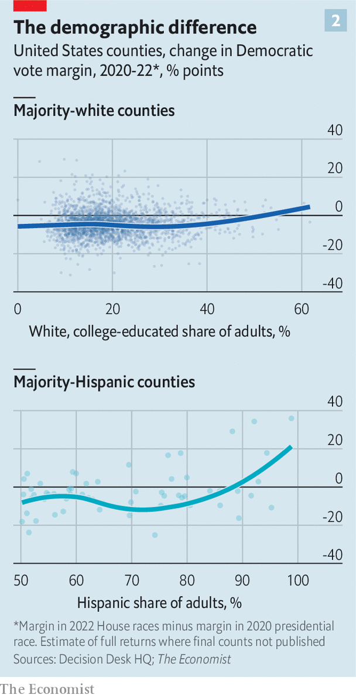

###### False tsunami alert

# A Republican victory will be much smaller than Democrats feared 

##### Several sorts of extremism may have prevented the party from securing a more convincing victory 

 

> Nov 10th 2022 


IMAGINE IF NOAH’S prognostications about a world-ending flood had ended in a light shower. That is roughly the situation faced by Republicans who had been expecting a biblical sort of rebuke of President Joe Biden in the midterm elections. Despite clear voter discontent with Mr Biden and the pace of inflation, Republicans managed only a limp showing. As final results were being tallied, they looked on track to barely pick up the five seats needed for a majority in the House of Representatives (a typical loss for a president’s party in the modern era is 30 seats). That will be sufficient for Kevin McCarthy, the Republican leader in the House, to wrest the speaker’s gavel from Nancy Pelosi, the Democratic leader, and ensure divided government in Washington for the next two years. But it is hardly a spectacular showing. 

 


The same is true of the contest to control the Senate, which may take weeks to decide, due to the need for a run-off election in Georgia in December. Taking the Senate would have required netting only a single additional seat—but it now looks likelier than not that even this low bar will not be met (see chart 1). Democrats never met the attacks that Republicans launched at them on crime, inflation, indoctrination of schoolchildren and immigration with a convincing or cohesive rejoinder. And yet the morning after the election there was, surprisingly, more need for Republican soul-searching than for Democratic recriminations.

Several sorts of extremism may have robbed Republicans of the marginal seats they needed to secure a more convincing victory. The first was over abortion, which became an immediate rallying cry for Democrats when the Supreme Court overturned , the case that had established a right to terminate a pregnancy up until the point of fetal viability, in June. Although most Americans supported some limitations on the procedure, they also found bans pitched by many Republicans too extreme. In the suburban battlegrounds for the House, abortion proved a potent battering-ram for Democrats, who improved their margins in districts with lots of white, college-educated voters—previously a reliable constituency for the Republicans (see chart 2). 

Voters in Michigan resoundingly rejected Tudor Dixon, the Republican nominee for governor, who never managed to outrun her belief that abortions should be prohibited even in cases of rape. They also passed a constitutional amendment enshrining a right to the procedure in the state constitution. Even in Kentucky, where Republicans beat Democrats statewide as expected, voters narrowly rejected a referendum to amend the state constitution to allow abortion restrictions.

 


More consequential was the pall that Donald Trump continued to cast over his party. He intervened mightily in the election’s primaries, endorsing candidates for their willingness to parrot his lies about a stolen presidential election above all else. In critical Senate contests, the political neophytes that he helped to secure nominations for lost support relative to the presidential results of 2020. Mehmet Oz, a celebrity doctor, lost a not especially close race to be senator from Pennsylvania to John Fetterman, who suffered a near-fatal stroke months ago. Although J.D. Vance won Republicans a Senate seat in Ohio, it was a closer contest than expected. Having once been critical of Mr Trump, before fawning over him in a bid to win his endorsement, Mr Vance seemed to change yet again in his victory speech in Columbus: he did not mention the former president. 

Mr Trump’s repeated insinuations in the days leading up the midterms that he would announce another presidential run may also have reminded Americans of the chaotic future that Republican leadership promised. The attack on the Capitol on January 6th 2021—which the Republican Party is committed to ignoring on its moderate end and embracing on its radical end—was not as much a stain on the party as Democrats may have hoped. But the most fervent champions in the anti-democratic front, like Doug Mastriano, a Christian nationalist who was running to be governor of Pennsylvania, faltered badly. 

Whether or not the unexpectedly poor results scupper plans for Mr Trump’s announcement, his confidence will be unbruised: “I think if they win, I should get all the credit. And if they lose, I should not be blamed at all,” he told a conservative news programme on the eve of the election.

Cold comfort for Democrats

Democrats endured losses, even if these were not as apocalyptic as feared. Stacey Abrams, who became a progressive superhero after complaining that she had narrowly lost her bid to be the Democratic governor of Georgia due to voter suppression, lost once again to Brian Kemp, by a bigger margin of eight points. This time she immediately conceded defeat. Democrats did worse than expected in New York, traditionally a stronghold. Kathy Hochul, the incumbent governor, was elected by a surprisingly thin margin of six points, and Republicans flipped several House seats in the state. One was that of Sean Patrick Maloney, who chaired the party’s national campaign committee. The worst drubbing was in Florida, where Democrats lost by an astonishing 16 points in the Senate contest and nearly 20 points in the governor’s race.

It helped that the significant erosion of Democratic support among Hispanic voters in 2020 did not appear to get worse in this race. Our analysis of initial returns shows that in heavily Hispanic congressional districts, Democratic margins actually improved (see chart 2). Republicans were unable to flip all three congressional districts along the Mexican border of Texas as they had hoped, and Democrats did not seem to lose ground in other states with large Hispanic voting blocs, such as Arizona and Nevada. One exception was again found in Florida, where Ron DeSantis, the Republican governor, turned Miami-Dade County red, winning it by 11 points when Mr Biden had won it by seven in 2020 and Hillary Clinton won it by 30 in 2016. Indeed, Mr DeSantis, whose cold war with Mr Trump over the leadership of the Republican Party has begun to hot up, is perhaps the  in America at the moment. 

In the past seven years that Mr Trump has led the Republicans, and transformed the country’s politics, rarely has his grip on the party looked as tenuous as it does now. Jostling for the next election is well and truly under way, and not only on the Republican side. Mr Biden has taken advantage of the unexpectedly minimal losses to try to quell the insurrectionists in his own party, reiterating that he plans to run again in 2024  .

Expectations for the divided government in prospect for the next two years are low. Mr McCarthy will probably obtain the speakership that he has so desperately sought. But he will do so with such a small majority that the hard-right element of his party may whip him harder than he does them. If so, the White House’s remaining legislative agenda of large-scale social investments and tax increases on the wealthy will be largely abandoned. 

Much of the administration’s energy could be sapped by bruising battles with Republicans who would use the leverage of the country’s debt ceiling and need to pass a budget to enact concessions on spending, including, potentially putting the continued military support for Ukraine at risk. The January 6th committee would be decommissioned; its investigations might even be subject to counter-investigation. An unrelenting series of probes into the administration’s massive spending, mismanagement of the southern border and the peccadilloes of the president’s son, Hunter Biden, will produce perpetual embarrassment. Like most varieties of joy, the one that Democrats are currently experiencing will prove ephemeral. ■


