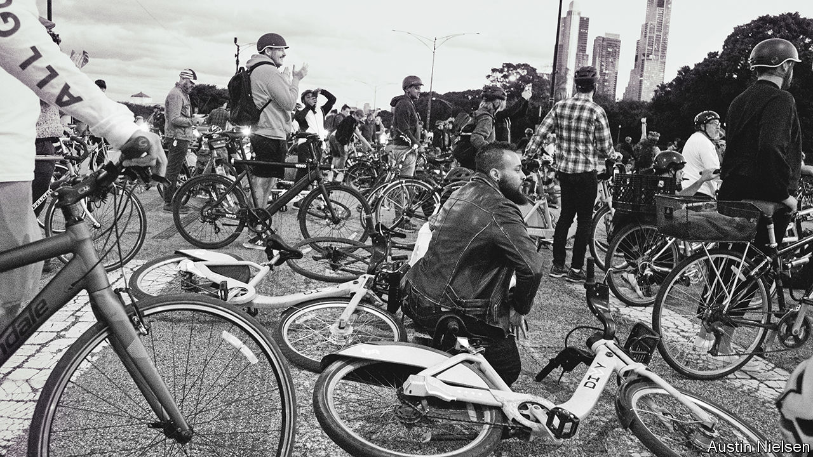

###### Bike activism

# Cyclists are shutting down streets to demand safer rides 

##### Politicians may slowly be catching up 

 

> Nov 10th 2022 

AS PROTESTS GO, few are as good-natured as those led by Bike Grid Now, a Chicago-based group of cyclists. On one held early in the morning of October 26th, three dozen or so cyclists gathered outside the Loop, Chicago’s downtown, before cycling together to Daley Plaza, next to City Hall. Riding various sorts of bicycles—from the basic bikes of the city’s “Divvy” hire scheme to electric ones with child seats—they cycled around the block, spreading across all three lanes, before pausing outside the entrance to block car traffic. After a police officer, who was also on a bicycle, politely told them that they had five minutes before he would have to arrest them, they rang their bells and chanted demands for bike lanes. A few minutes later the group, made up largely of 30-something white professionals, dispersed to their jobs in the nearby offices.

Such protests now happen in Chicago almost weekly. The Windy City has at least half a dozen groups demanding more safety for cyclists. In September, on “World Car Free Day”, several hundred cyclists staged a “die in”, blocking an eight-lane highway that runs alongside Lake Michigan. An even larger group has cycled around the Jane Byrne interchange, a highway junction that is normally among America’s most congested roads (and off-limits to cyclists). Similar protests have been held in cities including Oakland in California, Portland in Oregon and Miami, Florida.

Bike activism is hardly new. The freeway trespass was organised by Critical Mass, a movement that emerged in San Francisco 30 years ago. Yet the pace has accelerated, largely thanks to trends unleashed by covid-19. Though official data suggest fewer people are cycling to work (and only around 0.5% of Americans do so) than before the pandemic, reversing what had been a long, slow rise, that is probably because more are working from home. In reality, more cyclists are probably on America’s roads than ever. Bicycle sales have soared—electric bikes outsold electric cars last year—and municipal cycle-hire schemes in New York, Chicago and elsewhere recorded more users than ever this past summer.

As more people are getting on bikes, they are also realising how unsafe many American streets are. Though bike lanes are proliferating in many cities, they are still rarely protected or enforced. The rise in protest is “because of tragedies”, says Courtney Cobbs, an activist in Chicago. In June Elizabeth Grace Shambrook, a three-year-old girl, was killed when her mother was knocked off her bike by a lorry driver who ignored her as she tried to get round a van parked illegally in a bike lane. 

In 2020, 1,260 people nationwide were killed in crashes on bikes, a 44% increase on a decade before, according to the National Safety Council, a non-profit group. Some of that increase may be because more bikes are on the roads, but it also seems likely that people are driving more dangerously, too. Last year almost 43,000 people were killed in car crashes of all sorts, the highest figure since 2005. 

Christina Whitehouse, who set up a website, Bike Lane Uprising, to report people who park in Chicago’s bike lanes, says the site has been inundated with such reports. But she thinks cyclists are making at least a little headway in forcing change. The city has, for example, put concrete barriers in some bike lanes to stop drivers from entering them. Ms Whitehouse says officials did this in response to protests. “There are so many bikers who are becoming single-issue voters,” she says. They may be starting a virtuous cycle. ■


