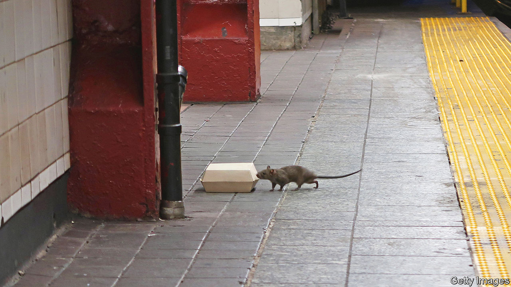

###### Hamelin on the Hudson

# Eric Adams, New York’s Pied Piper, declares war on rats 

##### The mayor vows to fight the city’s latest plague 

 

> Nov 10th 2022 

ASIDE FROM the Statue of Liberty and the Empire State Building, is there a more quintessential image of New York then a rat carefully, nay heroically, carrying a slice of pizza down some subway stairs? The horror and admiration of New Yorkers sent footage of “Pizza Rat” viral in 2015. Little admiration has been directed at rats of late. Rat sightings, as reported to the city’s 311 customer-service number, rose by more than 70% in the first nine months of the year against the same period in 2020. Eric Adams, the mayor, said recently his administration will make the Big Apple liveable by “fighting crime, fighting inequality, fighting rats”.

Mr Adams and Jessica Tisch, the Department of Sanitation commissioner, have a plan to end rodents’ “all-night, all-you-can-eat-buffet”. Rubbish, now left on the curb for up to 14 hours, will be picked up within four. After all, Ms Tisch says, “rats don’t run this city, we do.” The city has hired McKinsey, a consulting firm, to study scalable rat-proof trash containers. “People think it’s so easy, ‘why not copy and paste Barcelona [which has underground containers]?’” says Ms Tisch. But New York is a far denser city, so more trash below its streets would compete for space with sewers, fibre-optic cables and the subway. Mr Adams will soon announce more anti-rat schemes. 

Last month the city council passed a rat pack(age) of bills, which includes designating areas with high infestation as mitigation zones, allowing targeted rodent management. Another bill requires the use of licensed exterminators as a condition for construction permits. “They may be our neighbours, but they are not our friends,” says Shaun Abreu, who co-sponsored the package. “If we don’t take the war to them, they’ll take it to us.” Some New Yorkers have taken matters into their own hands. One long-established group of rat vigilantes, called the Ryders Alley Trencher-Fed Society (RATS), hunt the vermin with their dogs.

But all these efforts may not be enough. Controlling rats will require everyone who lives or works in the city to play a role. Therein lies the problem, says an urban rodentologist. “One bad property-owner on a block of ten beautiful homes can cause the entire block to experience sightings of rats.” Rats take advantage of weakness.

They are tenacious and bold. They eat what people eat, be it pizza or caviar. They can squeeze through a hole the size of a coin and can fall five storeys without injury. They chew through pipes and cinder blocks and gnaw on wires. And rat puns aside, rats are no joke. They carry disease and parasites. A Columbia University study in 2014 found that New York City rats carry 15 pathogens and 18 viruses never seen before in the city.

As bad as it is, the Big Apple is not the worst. Chicago has been America’s rattiest city for eight consecutive years, according to Orkin, a pest-control company. New York, which ranks second, can only hope that Mr Adams lives up to his new moniker, “the Verminator”, to ensure a happy twist in the tail. 


