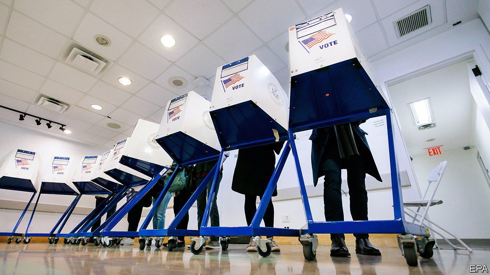

###### Midterm maths: Polls v results

# How well did America’s pollsters do? 

##### In a reverse of recent trends, they may have slightly underestimated Democrats 

 

> Nov 10th 2022 


THE GROUP that needed the best midterm election night was not America’s Democrats or Republicans, but its pollsters. After the 2016 and 2020 cycles, which saw the worst polling errors since the 1980s, the industry has been under heavy scrutiny. Some have claimed that pollsters’ tools are broken; others, that they are now simply irrelevant. Another poor showing could have ended many public-polling operations. Such fears can now be assuaged. The pollsters had a rosy year.

Take the House of Representatives. Though the final tally will not be known for some time,  has built a statistical model to estimate vote-counts in each race based on the number of outstanding ballots in each county. This model shows Republicans on track to win roughly 50.8% of the total votes cast for either major party in the chamber. If so, pollsters will have come impressively close: our aggregate of so-called generic-ballot polls had the party winning 50.4%. 

Such a showing would make the polls this year some of the most accurate ever. In midterm elections since 1942, the generic ballot has missed the Democrats’ share of the House popular vote by nearly three percentage points on average. Error has been below one point in only a fifth of all midterm contests over the same period.

Pollsters did similarly well in the Senate. In Georgia, for example, our poll-of-polls found Raphael Warnock, the incumbent Democratic senator, within the margin of error with Herschel Walker, a former American-football star. Mr Warnock leads in the current vote-count by just under one percentage point. And in Ohio, Tim Ryan was trailing his Republican opponent, J.D. Vance, by six points in our average of polls. With nearly all the votes counted, he lost by the same amount.

All this is a stark contrast with the misfires in 2020. Then, pollsters in Ohio underestimated Donald Trump’s margin of victory by six points. In Iowa they overestimated Mr Biden’s vote by eight points; in Wisconsin by seven; in Florida by six; and so on. This time, in Iowa the polling error was just 2.6 points. In North Carolina’s competitive Senate race, our polling average was spot-on—compared with a five-point error last time. 

 


The story is much the same elsewhere. Across 19 states that had competitive Senate races this year, polls for presidential and Senate races in 2020 overestimated Democratic candidates’ vote margin by an average of 4.7 points. This year they appear to have undershot the party by 0.9 points on average. Several notable states saw complete reversals of their previous biases. In Pennsylvania the senator-elect, John Fetterman, is on track to beat his opponent, Mehmet Oz, by roughly four percentage points. We had Mr Fetterman in a tie, making for a four-point error against him. In 2020 the polls overestimated Democrats by the same amount. Polls appear to have underestimated Democrats in Colorado, New Hampshire, Washington and Wisconsin as well (see chart).

It will take months for pollsters to probe why they did not suffer so badly this year from the methodological spectres haunting their methods last time. One theory is that Donald Trump’s presence on the ticket heightens turnout among lower-propensity voters who do not answer pollsters’ calls. That caused polls to underestimate Republicans in presidential years but not in midterms.

Another possibility is that aggregates were dominated by pollsters who are friendly towards Republicans, biasing our forecasts. Nine of the final ten polls released for the New Hampshire Senate race, for example, came from firms that our algorithms estimate were friendlier towards Republicans than the average pollster. That is a good reminder that, when it comes to election prediction, most prognosticators are at the mercy of the pollsters. This time round, they have done well. ■


