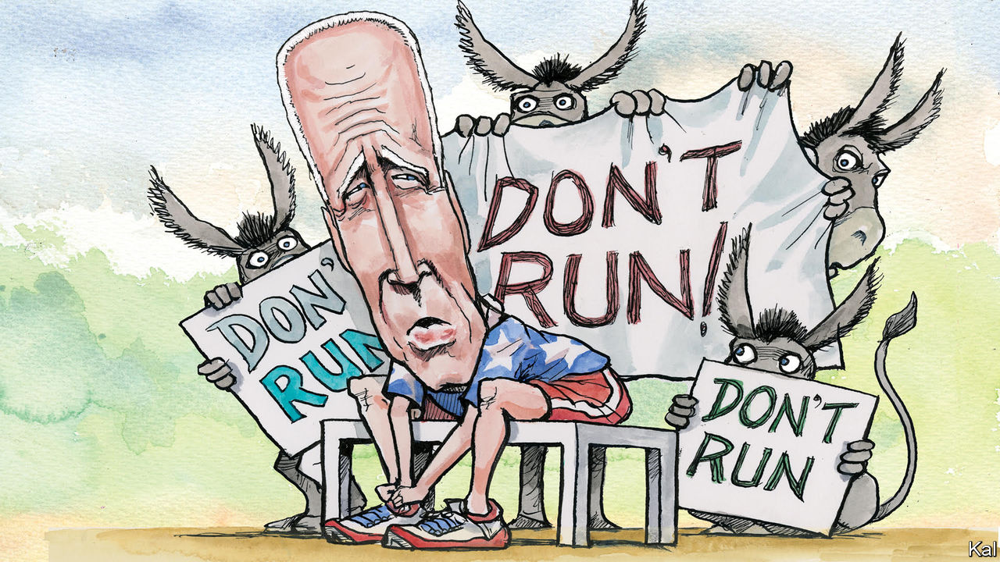

###### Lexington

# Joe Biden should not seek re-election 

##### He and the country have more to gain if he rises above the next presidential contest 

 

> Nov 10th 2022 


After a lifetime of public service, Joe Biden defeated a sitting president and then accomplished more in two years, and more of it with bipartisan support, than few but he imagined possible. He has led his party to a strong showing, by past standards, in the midterm elections. 

Now, with those elections over, the 2024 presidential campaign is beginning to obsess the political class. Mr Biden should prepare to make a painful concession, not to the Republicans but to reality—actually to two realities, one of politics and another of biology. Declaring in the months ahead that he will not seek a second term would be a historic act of leadership, a demonstration of his faith in democracy and his own best chance to receive the respect and honour he has earned. 

If, as seems probable, either the House or Senate winds up in Republican hands once all votes are counted, Mr Biden’s path to achieving significant legislation, always narrow, will be blocked. The rest of his term will be spent trying to keep the lights on in the federal government and in Kyiv. 

Even if this White House were as creative and fierce as Bill Clinton’s—and it is not—the era of triangulation, of playing one party’s extreme off against the other’s to achieve compromises and a distinctive presidential politics, is over. Arsonist that he was, Newt Gingrich, as speaker, nevertheless had an interest in making deals with Mr Clinton. Though tormented by his radical Tea Party caucus, John Boehner, as speaker, was, as Barack Obama said, a patriot who believed in compromise.

But polarisation and gerrymandering have hardened both party factions in Congress. The number of representatives with an incentive to find common ground has dwindled. Many House Republicans are acolytes of Donald Trump, and if they secure a slender majority, the probable new speaker, Kevin McCarthy, will be preoccupied with placating Representative Marjorie Taylor Greene and the rest of the berserker caucus. 

The Senate Republican leader, Mitch McConnell, is a ferocious partisan, but he is also no friend of Mr Trump, and he cares about governance. Yet several Republican senators who were also serious about governing are retiring, one to be replaced by a Democrat and five by the likes of Eric Schmitt, who as Missouri’s attorney-general tried in 2020 to overturn election results. In both Houses, Republicans will want to deny a Democratic presidential candidate anything voters might perceive as the smallest success. 

By saying he would not run again, Mr Biden would not surrender political leverage so much as enhance his chance to reach at least some deals. And he would make any Republican investigations of him and his family seem like malicious irrelevancies. 

Exit polls showed that voters overwhelmingly do not want Mr Biden or Mr Trump to run in 2024. His own low approval ratings, Mr Trump’s weakness and the growing strength of a potential challenger like Governor Ron DeSantis of Florida all suggest Mr Biden will draw a primary challenge. Five sitting presidents in the post-war era faced serious challengers. All either bowed out (Harry Truman, Lyndon Johnson) or went on to lose the general election (Gerald Ford, Jimmy Carter, George H.W. Bush). 

A challenge would distract Mr Biden and possibly make him unelectable. “It’s going to be hard as it is to get anything done, but if you’re going to have to move to the left to survive a primary it’ll be impossible,” says Doug Sosnik, who as one of Mr Clinton’s chief strategists worked to prevent a primary challenge after the 1994 midterms. Back then Mr Clinton could stifle opponents by blocking access to big donors, and he also had more reason to believe he could improve his favourability rating. The internet and intensifying polarisation have changed the game.

Mr Biden is particularly vulnerable to be challenged because of the second reality: his age. He is about to turn 80. Voters know someone that old. Can they imagine that person having the vitality to run the country in this era of cascading emergencies? As a candidate in 2020 Mr Biden was lucky to be in lockdown. When he was out on the trail in the midterms, Republicans gleefully swapped clips of his gaffes and moments of confusion. 

The delight Democrats took this autumn in the force and agility of Mr Obama, back on the campaign trail, stood in painful contrast to the anxiety that gripped at least some when Mr Biden opened his mouth. Even Mr Clinton, though frail, seemed faster on his feet, more able to condescend with amused confidence to the Republicans. Mr Clinton has been out of office for more than two decades. At 76 he is four years younger than Mr Biden.

His own infrastructure project

It is poignant. Mr Biden was never one of his party’s great communicators. But he was among the happiest of its warriors—not just brave but cocky, talking himself into a hole and then, grinning, right back out again. Glimmers of that joyful and even overwhelming presence still come through. But not enough of them. 

The midterm results affirm the role Mr Biden envisioned for himself in 2020, as a bridge to a rising generation of leaders. The country wants to move forward, to discard the nihilistic tenets of Trumpism—election denial in particular—and Mr Trump, too. By declining to run, Mr Biden would concentrate the public glare on Mr Trump’s egotism and his party’s extremism. And a wide-open Democratic contest would create space for a new Democrat to crusade against all the old ways, including the spectacle of bipartisan inanity that looms in Washington. 

America could do with a demonstration of grace and wisdom in public life, and Joe Biden is the man for the job. He has the chance, while in office, to transcend the political mosh pit and vindicate his project to save democracy as a principled, not partisan, undertaking. He can liberate himself to be what biology and politics are making him, and what America needs—an elder statesman. ■


