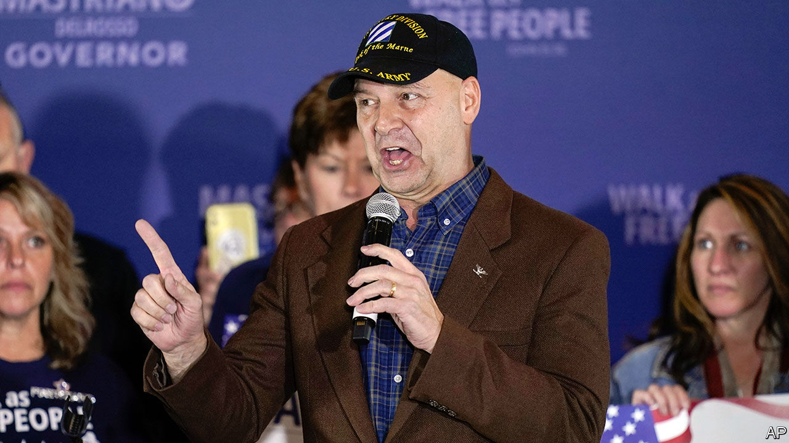

###### The anti-democrats

# Many Republican election deniers lost their statewide races 

##### Spreading election-related conspiracy theories wins primaries, not necessarily general elections 

 

> Nov 9th 2022 


ONE OF THE ironies, and worries, of these midterms was the number of Republican candidates peddling election conspiracy theories who were also vying to run America’s elections. Many were seeking to be governor, secretary of state and attorney-general, officials that play a role in overseeing and certifying votes. Their embrace of Donald Trump’s “Big Lie”, that he actually won the 2020 presidential election, bought them the former president’s endorsement, which carried them through their primaries. If they had won in swing states this week, principled Republicans who resisted Mr Trump’s pressure campaign in 2020 would be replaced by partisans likelier to back a similar one in future. 

In many cases, voters decided that would be a bad idea. Doug Mastriano, who was not only present at the Capitol on January 6th 2021, but also paid to transport protesters to Washington, DC, lost his bid to be governor of Pennsylvania. In Michigan, voters rejected election-denying candidates for governor and secretary of state. 

True, many election-denying incumbents won re-election. And some high-profile races remain too close to call. Kari Lake, who has become a kind of warrior-icon for election-deniers, may yet win the governorship in Arizona. Mark Finchem, a cowboy-hatted conspiracist who once admitted belonging to the Oath Keepers militia, could become Arizona’s next secretary of state. Nevadans may elect a secretary of state who wants to ditch voting machines in favour of hand-counting ballots. 

Even if these zealots lose their races, Mr Trump’s Big Lie will continue to percolate, for three reasons. First, some of them may claim victory anyway. “We had a big day today,” Ms Lake told her election-night crowd, “and don’t let those cheaters and crooks think anything different.” Second, Mr Trump is readying to run for president again. Third, many Republican voters have adopted the Big Lie as a quasi-religious belief, and won’t abandon it overnight. 

Research shows that Americans are more confident that their vote was counted as they intended when their preferred party wins. Mr Trump’s allegations of fraud leading up to and after the election amplified that effect in 2020. “People who are primed to not want to trust the election results are being given the fuel not to believe it by political leaders that they trust,” says Lawrence Norden of the Brennan Centre for Justice. “The only way to put the toothpaste back in the tube”, he argues, “is if you have leadership in both political parties pushing really strongly back against this.”

But disavowing the Big Lie means crossing Mr Trump, and until Tuesday night it seemed inconceivable that the Republican Party would do so. Perhaps the poor performance of many of his favoured candidates will induce Republicans to question the wisdom of shackling themselves to the former president and his favourite conspiracy theories. Mr Trump’s diehard fans may want to relitigate the 2020 election, but most Americans want to move on. 

Electoral reforms could make it harder for extremists to win elections. Nevadans voted on a ballot measure that would establish non-partisan primaries in which the top five vote-getters advance. All registered voters would be able to participate, rather than just registered party members, opening the primary to people with weaker partisan preferences. The general election would then be decided using ranked-choice voting. If the measure passes (the votes are still being counted), hard-left and hard-right candidates would have to appeal to the general electorate, not just the most-engaged slice of their own party. 

Election workers are trying to dispel voters’ anxieties. Many municipalities offer tours of polling places. Maricopa County, Arizona’s most populous, live-streamed its workers as they counted ballots. A room full of mostly older Americans stare at screens, and occasionally make marks on the papers in front of them. If the conspiracists crying fraud took the time to watch, they would probably be bored by what they saw. That is as it should be. ■


