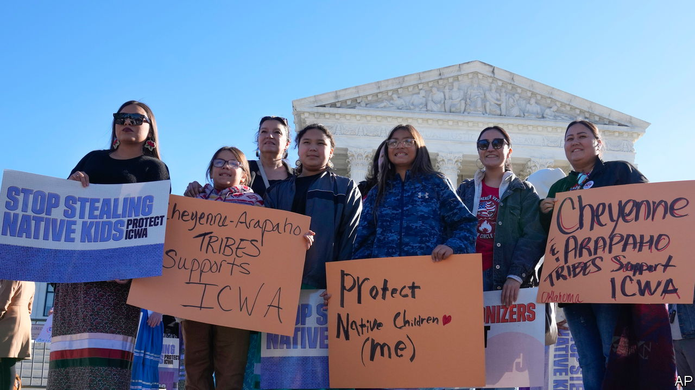

###### Kid gloves

# Native-American children come before the Supreme Court 

##### A challenge to the Indian Child Welfare Act raises questions about tribal sovereignty 

 

> Nov 10th 2022 

Daryle Conquering Bear Crow was 11 when his grandmother died and his mother turned to alcohol. Social workers in Colorado removed the boy from her care. The state refused to send Daryle to his father on the Pine Ridge reservation in South Dakota—too far, they said. So the member of the Oglala Sioux tribe shuttled through group homes for six years. Now aged 35, he says the decision inflicted needless pain. Family and culture were “ripped away”.

Daryle’s path may have been smoother had a law governing Native-child custody cases been properly applied. The Indian Child Welfare Act (ICWA) prioritises placing Native children in Native homes. The idea, Congress noted upon its enactment in 1978, was to stop a “white, middle-class standard” from dictating care decisions. The ICWA impels states to place kids with family when possible and to honour cultural connections. Now the law is in jeopardy. On November 9th the Supreme Court heard arguments in , a consolidation of four lawsuits targeting it.

Congress passed the ICWA to rectify a history of Indians’ forced removal from their families—at government boarding schools and by overzealous social workers. Studies from the 1970s showed that 25-35% of Indian children were being separated from their communities, often because poverty or child-rearing by extended family were misinterpreted as neglect. 

States seeking to remove Native children from their parents must go to greater lengths to prove that they are at risk of harm than what is required for non-Native kids. And states are expected to offer rehabilitation services to Native parents before terminating custody. The ICWA empowers tribes to intercede in custody cases and place the child with extended family, unrelated tribal members or, as a last option, Indians of any tribe. 

Compliance with the ICWA has been spotty, as Daryle’s experience shows. In 2013 the American Civil Liberties Union sued officials in one county in South Dakota where the state had removed Native children in every custody dispute. Still, removals have fallen and family placements have increased. For all children, those in “kinship” care fare better than those sent to live with strangers in the foster system.

At the Supreme Court hearing, lawyers representing non-Native adoptive parents and the state of Texas depicted the ICWA as congressional overreach and as racial discrimination in violation of the 14th Amendment’s promise of equal protection. The law fails to protect the “best interests of the child”, Matthew McGill said, by plucking kids from foster families with whom they have bonded. 

In response, lawyers on behalf of the federal government and tribes noted that Congress enacted the ICWA to prevent Indian children from “being torn from their families and tribes”. Indian tribes have been regarded as “political”, not racial, entities “from the beginning” of the republic, one lawyer noted. The arrangement is written into the constitution and has been recognised in decades of precedent.

Four justices, including Neil Gorsuch, typically a staunch defender of tribal sovereignty, seemed unpersuaded by the attack on the ICWA. Justice Elena Kagan criticised Judd Stone, Texas’s lawyer, for peppering his brief with what Justice Gorsuch had called “policy arguments” against the law rather than persuasive legal contentions. Isn’t care of Native children “Congress’s judgment”, she asked, that the court is “supposed to respect”? Justices Amy Coney Barrett and Brett Kavanaugh had sceptical questions for both sides; it is not clear if either will provide a clinching fifth vote to save the law.

The ICWA’s opponents focused on the law’s provision placing children with other tribes if no adoptive families could be found among their own. Mr Gershengorn admitted that shipping children from Maine to Arizona, just to keep them in a tribe, would pose legitimate concerns. But he observed that no such outrageous examples exist “in the real world”. The court may trim that provision rather than strike the law entirely.

Erasing the ICWA would move standards for Native children’s care in the opposite direction to those for all other youngsters, notes Marcia Yablon-Zug of the University of South Carolina. Child-welfare policies have prioritised extended family and community considerations. ■


