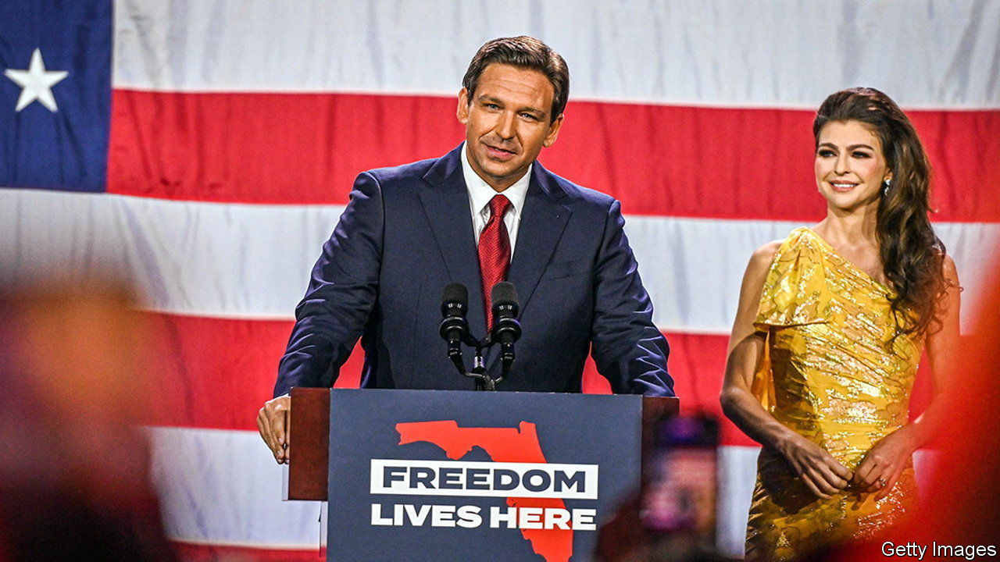

###### States of play

# Ron DeSantis and other winners 

##### The state-level elections will have profound consequences for America 

 

> Nov 10th 2022 


FOR THOSE riveted by the drama of politics in Washington, DC, candidates for state-level posts are often regarded as minor characters, upstaged by congressional stars. The reality is different. Individuals and parties who won power within states on November 8th will matter even more than usual if, as the final tallies are expected to show, Washington descends into partisan semi-paralysis for the next two years. 

There were 36 governor’s races. The star performance was by Ron DeSantis, the governor of Florida. A red wave may not have engulfed the whole country, but it swept the Sunshine State. Mr DeSantis trounced his Democratic rival, Charlie Crist, by around 20 points. In 2018 Mr DeSantis won by a paltry 32,000 votes (0.4 points). 

His victory in South Florida was especially noteworthy. Miami-Dade County voted Republican for the first time since 2002. Hispanics, who had not supported Mr DeSantis in his first gubernatorial bid, connected this time with his outspoken style and his support for parental say in the school curriculum and opposition to shutdowns of businesses during covid. His adept handling of Hurricane Ian, a destructive and deadly hurricane that hit Florida in September, also won him broad support. 

Mr DeSantis’s victory says a lot about a changing Florida and carries national significance too. As more Americans have moved to Florida, Republican registration has shot up. Since March 2020 roughly 400,000 people have relocated from other states and registered to vote in Florida: nearly half of them are Republicans, double the share who registered as Democrats. Mr DeSantis’s big win will serve as proof of his broad appeal as he prepares a run for president, pitting him against Donald Trump, who helped him win office originally but now snidely suggests he is willing to “tell you things about him that won’t be very flattering”. 

A big question is whether Mr DeSantis will continue to push to the right to brandish his reputation as a conservative populist or soften his approach in preparation for a national run. Susan MacManus, of the University of South Florida, predicts that Mr DeSantis and the Florida legislature will be “more cautious” about taking on divisive social issues and will focus instead in the coming year on “three E’s”—education, the economy and the environment—which are winning issues with voters. 

Whichever direction Mr DeSantis goes, he will be closely watched. He is likely to spar frequently with President Joe Biden, as well as with another governor who won re-election by a large margin, Gavin Newsom in California. Mr Newsom is also mulling a presidential run and will use his next term to position California as a leading incubator of Democratic policies on the environment, labour law and more.

One more antagonist with Mr Biden in his sights will be Ken Paxton, Texas’s attorney-general, who also won re-election. As the top law-enforcement officer in Texas since 2015, he has been indicted on federal securities-fraud charges and is reportedly under investigation by the FBI for abusing his office to help a campaign donor. (He denies wrongdoing.) Republican voters have remained indifferent to his ethical scandals. Mr Paxton has delighted in throwing sticks in the spokes of Mr Biden’s presidency, while greasing the wheels of Donald Trump’s. He will eagerly sue the White House over policies that Mr Biden tries to advance via executive order in the face of a divided Congress, predicts Mark Jones of Rice University in Houston.

State legislatures will play a strong role as either allies or foils of leaders in Washington, DC. Much as Democrats did better than some predicted in contests for the House and Senate, they also enjoyed some notable victories in races for state legislatures. In Michigan they flipped both legislative chambers, taking total control of state government (with the successful re-election of Michigan’s governor, Gretchen Whitmer) for the first time in almost 40 years. In Minnesota, which until election day was one of the last remaining divided state legislatures in the country, Democrats flipped the state Senate, so will also have full control of both chambers and the governor’s office.

Control of statehouses will matter especially in the years ahead as states press forward with policies on abortion, the environment and energy. As politicians in Washington, DC, wrangle over spending, government shutdowns and other issues, it will be “in even more areas of policy that the federal government isn’t acting where states are going to have to fill the void”, predicts Chris Warshaw, of George Washington University, co-author of the book “Dynamic Democracy”. 

It will also carry big consequences for future elections. In December the Supreme Court is set to hear arguments in a case concerning the “independent state legislature theory”, which would give near-total control to state legislatures (and not governors or state courts) in how to conduct elections in the future. This has heightened the urgency of ensuring that state legislatures are controlled by people who will act ethically in election certification, says Daniel Squadron, a former state legislator who runs the States Project, a Democratic “super PAC”. The stakes in states could not be higher. ■


