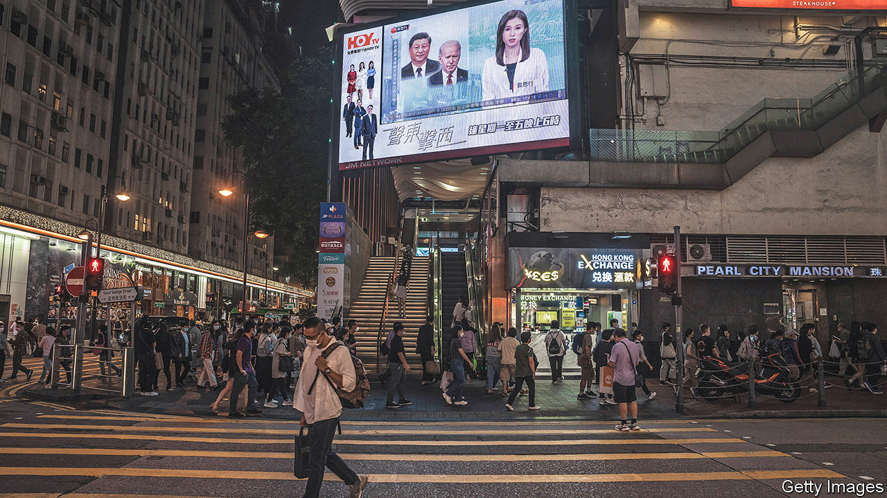

###### Elephants in the long grass

# How the rivalry between America and China worries South-East Asia 

##### The region’s 700m people have much to lose 

 

> Nov 17th 2022 

WHEN Donald Trump began slapping tariffs on imports from China in early 2018, Indonesia’s president, Joko Widodo (or Jokowi, as he is called) saw opportunity. He asked foreign visitors how Indonesia might take advantage of the growing spat. Could he, for instance, entice multinational companies to shift parts of their supply chains from China?

How times have changed. Under Mr Trump’s successor as president, Joe Biden, the trade war with China has intensified, and been reinforced by geopolitical, ideological and even military competition that at times has seemed to risk conflict. On the Chinese side, an all-powerful President Xi Jinping speaks of a titanic struggle with an American-led West. On the American one, Mr Biden in October announced draconian controls to stop Chinese companies from benefiting from American technology—a clear bid to keep China down. He has also broken with a decades-long policy of rhetorical obfuscation in which America refused openly to commit itself to defending Taiwan, the self-governing island whose eventual unification with the mainland is the Communist Party’s most sacred tenet.

In the face of superpower rivalry, South-East Asians feel powerless. They are “the grass, not the elephants”, regional strategists say. Jokowi has shifted from seeing opportunity to sounding the alarm. This month he told  he was “very worried” about the possibility of a conflict over Taiwan, not least because it could destroy the region’s hopes for development and prosperity. He pushed hard for this week’s  in Bali, on the eve of his hosting of world leaders there for the G20 summit. He called it the “most difficult” G20 ever. “We should not divide the world into parts,” he said, in his opening speech. “We must not allow the world to fall into another world war.”

Otherwise, President Vladimir Putin’s war in Ukraine dominated deliberations at the g20, where the mood against Russia’s invasion hardened. For South-East Asian leaders, it is not their fight: only a minority of the region’s governments have openly condemned the invasion. Yet Asia is grappling with its consequences, including disrupted food supplies and rising prices.

The faraway conflict has also underlined the importance of peace at home. As the prime minister of Singapore, Lee Hsien Loong, put it at a national-day rally in August: “Look at how things have gone wrong in Europe. Can you be sure that things cannot go wrong in our region too? Better get real, and be psychologically prepared.”

Taiwan is the main security concern of South-East Asian policymakers. They have long worried about a superpower clash. But it was thought more likely to be in the South China Sea, where China’s vague but expansive “nine-dash line” encompasses nearly the whole sea and where it has built military installations on offshore reefs. This has changed, says a regional diplomat. “The nine-dash line,” the diplomat says. “That’s not a red line. [For China] Taiwan is the real red line.”

Island in a storm

In that context, regional strategists are alarmed by the American shift in rhetoric. They think the Biden administration has gone too far. They also deplore the visit to Taiwan in August by Nancy Pelosi, the Democratic speaker of the House of Representatives, as needlessly provocative. China responded with live-fire military exercises all around the island. They are therefore nervous about the consequences if Ms Pelosi’s likely Republican replacement, Kevin McCarthy, follows through on his promise to visit Taiwan, too.

They also worry that a dearth of trust acts as an obstacle to communication. In turn, mutual disdain grows. A South-East Asian diplomat who talks to both sides says Chinese officials look at America’s political polarisation as proof of great-power decline. Both sides complain that conversations are superficial. Chinese and American officials, says the diplomat, are not pulling their counterparts aside for frank discussions over how to defuse tensions. The pandemic, in reducing face-to-face meetings, made a bad situation worse.

As for the weaponisation of technology against China, even America’s closest friends in South-East Asia say the administration is taking the region down a dangerous road. It forces countries to take sides in painful ways. Singapore has already accepted that in a bifurcated world where technology is “friend-shored” the city-state will end up hewing to American-led supply chains. But what if America extends sanctions to tech-heavy Chinese firms operating outside China? This, says one Singaporean official, would create a huge dilemma for a city-state whose reputation is built on being a safe, predictable, open-for-business jurisdiction. For that matter, will Indonesia’s budding industry powering electric vehicles one day be forced to choose between America and China?

Mr Biden and his team are aware of some of the region’s concerns. Just before the g20, the American president was in Phnom Penh, where Cambodia hosted the annual summit of the ten-country Association of South-East Asian Nations (asean). He assured asean it was “the heart” of his policy in the Indo-Pacific region. He promised a “new era” of co-operation—a recognition that the region’s interests had been somewhat ignored.

For all that their economies are bound to China’s, South-East Asians do want American engagement as a counterweight to their huge northern neighbour. China’s presence brings economic possibilities but also perils, such as military expansion in the South China Sea, indebtedness from Chinese-led infrastructure projects and China’s subversion of asean unity as it turns Cambodia and Laos into client states.

American involvement, then, is welcome. But, says one political leader, it has to be within a more “balanced” framework that provides long-term economic commitment. In Phnom Penh and Bali, Mr Biden promised this. America and Japan (which considers itself cannier at steering poorer Asian countries than its American ally, see Banyan) proposed new ways to help Indonesia decarbonise. Many South-East Asians are sceptical that the promises will amount to much. Mr Biden’s Indo-Pacific Economic Framework, a proposition for American involvement in the region, lacks heft. Only a few pockets of Mr Biden’s administration, such as the commerce department, are pushing for more openness. Too much of his Asia policy, regional strategists say, is driven by anti-China ideology.

There was, then, relief at Mr Biden’s meeting with Mr Xi. It did not represent a reset, but restored communication. At the least, says one South-East Asian official, the two elephants have trumpeted a desire to prevent a descent towards war. The grass gets a little reprieve, but for how long?■

