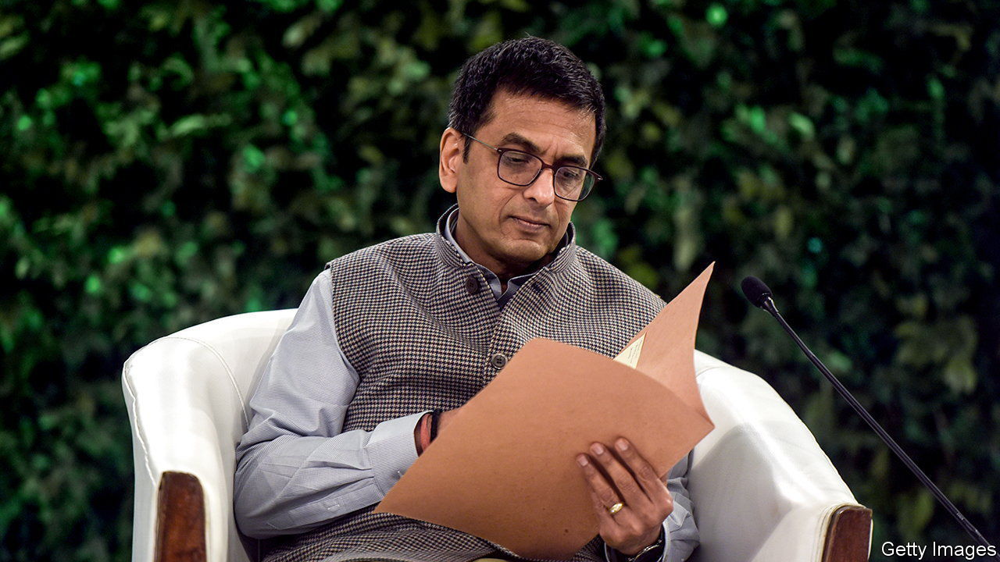

###### Modi and the judges

# India’s new chief justice faces a trial of strength 

##### Will the Supreme Court stand up for its independence? 

 

> Nov 17th 2022 

NARENDRA MODI has never made a secret of his distaste for an independent judiciary. One of his first moves after becoming India’s prime minister in 2014 was to push for a constitutional amendment that would have given the government significant influence over the selection of top judges. Having passed both houses of the legislature, Mr Modi’s effort was thwarted in October 2015 by the Supreme Court, which ruled that the amendment was unconstitutional. New judges continue to be selected by a group of their colleagues.

Dhananjaya Chandrachud, who assumed office as India’s 50th chief justice on November 9th, was appointed to the Supreme Court seven months after that ruling. He joined a court still deeply mindful of its failure to check Indira Gandhi’s assumption of dictatorial powers during the Emergency in 1975 and, as a result, fiercely protective of its independence. Yet the court, under constant pressure from the government, has once again tended to bend to its demands, including in a ruling last week that confirmed a government line on expanding government-job quotas for upper-caste groups. Whether it continues on that path or stiffens its spine could depend largely on Mr Chandrachud.

On the face of it, the new chief will be no pushover. He comes from the traditional Delhi elite, which is despised by the prime minister’s acolytes. His father was the longest-serving chief justice on the Supreme Court, his mother a classical musician who sang for All India Radio. Mr Chandrachud attended rarefied St Stephen’s College and then Delhi University, before writing a doctoral thesis on affirmative action at Harvard. 

He has long been an outspoken advocate of liberal values and minority rights. In a lecture in 2020 he condemned governments that disdain criticism. “The blanket labelling of dissent as antinational or anti-democratic” was harmful to democracy and the constitution, he argued, and use of “the state machinery” to curb such dissent violated the rule of law.

His record as a judge also reflects those concerns. His best-known judgments as a Supreme Court justice concerned citizens’ rights to free speech and privacy. In 2018 Mr Chandrachud notably dissented from the court’s ruling confirming that the government’s Aadhaar programme, the world’s largest biometric identity system, was constitutional. In his view the programme facilitated surveillance and violated citizens’ privacy in ways that were disproportionate to its stated aims. 

Mr Chandrachud says he wants to make the judiciary more representative, efficient and accountable to citizens. He will have his work cut out. The government is becoming increasingly inventive in its efforts to influence the courts. It has dragged its feet on clearing the appointments of new judges it dislikes. More insidiously, government agencies are deliberately stretching already overworked and understaffed courts by filing spurious cases against their opponents. 

The Supreme Court has appeared not merely supine but troublingly pro-government at times. In June it cleared Mr Modi of complicity in deadly sectarian riots in Gujarat in 2002, when he was chief minister of the state. The ruling accused the petitioners of abusing the judicial process and suggested prosecuting them. One, an activist called Teesta Setalvad, was later arrested. She spent more than two months in jail before being granted interim bail.

Will Mr Chandrachud stand more firmly against Mr Modi and his henchmen? His record also suggests he might not. In 2019 he went along with a ruling that awarded the land in Ayodhya where, in 1992, Hindu extremists had demolished a mosque, to a trust intending to build a Hindu temple on the site. And Mr Chandrachud’s response last week to an attack by the justice minister on the “opaqueness” of judicial appointments sounded oddly conciliatory. Upholding the integrity of the court against such bullying requires more than espousing liberal values. It demands a willingness to defend them.■

