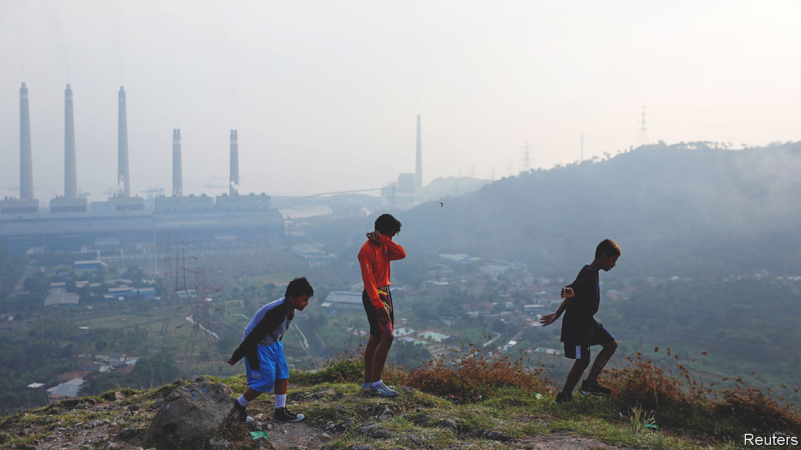
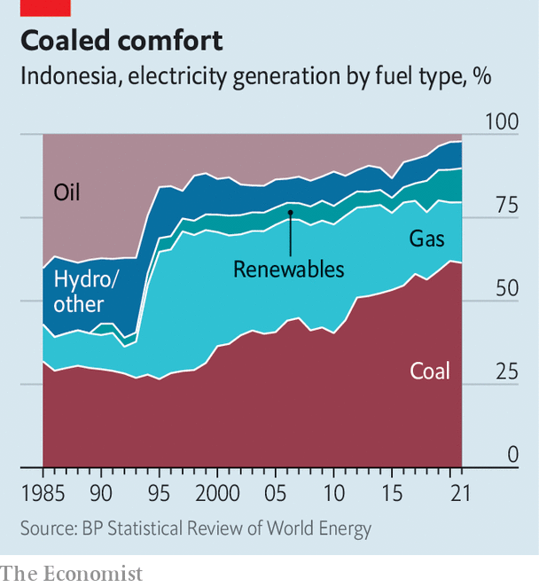

###### Climate action

# Indonesia’s tilt at King Coal 

##### A major coal user signs a $20bn deal to help it reach net-zero emissions 

 

> Nov 16th 2022 

“Indonesia is committed to using our energy transition to achieve a green economy.” Thus Joko Widodo, Indonesia’s president, heralded on November 15th a new international accord designed to curb his country’s addiction to coal. The Just Energy Transition Partnership (jetp), a deal brokered by America and Japan among seven other wealthy countries, promises Indonesia $20bn in public and private financing from abroad to fuel its transition from dirty to . Negotiations with Vietnam, India and other countries in line for jetp deals have been bogged down, so a big success in Indonesia could be catalytic as well as momentous in itself. 

The deal includes some eye-catching promises. Indonesia will aim to reach net-zero emissions of greenhouse gases from the power sector by 2050, bringing forward its target by a decade, and reach a peak in those emissions by 2030. It is increasing its target for the penetration of renewable energy to over a third of all power generation by 2030, which would mean doubling the pace of current deployment. Donors will put in $10bn within five years using a mix of guarantees, concessional loans, grants and other financial tools. Banks that are part of the Glasgow Financial Alliance for Net Zero, a climate-focused group, aim to mobilise some $10bn in private money.

There are several reasons to applaud this. Above all, unless the  burned by Asia’s giant economies are replaced by cleaner alternatives, the world will bake. Clever ways of paying to retire coal plants early using official money, while increasing the flow of private capital to finance renewable energy—as the new deal envisions—are therefore essential.

The deal also builds on a smaller jetp pact agreed with South Africa a year ago. That $8.5bn agreement has been slow to take off. Mandy Rambharos of the green group edf, who helped launch it, says the sluggish pace is the fault of South Africa’s bureaucracy and coal lobby. She reckons the Indonesia deal benefits from its focus on the power sector (South Africa’s also covers electric vehicles and green hydrogen). Richard Folland of Carbon Tracker, a research firm, agrees that the new deal looks stronger, mainly because of the shorter-term commitments the Indonesians have made to reduce their emissions. 

 


But there are snags. To begin with, it will take far more than $20bn to tame this beast. TransitionZero, a research outfit, estimates that winding down power-purchase agreements for coal early would alone cost $37bn. The Institute for Essential Services Reform, a think-tank, reckons combining coal shutdowns with clean-energy investment would cost up to $25bn a year through 2030. Indonesia spent just $3bn on renewables from 2017 to 2021. 

Moreover, its coal addiction is extreme. Indonesia is the biggest producer of the stuff after India and China. Its coal mines employ a quarter of a million people. In the past decade, coal’s share of its power generation has gone from 49% to 61%. That has led to huge overcapacity, making it harder for renewables to compete. The country’s newish fleet of 237 coal-fired plants could burn for decades if nothing is done.

Regional concentration is another headache. The International Energy Agency, an official forecaster, reports that Indonesia’s “multifaceted dependence” makes it the most vulnerable of all big coal-dependent economies. Coal makes up 35% of East Kalimantan’s gdp and employs nearly 9% of its population. In China’s sooty Shanxi province, the comparable figures are only 12% of gdp and 4% of the population. In Mpumalanga, the heart of South Africa’s coal belt, the relevant figures are 19% of gdp and 5% of the population. 

Worse yet, most Indonesian mines are controlled by a few family conglomerates with deep pockets and heavy political clout. The industry is a huge spender on political campaigns, especially in East Kalimantan. In the decade after the central government in 2001 transferred authority for approving new mines to regional governments, the number of mining permits rose 13-fold, peaking around election time.

Jokowi, as Indonesia’s leader is known, won power by vowing to shake up an oligarchic system. But the coal industry seems to have found a place on his team. The manager of his re-election campaign in 2019 was Erick Thohir, whose brother is chief executive of Adaro Energy Indonesia, the country’s second-largest coal miner. Several members of his cabinet have worked for or own shares in a coal giant.

Previous efforts to curb coal have flopped. The government planned to reduce coal production from 458m tonnes in 2014 to 400m tonnes by 2019. This year it will hit 663m tonnes. And Jokowi has left alone the billions in goodies coal firms enjoy each year, including exemption from sales tax and a steep discount on export tariffs, even as he cuts subsidies for petrol.

In September he at least banned new coal plants And the jetp announcement marks a fresh start, using foreign cash to work with the coal industry not against it. Overseeing a green transition in Indonesia will be a punishing task requiring full presidential heft. But if it is forthcoming, this innovative deal could help leave much of the country’s coal underground.■


