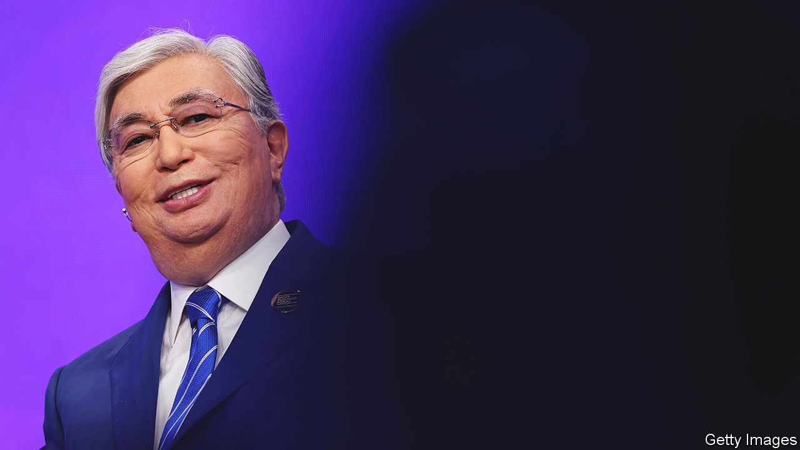

###### One steppe forward

# Old politics in the “new Kazakhstan” 

##### A reformist president has arranged his re-election 

 

> Nov 17th 2022 

NOWHERE HAS the international recoiling against Vladimir Putin’s invasion of Ukraine been more striking than in Kazakhstan. The vast, mineral-rich country shares over 7,600km (4,750 miles) of border with Russia and was long one of its closest allies. Yet Kazakhstan has banned displays of Russian military propaganda. It has given refuge to perhaps 100,000 Russian draft-dodgers. And its president, Kassym-Zhomart Tokayev, has shown an impressive lack of enthusiasm for the war.

His keenness to put Mr Putin at arm’s length is all the more conspicuous because Mr Tokayev is casting off another former patron: Nursultan Nazarbayev, who ruled Kazakhstan for 30 years before handing it to Mr Tokayev in 2019. The 82-year-old former strongman had conferred huge powers on himself, as well as immunity from prosecution and the title “Leader of the Nation”. But in January an insurrection allegedly backed by former members of his regime left 238 dead. The 69-year-old Mr Tokayev has since scrapped his predecessor’s powers, pursued some of his cronies for their outlandish wealth and passed reforms intended, he says, to bring about “a radical reset of the entire political system”.

A snap election due on November 20th is ostensibly part of that effort. Mr Tokayev called it after amending the constitution to extend presidential terms, from five years to seven, and impose a one-term limit on the office in future. Azamat Junisbai, a Kazakhstan-born social scientist at California’s Pitzer College, considers the election—18 months ahead of schedule—a defensive move against the still-powerful Nazarbayev elite. Yet if Mr Tokayev appears sincere in his bid to make a “new Kazakhstan”, the election recalls the old one.

No one doubts the president will win it with ease (if maybe not with the 97.7% vote-share his predecessor achieved in 2015). The only critic of Mr Tokayev who dared to try to run was disqualified on a technicality. The president’s five permitted opponents are nonentities. One, a 68-year-old member of the obscure Auyl (Village) party, is best—or solely—known for a video on social media which shows him karate-chopping a meat bone. Mr Tokayev did not attend a televised debate on November 11th. He sent a proxy, whom some of his opponents politely quizzed on the president’s plans for his next term. “There’s no point voting,” shrugged a man running a fairground stall in an Almaty park. Hardly anyone on the city’s streets could name one of Mr Tokayev’s opponents.

Still, the president, a former foreign minister and deputy UN secretary-general, does not seem unpopular. Despite its deep ties to Russia, Kazakhstan has suffered a fairly modest economic hit from the war; its economy has grown by 2.5% in the year to date. And if inflation is high, Kazakhs are somewhat used to that. Asked for their view of the president, several passers-by in Almaty praised his efforts to “de-oligopolise” the economy.

The government has taken over several firms from relatives of Mr Nazarbayev; one of his nephews is in jail on graft charges. Though Mr Tokayev has issued an amnesty to most of the 1,600 people convicted or charged over the violence in January, it does not cover its alleged leaders.

They include Mr Nazarbayev’s former security chief, Karim Masimov, who will soon be tried for treason. Mr Tokayev has shown courage against his erstwhile patrons. But will he bring the strong institutions and accountability he promises? The election, an early test, is discouraging.■

