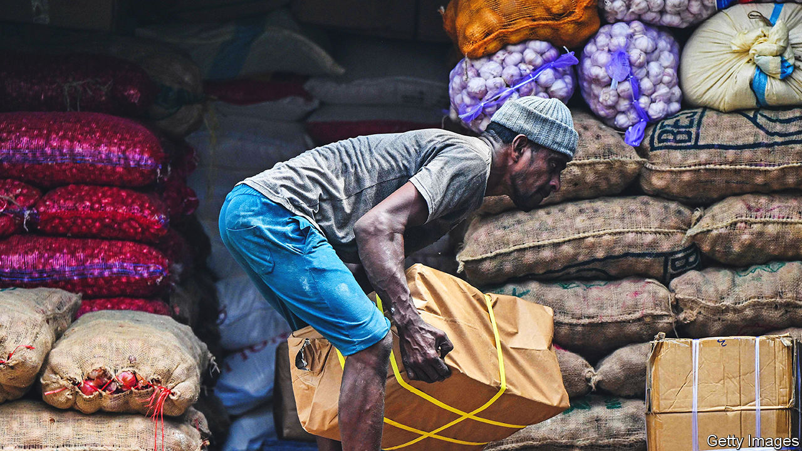

###### Oh Colombo

# Sri Lanka’s president pushes economic stability over political reform 

##### Ranil Wickremesinghe pays little heed to protesters’ demands 

 

> Nov 17th 2022 

ADDRESSING PARLIAMENT on November 14th on the subject of next year’s budget, Ranil Wickremesinghe strived to offer an uplifting vision for his crisis-ridden country. “Let us create a new economy tailored to the expectations of the youth,” said Sri Lanka’s president and finance minister. Attempting this, he pointedly added, need not involve the “traditional protests, struggles and strikes”.

Mr Wickremesinghe has been treading a fine line since he became president in July. The protesters who hounded his predecessor, Gotabaya Rajapaksa, from office and from the country demanded deep reforms, including a clear-out of the political elite and a reduction in the powers of the presidency. Mr Wickremesinghe, a six-time former prime minister, has largely ignored them. Although he is working hard to restore economic stability, he has chosen to work with Mr Rajapaksa’s supporters, paid little heed to the protesters’ demand for political reform and, when some bitterly objected, persecuted them.

On the surface, his focus on economic stability is paying off. Colombo has returned to a sort of normal. The fuel queues that were a symbol of Sri Lanka’s failing economy are now uncommon; power cuts are shorter. A suspension of foreign-debt repayments and a steep fall in imports over the past few months have freed up foreign exchange for fuel purchases. A new rationing system has reduced demand and the import of discounted Russian oil (which European countries and America shun) has improved supply. Last month Sri Lanka’s parliament passed a law ending the government’s control of fuel imports. That should allow private companies to bring in additional fuel supplies in short order. 

But this is delicate progress. Inflation, at 66% in October, has left millions of people unable to afford enough food. A bail-out from the International Monetary Fund that would allow Sri Lanka to resume servicing its debts and restore regular access to international credit markets appears to be months away. Still, the progress made on power cuts and fuel shortages has at least mollified middle-class city-dwellers—an important component of the street protests that did for Mr Rajapaksa. This has created space for Mr Wickremesinghe, whose cabinet is mostly composed of former Rajapaksa loyalists, to quietly shelve the reform agenda.

The political alliance led by the disgraced former president’s party will probably have a parliamentary majority at least until February. At that point Mr Wickremesinghe could dissolve parliament and call fresh elections, another popular demand of pro-reform activists. But he has given no indication that he will do so. Instead, he has used anti-terror laws to arrest and intimidate the most persistent activist leaders. Human-rights groups complain of a shrinking space for dissent. A promised constitutional amendment to limit the overweening powers of the presidency passed parliament in such a watered-down form that one opposition lawmaker claimed it amounted to “fraud”. 

Mr Rajapaksa, whom the protesters want to be prosecuted for his contribution to ruining the economy, has returned to Sri Lanka and is living in a heavily guarded residence in Colombo at public expense. His almost equally reviled brother and former prime minister, Mahinda, and Mahinda’s son Namal are meanwhile back on the trail in the country’s south, rallying their Sinhala Buddhist supporters. Namal Rajapaksa has been put in charge of a parliamentary committee that is developing policy recommendations on everything from health care to fisheries.

Having seemingly gambled all on his economic management, Mr Wickremesinghe had better hope it comes good. And it may not. The imf bail-out has been delayed by Sri Lanka’s struggle to come to a debt-restructuring agreement with its bilateral creditors, including China and India. Liberalisation, particularly of vast state enterprises, is progressing slowly if at all. So long as inflation remains devastatingly high and Mr Wickremesinghe is unable to point to more convincing signs of a turnaround, he has reason to fear that the streets around his office will throng with angry citizens once again.■

