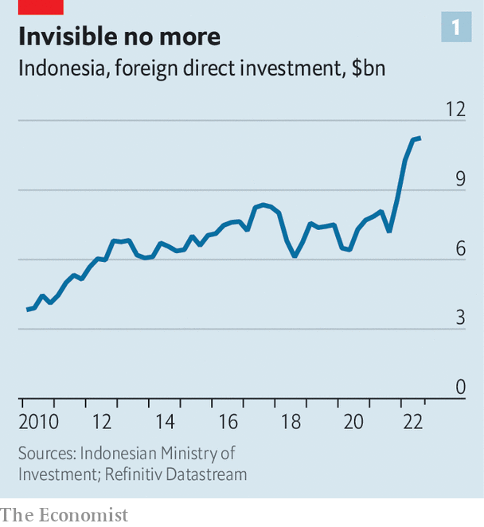
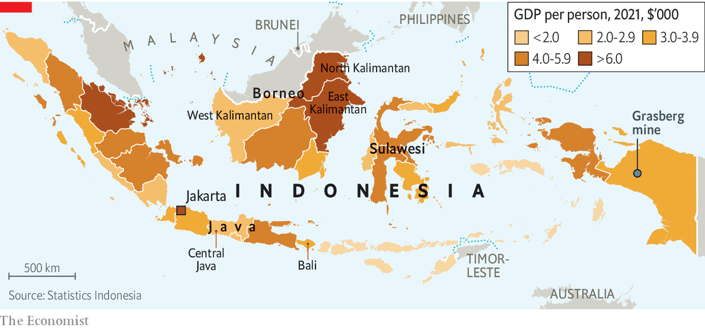
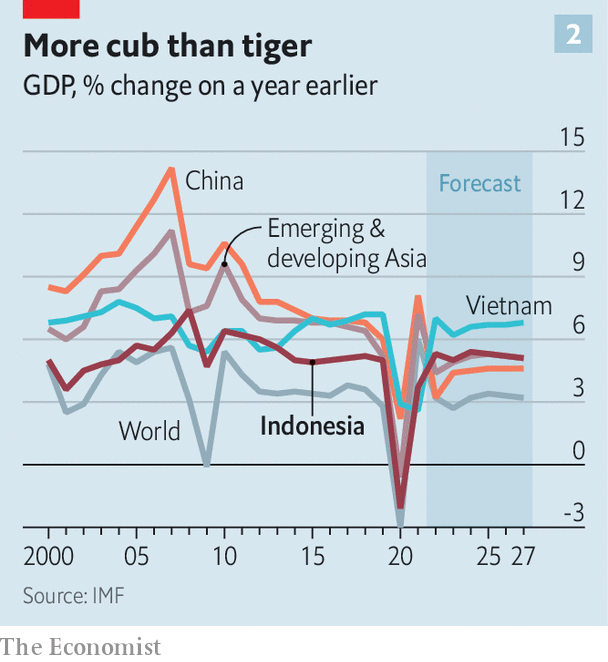
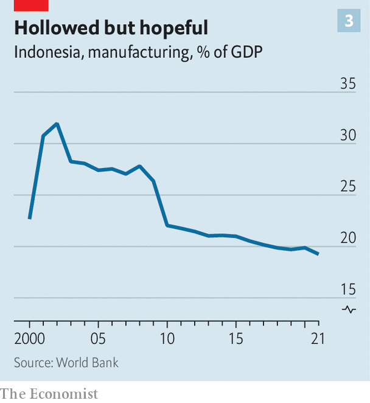

###### Thousand-island progressing

# Indonesia is poised for a boom—politics permitting 

##### Inconsistent policymaking may yet undermine its progress 

 

> Nov 14th 2022 

Indonesians are used to  on the world stage. John Riady, a scion of Indonesian business, once joked that his country was the planet’s biggest invisible object. But under the bonnets of new electric vehicles (EVs) and on apps used by hundreds of millions of customers, South-East Asia’s largest economy is rapidly becoming more visible. 

Indonesia holds more than a fifth of the world’s nickel, a crucial component of the batteries used in electric vehicles. The only other country with similarly big reserves is Australia. Indonesia is also the world’s third-largest source of cobalt, another vital input. Analysis by  suggests that by 2030, Indonesia will probably be the fourth-largest producer of  commodities in the world, behind only Australia, Chile and Mongolia. The government hopes this abundance of essential resources for the global energy transition can fuel an economic revival, accelerating growth and arresting two decades of deindustrialisation.

“We want to be the main players in the EV battery industry,” says Joko Widodo, Indonesia’s president of eight years, known almost universally as Jokowi. As the host of the  this week in Bali, he is eagerly advertising his country’s openness to foreign investment.

But Indonesia’s natural resources are not the only factor that might spur faster growth. Jakarta, the capital, has become one of South-East Asia’s most successful incubators of new technology companies. That in turn has raised hopes that Indonesia’s difficult geography—it is a vast archipelago of thousands of islands—can be surmounted by digitisation.

Indonesia has much to recommend it to foreign investors. It is young: 26% of the population is under 15, in stark contrast to ageing East Asia. It has also maintained a careful diplomatic neutrality for decades, making it a plausible destination for both Chinese and Western investment—one area in which its otherwise frustrating international anonymity provides an advantage. It is the world’s fourth-largest country by population, with 276m people, and so a gigantic market. And although it is only the world’s seventh-largest economy after accounting for the cost of living, and 16th at market exchange rates, it is steadily climbing up the rankings.

A surge in foreign investment, especially in metals-processing, has provided the most obvious boost to growth in recent years (see chart 1). In 2014, just before Jokowi’s first term in office, Indonesia banned the export of unrefined ore. “Industrial down-streaming is very important for Indonesia, to allow the raw material to be processed domestically,” Jokowi . Although the policy runs counter to free-market orthodoxy and initially led to the closure of many mines, thanks to Indonesia’s clout in the nickel market in particular, it is yielding results. 

 


The island of Sulawesi illustrates the policy’s success. Construction at the Morowali Industrial Park began in 2013, and the area now hosts at least 11 working smelters. The project was little known even in Indonesia when it began, spearheaded by China’s Tsingshan Group, the largest producer of nickel in the world. It has since become a centrepiece of the country’s industrial strategy, with a cumulative $18bn invested by several companies. 

Another mineral that is beginning to be processed domestically is bauxite, the ore that is refined into aluminium. A big refinery is under construction in the province of West Kalimantan, on the island of Borneo. In North Kalimantan, Adaro Energy Indonesia, a coal-mining firm, is building a hydropower plant, which should allow it to produce “green” aluminium, smelted using low-carbon energy.


The investment extends beyond metals-processing to manufacturing. On the island of Java, home to half the population, a South Korean battery firm, LG Energy Solution, and Hyundai, a carmaker, began building Indonesia’s first EV battery-cell plant late last year. The government wants Tesla to follow and has offered the company land for a big factory in Central Java.

There are local initiatives, too. Electrum, a joint venture between TBS Energi Utama, a conglomerate, and Gojek, a huge ride-hailing and delivery service, aims to begin building an electric-motorbike factory in the second half of 2023. The new venture has partnered with Gogoro, a Taiwanese firm that has pioneered battery-swapping stations for electric motorbikes and mopeds. “It’s the future for us,” says Pandu Patria Sjahrir of tbs, which began life as a coal-mining firm. “Business and government think alike on this, and you have a large domestic market which helps things move faster.” 

The second force improving Indonesia’s economic outlook is a rapidly growing consumer-tech industry. This digital boom should help reduce the gargantuan logistical costs that Indonesia’s geography imposes. The eastern and western tips of the country are almost as far apart as London and Kabul. The population is spread across some 6,000 islands, some densely forested and sparsely populated, others teeming with people, farms and factories, almost all of them mountainous. Jakarta’s GDP per person has risen to around $19,000. In central Java, a mere 230km away, it is below $3,000, and some far-flung islands are even poorer (see map). 

 


Several startups are removing the middlemen that proliferate in every physical industry. Kargo Technologies, which launched in 2019, operates as a truck-hailing firm connecting shippers with Indonesia’s army of truckers. Tiger Fang, one of the company’s founders, was the general manager of Uber’s operations in Indonesia. His former boss, Travis Kalanick, has invested. GudangAda, an online marketplace for consumer goods, connects wholesalers direct to millions of tiny retailers. With 600 distribution centres across the country, it removes many layers of intermediaries who pushed up costs and eroded margins. 

Even as interest rates have risen this year and investors have backed away from emerging markets, Indonesian tech firms have continued to raise money. East Ventures, an Indonesian venture-capital firm, raised $550m for a fund in May. AC Ventures, another firm, raised $250m for its fifth fund in September. Indonesia has become a lasting, if small, element in the portfolio of many big private-equity investors, including KKR and the Carlyle Group. 

GoTo, the product of the merger in 2021 of Gojek and Tokopedia, an e-commerce outfit, is the behemoth that bestrides Indonesian tech. Its turnover is equivalent to around 3% of Indonesian GDP. The hope is that other local tech firms will prosper on a similar scale by ironing out the economy’s many inefficiencies. 

The third factor propelling Indonesia’s growth has been sound macroeconomic management. The finance minister, Sri Mulyani Indrawati, is a respected former managing director of the World Bank. The government restored its pre-pandemic deficit cap of 3% of gdp in its latest budget, winning praise from the IMF. Government debt is low and little of it is denominated in foreign currencies.

The central bank’s reserves, of around $130bn, are plentiful. The currency, the rupiah, has dropped by 9% against the dollar since the beginning of 2022, far less than most of its counterparts in emerging markets. Whereas rising interest rates have sucked capital out of other developing countries, Indonesia’s current account has swung from sustained deficit to surplus, as demand for its natural resources has risen. Of particular pride is this year’s trade surplus with China, the first in more than a decade.

But Jokowi has bigger ambitions. Indonesia’s economic output has grown by a respectable 4.9% a year since the turn of the century, well above the global average of 3.6%. But its expansion has been overshadowed by faster-growing economies: China’s gdp per person rose by an average of 8.7% a year over that period, and Vietnam’s by 6.3% (see chart 2). The president first won election on a pledge to raise the growth rate to 7%.

 


Jokowi’s early focus was infrastructure. He likes to rattle through a list of concrete-heavy projects: 16 new airports, 18 ports and 2,100km of toll roads—more than two-and-a-half times the 821km built between 1978 and Jokowi’s election in 2014, according to official statistics.

Next Jokowi plans an invigorating spurt of deregulation. The sprawling Omnibus Bill, in the works since 2019, will ease restrictions on foreign investors. The number of industries on the “negative list,” which are fully or partially closed to foreign investment, will be reduced from 391 to 95. The process of licensing will be streamlined, with online applications replacing labyrinthine discretionary systems.

The law also liberalises Indonesia’s fearsome labour laws. Hiring and firing will become much easier. Industry-wide minimum wages will be scrapped in favour of provincial rates tailored to local conditions. 

The Omnibus Bill was approved by parliament in 2020 despite big protests, only to be thrown out by the courts on procedural grounds. The government hopes to usher a revised version through parliament again in the next few months. If it succeeds, doing business in Indonesia will become much easier, especially for foreign investors.

There remain two big risks, however, which could divert Indonesia from this heartening trajectory. The first is that reforms do not last. Jokowi himself is an inconsistent policymaker. As governor of Jakarta in 2013, he spooked business with a whopping 44% rise to the minimum wage. In 2018 his government bullied Freeport McMoRan, an American mining firm, into selling it a controlling stake in Grasberg, a gigantic gold and copper mine in the Indonesian half of New Guinea. 

He has relied mainly on state-owned enterprises to build all his new infrastructure, incurring big debts for which the state is liable but which do not appear on the government’s books. Four publicly listed but state-controlled construction firms for instance, had debts of 128trn rupiah ($8.2bn) in the middle of 2022, up from around 7trn in 2013. The construction of a new capital, Nusantara, in the jungles of Borneo, a pet project of Jokowi’s, is likely to burden state-owned enterprises with yet more debt. Foreign investors are also being courted to finance the project, officially estimated to cost $34bn. But many worry about whether Jokowi’s successor will stick with such an expensive white elephant.

One minister in particular symbolises the ambiguous stance of Jokowi’s government: Luhut Binsar Pandjaitan, the co-ordinating minister for maritime affairs and investment, and a former chief of staff to Jokowi. His vague title belies a broader role as a fixer for big business. He is the first name on the lips of optimistic investors, foreign and domestic, who view him as a canny ally. In their telling, his network of bureaucrats and businessmen has been crucial to the recent leap in private investment.

But Mr Luhut’s circle is undoubtedly clubbish. Mr Sjahrir, of tbs, is his nephew. Erick Thohir, the minister of state-owned enterprises and former chairman of Inter Milan football club, is the brother of Garibaldi Thohir, president director of Adaro, the firm seeking to power green aluminium smelting in North Kalimantan. Unlike Jokowi, Mr Luhut is a long-standing member of the elite, having served as a general in the era of Suharto, Indonesia’s dictator for 32 years. He owns a coal mine. 

Earlier this year Mr Luhut aired the idea of ending the two-term limit on the presidency, which was introduced after Suharto’s fall in 1998. The proposal would have paved the way for Jokowi to perpetuate himself in power, but was quickly shot down by Megawati Sukarnoputri, a former president who is still the leader of Jokowi’s political party.

The assumption in Jakarta is that Jokowi, despite having publicly disavowed the idea of extending his time in office beyond the end of his term in 2024, is still looking for a way to do so. There is talk of constitutional fiddles such as a state of emergency to forestall elections, or of the president running for vice-president with a close ally at the top of the ticket (although Jokowi explicitly ruled this out when speaking to ). Even those who are positive about his record are scathing in private about his rumoured reluctance to leave office. A senior bureaucrat says that democracy will not survive if he finds a way to remain president.

And even if Jokowi does step down on schedule, his potential successors will not necessarily manage the economy as well as he has. Candidates need the support of at least 20% of mps to stand, so the likely roster is quite small and reasonably predictable. Prabowo Subianto, the defence minister, who lost to Jokowi in the past two elections, appears likely to run again. The former general, who has been accused of human-rights abuses in East Timor during the 1980s, has softened his strongman image somewhat in recent years—but he still makes an unlikely reformer.

Anies Baswedan, the governor of Jakarta until October, is another likely candidate. He became governor with the support of Islamic agitators and conservative voters, which worries non-Muslims, including the many Chinese-Indonesians who are prominent in business. Mr Anies himself is of a mild, bookish mien, however, and his supporters insist he would govern technocratically. Jokowi’s candidate, if he does not run himself, is likely to be Ganjar Pranowo, the governor of Central Java and a member of the same party as the president, the Indonesian Democratic Party of Struggle (PDI-P). None of these candidates has expressed strong views on Jokowi’s economic reforms or clear plans of their own. Investors, foreign and domestic, will probably be left guessing as to their intentions even as election campaigns begin.

This vagueness makes the second big risk to Indonesia’s promising new economic outlook all the more salient, and that is the country’s weakness for economic nationalism. The decision to ban exports of raw ore worked to encourage more nickel-processing largely because Indonesia has such big reserves of the metal, demand for which is rising sharply. But attempts to apply a similar logic to other exports will probably end in failure. The bauxite industry, for instance, is only just beginning to recover from the export ban of 2014, which had to be temporarily reversed after producers responded to it by shutting mines and moving to other countries rather than build new refineries in Indonesia. 

Comments like those of Bahlil Lahadalia, the investment minister, who suggested in October that the country might look to establish a cartel equivalent to OPEC for the battery metals industry, only compound that concern. Muhamad Chatib Basri, a former finance minister during whose tenure taxes were raised on exports of raw minerals to encourage miners to invest in processing, says there are limits to how far mining companies can be prodded to move downstream. “You can’t forget about competitiveness while doing industrial policy,” he argues.

Indonesia used to be an archetypal Asian tiger in the 1980s and 1990s, with booming manufacturing and exports. But manufacturing’s share of gdp has fallen steadily over the past 20 years (see chart 3), owing both to the political and economic turmoil that followed Suharto’s fall and also to the rise of rival cheap manufacturing hubs in the region, such as Vietnam. Securing a share of the booming market for components of electric vehicles may slow the decline; it is unlikely to reverse it. 

 


To do that, Indonesia will need to capture some of the investment in manufacturing that is migrating from China to other parts of the developing world. So far, little seems to be coming. Apple has 26 suppliers in Vietnam, 20 in Malaysia, 18 in Thailand, 16 in the Philippines and 11 in India. In Indonesia, it has only two.

Exporters gripe that the country still thinks of trade mostly in zero-sum terms. Its participation in global value chains is below the world average, whether measured by trade or production. It is the only big economy in South-East Asia for which that is true, according to research published by the Asian Development Bank. What’s more, it is one of a very small number of countries where the level in 2019 was lower than in 2000 or 2010. Exports have slumped relative to GDP, from an average of around 30% in the 1990s to 22% last year.

The World Bank’s final report, published last year, suggested that exporters faced a combined 117 hours of checks and paperwork for each consignment of goods leaving the country, far higher than the figures for India, Malaysia, Thailand or Vietnam. And this is an area where the Omnibus Law will not transform the overall picture. 

Indonesia may still attract scant attention internationally, but the outlines of a more visible economy are increasingly clear. Its nickel deposits alone all but guarantee it a leading part in the booming electric-vehicle industry, which is still in the early stages of a decades-long expansion. In areas where the country has fewer natural advantages, the future is still blurry. Filling in the detail will require continued, painstaking reform—and so an unusual degree of far-sightedness from Indonesia’s politicians. ■

