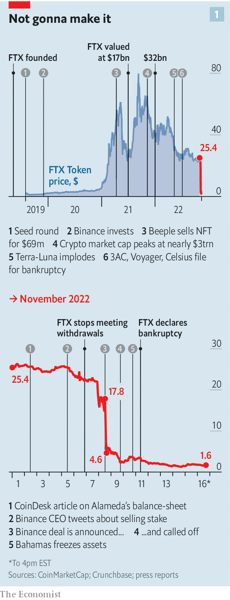
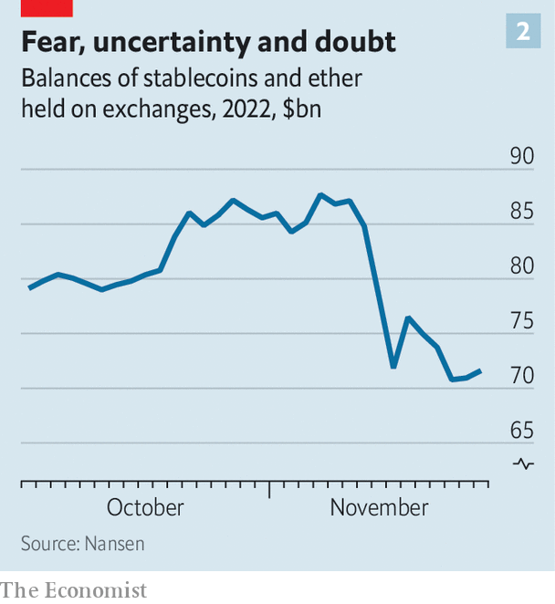

###### Crypto’s crisis

# The failure of FTX and Sam Bankman-Fried will leave deep scars 

##### It is harder now to assert that crypto represents the future 

 

> Nov 17th 2022 

Nobody in crypto has slept in days. That, at least, is what it feels like in the never-ending Twitter “spaces” which have been running since ftx, a Bahamas-based crypto exchange and crown jewel in the empire of Sam Bankman-Fried, its once-feted founder, filed for bankruptcy on November 11th. The scattered crypto-community often comes together in these online forums—they are where people shill tokens, organise pump and dumps, and occasionally even discuss exciting innovations. In the days after the fall of ftx and Mr Bankman-Fried’s other firms, including ftx.us, an America-based exchange, and Alameda Research, a trading firm, they became places for traders to mourn, former employees to spill the beans and other exchange operators, including Changpeng Zhao of Binance and Jesse Powell of Kraken, to try to reassure customers. 

In other words, they are places that now reek of despair—not just about the billions of dollars that are trapped on a defunct exchange, but about the architect of the mess. Mr Bankman-Fried was crypto’s golden boy. He studied physics at the Massachusetts Institute of Technology and was supposed to have learned the craft of marketmaking and trading at Jane Street, an elite financial firm. It was this, along with the fact that ftx gobbled up market share after it was founded in 2019, that attracted investors like Sequoia, considered one of Silicon Valley’s sharpest venture-capital firms, and Temasek, Singapore’s sovereign-wealth fund. Mr Bankman-Fried used his credentials and newfound wealth—ftx was worth $32bn at its peak in January—to donate to politicians, push his views on regulation and buy up competitors. He was supposed to be crypto’s future. Instead, he may have robbed the industry of one. 

It was possible to get very rich, very fast in crypto. A certain type of winner got lucky, bought Lamborghinis and justified their riches by belligerently asserting that blockchain technology or bitcoin was the future. Those who disagreed got the now-familiar rejoinder: “Have fun staying poor.” It is tempting to see comeuppance in every scam, failure or hack that befalls the industry. The failure of ftx is certainly the closest thing to a death blow it has faced.

Everyone in ftx’s orbit has suffered a financial hit, but the real wound cuts deeper. Mr Bankman-Fried has let down supporters, embarrassed investors and made fools of politicians. He has also damaged and exposed flaws in , a movement that aims to safeguard humanity’s future, and to which he donated time and money. The result of the mess will be less sympathetic regulators. Institutions and punters who embraced crypto will shun the Wild West.

The details of precisely what went wrong at ftx will spill out in bankruptcy proceedings and possibly criminal ones over the coming months and years. But the early evidence, in particular a balance-sheet obtained by the , does not make for pretty reading. In the spreadsheet, which metadata suggest Mr Bankman-Fried created, ftx appears to hold about $1bn of real money or money-like assets, including currencies and stablecoins (crypto-tokens pegged to the dollar), against some $9bn of liabilities owed to customers. Mr Bankman-Fried claims to hold an additional $3.5bn in equity or venture investments. Almost everything else on the balance-sheet—assets claimed to be worth around $5bn—are either tokens ftx minted itself, had a hand in creating or those known in the vernacular as “shitcoins”, which are not worth the energy needed to render the pixels on a screen. To add insult to injury, ftx has since lost most of its liquid assets, worth around $500m, in a hack that seems to have been orchestrated by an insider. 

Astute readers may notice this is not how an exchange should work. Normal ones hold customer deposits, not a mix of venture investments and tokens. Then there is an apparent hole in the accounts. In a grovelling note left in them seemingly by Mr Bankman-Fried, the writer claims not to have realised $8bn was missing, an amount worth more than half that deposited in the firm’s care. This is put down to a “poorly labelled” internal account. 

In messages published by Vox an online publication, Mr Bankman-Fried said ftx had directed customers to send money directly to Alameda but never checked it got passed along (Mr Bankman-Fried has since tweeted he thought the messages were private). This does not tally with what Caroline Ellison, chief executive of Alameda and reputedly a former girlfriend of Mr Bankman-Fried, is reported to have mentioned on a call with colleagues on November 9th. According to the , Ms Ellison said that she and Mr Bankman-Fried knew of a decision to move ftx customer funds to Alameda. Since Mr Bankman-Fried resigned from ftx on November 11th, the firm has declined to comment, but on November 16th the new boss issued a statement pointing out Mr Bankman-Fried has no role at ftx or Alameda and does not speak on the firms’ behalf.

To the moon...and beyond

The balance-sheet of Alameda—information about which has been reported by CoinDesk, a news website—appears similarly full of holes. It shows the trading firm owed $8bn in loans and that its assets again consisted largely of tokens created by ftx. Combining the two balance-sheets in a rough calculation, it appears that before things went south, Mr Bankman-Fried’s firms had taken in around $14bn of deposits, borrowed $8bn and raised almost $2bn of equity capital from investors. His firms gave back $5bn to those savvy enough to run away fast, and probably hold around $5.7bn in equity and venture investments plus $1bn in cash. This means a hole of perhaps somewhere between $4bn and $12bn, depending on how much of Alameda’s debt is owed to ftx. Mr Bankman-Fried insisted on November 15th that the trading firm’s problem was liquidity, not solvency, because it held lots of illiquid but valuable assets. But the balance-sheets appear to have exposed what Mr Bankman-Fried counts as a valuable asset.

How did Alameda lose so much money? It was clearly using leverage. In April last year a former employee tweeted the firm was taking long positions on crypto assets based on “narrative market-drivers”, such as Elon Musk’s tweets. Presumably such leveraged positions worked well until November last year, when crypto prices peaked, at which point things went downhill. Transactions that occur on a blockchain are public, meaning it is possible to look for evidence of when Alameda appears to have needed to tap ftx’s customer funds. Nansen.ai, a blockchain-explorer company, has identified wallets belonging to the firms. Analysis of them cannot provide a complete picture. Both firms could create new wallets on a whim; many transactions were directed through other trading firms, muddying the trail. Still, the wallets suggest Alameda blew up over the summer at the same time as other crypto firms, such as Three Arrows Capital, a hedge fund, and Voyager, a lending platform—and that Mr Bankman-Fried bailed out Alameda by lending it customer funds. 

The idea Alameda blew up in May or June may help explain why Mr Bankman-Fried swooped to rescue firms like Voyager. He may not, as was thought at the time, have considered himself the next John Pierpont Morgan, a banker who saved the American financial system in 1907. Instead, he may have been backed into a corner. Alameda is reported to have borrowed money from Voyager. If the lending platform had been liquidated it would have exacerbated problems at his fund.

The only way out would have been to bet big or raise money. According to reports, Mr Bankman-Fried has been trying to raise capital since the summer. He flew to Abu Dhabi two weeks ago in an apparent attempt to drum up interest. When his problems became acute, he called Sequoia and other early investors. He even tried Binance, owned by his great rival, Mr Zhao.

There is also more cynical speculation about what happened. One suggestion is that Mr Bankman-Fried may have used customer funds not just as a solution to a problem. Perhaps Alameda had been relying on ftx as its piggy-bank all along: depositing the exchange’s own tokens as collateral in order to move more reliably valuable crypto, like bitcoin or ether or stablecoins, to Alameda for trading purposes. 

 


It is a view which Mr Bankman-Fried’s words appear to support, if not insurmountably prove. In an interview with Bloomberg, a news website, he described how to build a token in order to borrow against it. He suggested making the number of tokens traded low relative to the number issued, thus making it easier to pump up the market capitalisation. For a token in theory worth $20m, “Maybe there hasn’t been $20m that has flowed into it yet”. But “You can ...finance this, right? You put X token in a borrow-lending protocol and borrow dollars with it.” Mr Bankman-Fried then described how, once these tokens have been deposited as collateral for a loan in exchange for dollars, “If you think it’s worth less than two-thirds of that, you could even just put some in there, take the dollars out. Never...give the dollars back.” He gave this description of borrowing real dollars he would never give back against a low-float, imaginary token on April 25th—two months before Three Arrows Capital was liquidated, and Alameda’s problems seem to have started.

It is this kind of public theorising that has made some even more suspicious. Regulators and law-enforcement agencies, including the Department of Justice and the Securities and Exchange Commission are investigating, along with authorities in the Bahamas. Mr Bankman-Fried may be flown to America for questioning; Congress plans to force him to testify in December about what went wrong. In crypto-forums, thousands of conspiracy theories are being traded. 

Still, the theory for which there is most evidence is the one Ms Ellison seemed to outline to Alameda’s staff on November 9th: that the trading firm had taken on leverage and was struggling to meet its liabilities in the summer, at which point the decision was taken to move over customer funds from ftx. The tale is one that makes plain why regulators tend to split up these kinds of firms in the world of traditional finance. Retail brokers, which take in customers’ deposits and hold their assets, are segregated from exchanges, the venue in which customers trade assets, which are in turn segregated from marketmaking firms, such as banks and hedge funds. 

ftx was an offshore exchange which, like Binance and others, had studiously avoided locating itself in a strict regulatory regime. (Its American counterpart, ftx.us, has also filed for bankruptcy, but seemed to face fewer problems redeeming customer assets.) Thus its blow-up is not straightforwardly the fault of poor American regulation. Nevertheless, Alesia Haas of Coinbase, another crypto exchange, argues a lack of regulatory clarity in America “pushed volumes offshore”, meaning more American customers will end up hurt by ftx’s implosion. She argues that rules making it clear how and where digital-asset exchanges ought to be registered would help. There are several bills floating around Congress that would do just that. They will surely have fresh impetus now.

 


The events also reveal just how interconnected crypto is, and the vulnerability this brings. When one large project (the Terra-Luna stablecoin system) blew up in the summer, it was enough to bring down a hedge fund and two lending platforms, which was in turn enough to bankrupt one of crypto’s biggest exchanges. This dynamic has been supercharged by the failure of ftx, which already seems to have taken out three smaller exchanges, aax, BlockFi and Liquid, as well as a lending platform, Genesis. Other exchanges faced enormous withdrawals (see chart 2). Given that it took around six months for the fallout of the summer’s blow-up to hit ftx, the stage is now set for more blow-ups. 

The bigger question the events raise is whether crypto is a cause for which it is worth fighting. ftx is just the latest and biggest in a long line of multi-billion dollar projects, businesses and funds that have gone spectacularly bust. Hacks and scams are commonplace. “Why bother with any of this?” is a reasonable question. It is an indictment that, almost 14 years after bitcoin was created, there are only a handful of use cases for crypto, such as firms paying workers in countries suffering from hyperinflation, like Argentina, or efficient decentralised exchanges and lending tools. Even these seem at present to offer only moderate improvements over more old-fashioned forms of finance. 

Diamond hands

Among the developers who work on the software powering the Ethereum blockchain, or those building applications on top of it, the promise of crypto has never seemed greater. In October, at a crypto conference in Colombia, Danny Ryan, an Ethereum developer, pleaded with the audience to work on functions and applications other than those related to finance. And that is the direction many are taking, especially now that efficient, scalable blockchains are beginning to emerge. Stani Kulechov, the creator of Aave, a decentralised-lending protocol, is building a social-media platform that would allow people to port their followers from application to application, thus allowing them to quit a platform without losing clout. The Gitcoin platform allows people to vote on grants to be distributed to so-called public-goods projects, like open-source software.

Much of crypto is just a casino—and thus high-octane, shiny and tempting. Mr Bankman-Fried positioned himself as the champion for the less dubious end of the industry. But it is now clear he actually ran one of the most dubious casinos of all. With his empire in ruins, crypto advocates must hope it is the underlying technology’s turn to shine. ■


