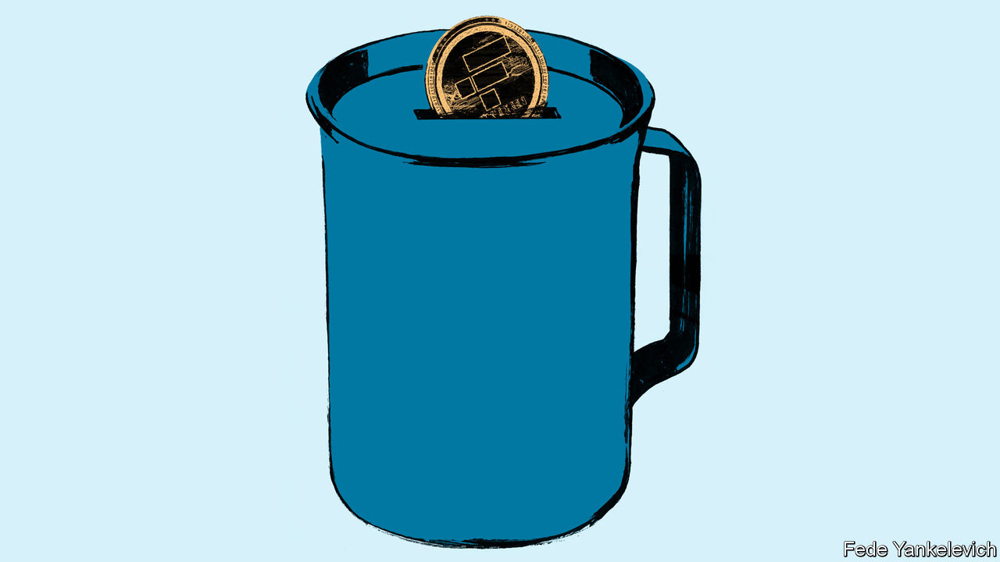
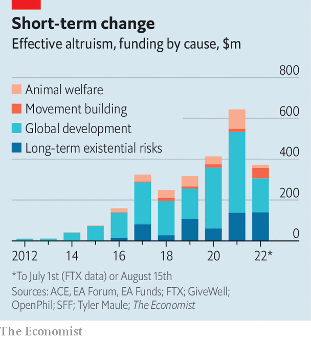

###### EA Games

# What Sam Bankman-Fried’s downfall means for effective altruism 

##### FTX’s implosion puts the movement in the spotlight 

 

> Nov 17th 2022 

Sam bankman-fried explained a curious belief in an interview earlier this year. The boss of ftx, a now-bankrupt crypto exchange, was asked by Tyler Cowen, an economist, what it means to him to be “risk neutral”. The concept is one used by investors who wish to be just as open to good surprises as bad ones. But Mr Bankman-Fried applies it more widely.

What would he do, Mr Cowen continued, if given the choice between two options. One (with a 51% probability) doubles the number of worlds in existence; the other (with a 49% probability) wipes out our world and any others. Mr Bankman-Fried ummed and ahhed. Mr Cowen noted he could repeatedly offer the same options, surely wiping out the world by the end of the game. Would this not make taking the risk an example of a “St Petersburg paradox”, in which maximising gains leads to a nonsensical conclusion? Mr Bankman-Fried countered that it might also lead to “an enormously valuable existence”.

Mr Bankman-Fried’s sudden fall from grace has cast a spotlight on effective altruism, a burgeoning movement to which he belongs. As an effective altruist, he seeks to maximise expected utility, even if doing so presents uncomfortable trade-offs. He has promised to give away his lifetime earnings, which he was making good on by pouring money into effective-altruist causes at the time of his downfall. The blow-up has raised hard questions. Was he motivated by the movement’s goals? Why did its leading lights not see this coming? And what now for effective altruism?

Effective altruism is both a social movement and research agenda aimed at maximising the good done with one’s time and money. It counted 6,500 active members in 2019. But the number of adherents seems to have shot up since then, and its ideas have been popularised in bestselling books by William MacAskill, an Oxford philosopher. Followers are drawn from elite universities, with nearly one in ten having attended Oxford or Cambridge. Many have a penchant for estimating expected values and writing long, introspective blog posts. The movement’s careers-advice arm guides youngsters on how to find the most “high-impact” careers. It is not hard to see why critics see it as something of a cult.

Until recently, even the most ardent critic would have said effective altruism was a pretty harmless one. The downfall of Mr Bankman-Fried, who has been apparently dedicated to the cause since his time at university, has led to a reckoning. Not only has effective altruism lost its wealthiest backer; its reputation has been tarnished by association. Many inside and outside the community are questioning its values, as well as the movement’s failure to scrutinise its biggest funder—something particularly painful for a group that prides itself on logically assessing risk.

The greatest happiness

Mr Bankman-Fried’s life story is intertwined with the history of effective altruism. The movement, which took inspiration from the utilitarian ethics of Peter Singer, a philosopher, was formally established in Oxford in 2011 by Mr MacAskill, a mentor to Mr Bankman-Fried, along with colleagues. Effective altruism was initially focused on helping poor people around the world, albeit in unusual ways. Effective altruists often advised graduates to “earn to give”—ie, to make lots of money and then donate it. More effective to be the banker who buys millions of bed nets than the guy who hands them out, or so the logic went.

According to a profile of Mr Bankman-Fried published by Sequoia, a venture-capital firm that invested in his crypto exchange, Mr MacAskill nudged Mr Bankman-Fried to take a trading internship so he could earn to give. After a few years in finance and a stint at the Centre for Effective Altruism, Mr Bankman-Fried corralled some fellow effective altruists to start a crypto firm. “This thing couldn’t have taken off without ea,” said a colleague. “All the employees, all the funding—everything was ea to start with.” Nine of Mr Bankman-Fried’s inner circle, mostly effective altruists who worked with him, lived with him in the same Bahamian penthouse. 

The crypto boom of 2020 and 2021 propelled Mr Bankman-Fried’s wealth and status. At his peak, he was worth $26bn, making him effective altruism’s richest big donor, at least on paper (the other big one is Dustin Moskovitz, a co-founder of Facebook). His rise preceded Mr MacAskill’s latest book, “”, which was published in August. This made the case for “long-termism,” a view that emphasises the fact most human lives will be in the future. As Mr MacAskill writes, “distance in time is like distance in space.” If people matter 1,000km away, they matter 1,000 years away. Long-termists seek to cut the risk posed by things like rogue, powerful artificial-intelligence.

 


Mr Bankman-Fried claimed to be a long-termist, and spent a lot of money advancing the cause. In 2015 nearly all effective-altruist spending went to global development. This year nearly 40% went to minimising existential risk (see chart). Mr Bankman-Fried’s “ftx Future Fund,” which was launched in February, disbursed $130m in its first four months, mostly to long-termist causes. So fast was the spending, some altruists believed the movement was no longer “funding-constrained”—it had so much money, the only problem was finding talented people who could make good use of it.

He also became a big donor to Democrats—along with his firm giving $110m in the run-up to the midterm elections—and donated smaller sums to Republicans he thought would help prepare for pandemics. He backed an advocacy group run by his brother, Guarding Against Pandemics, which became well-known in Washington. Money, politics, media campaigns, bestselling books: little wonder Mr Bankman-Fried, Mr MacAskill and effective altruism were everywhere from adverts on the London Underground to the covers of and . Effective altruism had peaked. 

That may be why Mr Bankman-Fried’s fall has caused such shock waves. On an online forum, Mr MacAskill wrote he was “outraged” at the harm Mr Bankman-Fried had caused and felt “sadness and self-hatred”. In private, many effective altruists say they are “betrayed” or “humbled”. “Maybe risk neutrality makes sense in some abstract way,” says an employee at an effective-altruism-backed charity. “Not when other people are depending on you.” 

Democratic strategists are mourning the loss of their big donor. The Future Fund’s collapse will leave nascent organisations in the dust. Kevin Esvelt of the Massachusetts Institute of Technology, and a co-founder of SecureBio, a bio-risk outfit that received a grant from Mr Bankman-Fried’s fund, says the collapse will set back work on pandemic preparedness. 

A hiring opportunity

ea is now funding-constrained. As one poster on an online forum puts it: “Back to earning [to] give I guess, I’ll see you guys at the McKinsey office.” The loss of trust may be more damaging for effective altruism’s long-term prospects than the loss of money, however. The problem is simple. As Mr Moskovitz wrote: “Either ea encouraged Sam’s unethical behaviour, or provided a convenient rationalisation for such actions.” Josh Morrison of 1Day Sooner, a public-health charity part-funded by Mr Bankman-Fried’s fund, worries that, “Fewer people may call themselves ea, and we may see fewer college students sign up.” 

In messages with Vox, an online publication, published on November 15th, Mr Bankman-Fried claimed his ethical positions were “dumb shit”; a move to gain a better reputation and impose his version of “good” on the world. To do this, he sought to win “by this dumb game we woke Westerners play”. The question now is exactly what he meant by “good” and which ethical positions he was disavowing.

The decline of Mr Bankman-Fried taps into existing , namely that it is too centralised and insular—and that this stifles dissent. Many spoken to for this article, including some who did not call themselves effective altruists, asked not to be named for fear of blowback. Two say there was talk in their social groups about unethical behaviour by Mr Bankman-Fried, including a lack of transparency in the relationship between his crypto firms, well before the ftx blow-up. 

Perhaps Mr Bankman-Fried’s money provided an incentive not to look too closely. The hope is this may be the fiasco to get effective altruism to finally change, says one adherent: “If ea is willing to suffer public criticism over this, I think that is a totally viable pathway to reform.” Effective altruists do not just need new funding. They also need new ideas. ■

