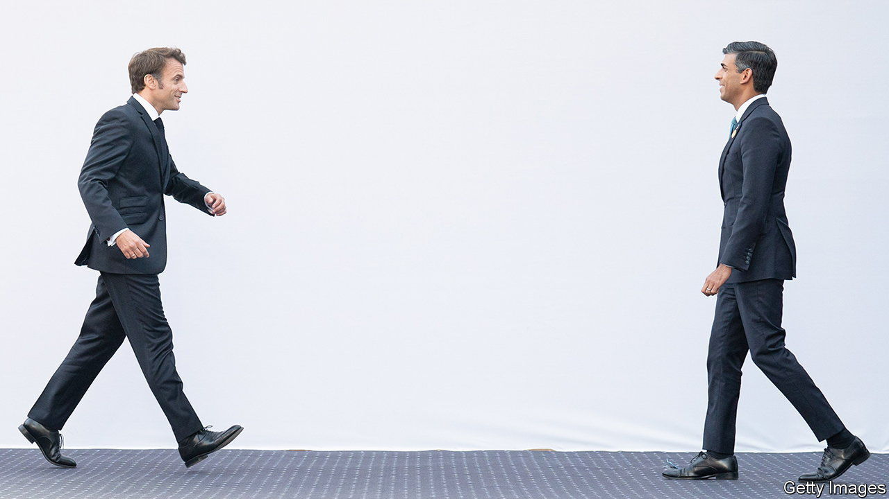

###### Cross-channel relations

# A tentative reset of Britain’s relationship with France 

##### Le bromance, or le wishful thinking? 

 

> Nov 17th 2022 

Billed as “historic”, the deal signed in Paris by the British home secretary, Suella Braverman, and her French counterpart, Gérald Darmanin, had the main virtue of taking place. Meeting on November 14th, the pair agreed to work together to curb “” crossings from the beaches of northern France to the British coast. So far this year 40,000 migrants have taken this perilous route, preferred by traffickers after security was tightened on ferry and tunnel crossings. Britain will pay France £63m (€72m) a year, or 15% more than currently, to have more French police patrolling the coast. France will allow British police to monitor such operations.

In reality, the agreement is in line with previous deals and will not stop traffickers plying their trade, although it may help to limit crossings. It does, though, seem to embody something bigger: a tentative reset of the troubled relationship between Britain and France. This tie has in recent years been marked by cross-channel finger-pointing and an utter . Boris Johnson urged the French to “”; Emmanuel Macron, the French president, privately called him a “clown”. Liz Truss could not even decide if Mr Macron was a friend or a foe. 

Rishi Sunak, by contrast, brings a welcome note of seriousness. “Friends, partners, allies,” he tweeted breathlessly after his first meeting with the French president on November 7th, when the pair seemed to rush into each other’s arms. “A new bromance?” mused the . 

Certainly, Mr Sunak and Mr Macron have plenty in common. Of the same generation (Mr Sunak is 42 years old; Mr Macron, 44), both are the sons of medics. Both are former investment bankers and deal-makers, who were educated at top schools and arrived late in politics. Both went into government via the finance ministry, and seem more at ease handling spreadsheets than bar-room banter. With their well-cut suits, the pair even appear to share a tailor—although  could not resist querying whether Mr Sunak, with his short trouser leg, wears the wrong size. 

In fact Paris began to reach out to London before Mr Sunak got the job—and after Mr Johnson lost it. Mr Macron sent generous messages to the “British people” upon the queen’s death. Mindful of Tory sensitivities about the European Union and France in particular, he was careful to take his fingerprints off an invitation to Ms Truss to the first meeting of the European Political Community, his brainchild, in Prague, which she accepted. James Cleverly, the foreign secretary, was invited to the Armistice Day commemoration in Paris. 

Indeed both governments have direct cross-Channel links. An arch Brexiteer, Ms Braverman studied law at the Sorbonne, and is a fan of Jacques Brel, a Belgian crooner loved by the French. Catherine Colonna, Mr Macron’s foreign minister, was formerly ambassador in London. Roland Lescure, the French industry minister, studied at the lse; Laurence Boone, the Europe minister, went to the London Business School. Plans to do more together are in the works. Mr Macron wants to host a Franco-British summit next year, the first for five years. Unveiling a national  on November 9th he vowed to raise defence co-operation with Britain “to another level”. There is muttering in Paris about a visit by King Charles next year. 

A decision by Europe’s only two nuclear powers, and nato allies, to behave like grown-ups can only be a good thing. Mr Sunak and Mr Macron are indeed likely to find a way to do business with each other. Yet it is early days and there is still wariness in Paris. One French minister calls the relationship “better” than before, no more. “It’s a step towards a reset,” says Alexandre Holroyd, French deputy for an overseas constituency that includes Britain.

Mr Macron’s centrist pro-European politics remain far from Mr Sunak’s Brexit-driven right-wingery. He will resist any bid by Mr Sunak to use bilateral talks to bypass Brussels. And the Northern Ireland Protocol bill still looms as a big potential obstacle. “Both capitals have tried hard to make the mood music better,” says Lord Peter Ricketts, former ambassador in Paris; “But the idea of a bromance is ridiculous.”■


