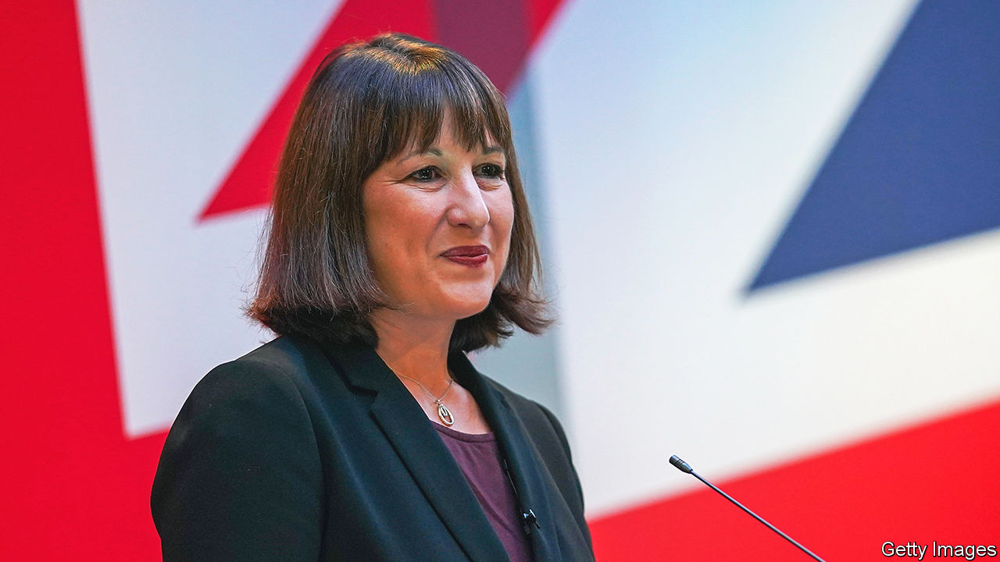

###### Labour’s industrial policy

# An interview with Britain’s shadow chancellor 

##### Rachel Reeves’s plans for a green economy 

 

> Nov 16th 2022 

When Rachel Reeves,  describes the Labour Party’s industrial policy as the “sounds and the sights of the future arriving”, she may be imagining something like the train factory run by Hitachi, a Japanese manufacturer, in Newton Aycliffe, in north-east England. Ms Reeves visited its gleaming production line on November 11th. Next year, trials will begin on battery propulsion, using systems built for family cars to power trains through the stations and tunnels of Britain’s creaking railway network. 

Whether Ms Reeves ever sees her party’s industrial policy implemented will depend in part on the fallout from the government’s  As went to press, Jeremy Hunt, the chancellor, was expected to announce tax rises and spending cuts of around £55bn ($65bn), or approximately 2% of gdp. The Conservative Party’s return to austerity offers a remarkable opportunity for Labour. Since Liz Truss, the former prime minister, inflicted grave damage on the British economy with unfunded tax cuts, which were then swiftly reversed, Labour has recouped its lead on economic management for the first time in 15 years, according to Ipsos, a pollster. Only one in three voters thinks the government has a mandate for spending reductions. 

Opportunity carries risks, too. Repairing the public finances is the chief goal of Rishi Sunak, the new prime minister. But while Ms Reeves has promised “ironclad” fiscal discipline, a general election fought over how to control public spending is not advantageous terrain for Labour. “The most important thing, and the agenda that I want to fight the next election on and lead on as chancellor, is growing the economy,” Ms Reeves told . 

At the centre of her plans is a vast package of state investment in decarbonisation, which includes insulating 19m draughty homes and creating a new state-owned energy company. It is pitched at the industrial towns that have drifted away from Labour over the past two decades. “We are not going to be doing green hydrogen electrolysis in Surrey. We are not going to be doing carbon capture and storage in Buckinghamshire,” says Ms Reeves. Instead she cites “big opportunities for Grimsby and Hull, Teesside and Merseyside, Grangemouth and South Wales, Scunthorpe and Rotherham”. The Hitachi plant is in Sedgefield, an old mining constituency represented for 24 years by Sir Tony Blair before it fell to the Conservatives in 2019. Labour have high hopes of winning it back.

How much of Ms Reeves’s plan, expected to cost a total of £28bn a year, could be delivered depends on the public finances, which have deteriorated sharply since the programme was announced in 2021. Ms Reeves stresses that the package is subject to her fiscal rules, which require debt to fall as a share of gdp.

The green industrial agenda has become a sweet spot for Labour, as it has for centre-left parties globally. It provides a modernising mission for a party that believes in state activism but has struggled to articulate an agenda for office since its proposals for wholesale nationalisation of industries were rejected by voters in 2019. 

A dash for renewable energy binds a fractious coalition of socialists, greens and security hawks. It was also once the agenda of Boris Johnson, who saw it as a recipe for holding on to seats like Sedgefield. Mr Sunak’s heart “was never really in net zero”, says Ms Reeves.

She paints a picture of Britain slipping behind its peers. The woes of Britishvolt, a battery maker that had wanted to build a factory in north-east England before it was rescued from bankruptcy, are “incredibly depressing”. She ruefully notes that President Joe Biden’s Inflation Reduction Act, which will shower $369bn in subsidies and tax credits over a decade on renewable energy and electric vehicles, hydrogen hubs and carbon capture and storage, has helped make America much more attractive to investors. Britain’s rotating cast of prime ministers, by contrast, means chief executives “just don’t know from one minute to the next what this government’s strategy is”. Labour’s supporters fret that their leadership is too cautious to win. But consistency is a popular virtue these days. ■


