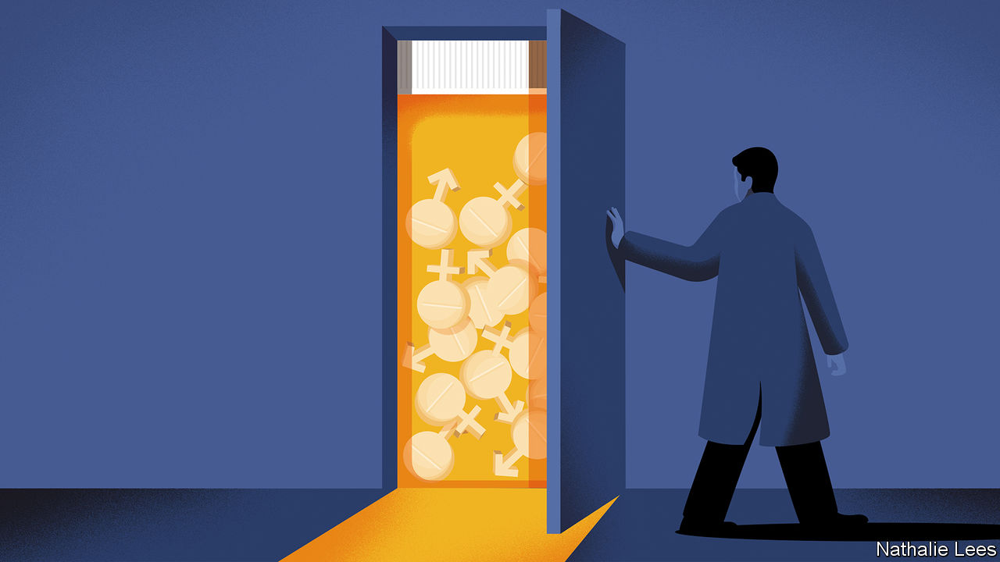

###### Body of evidence

# Britain changes tack in its treatment of trans-identifying children 

##### It may not be in time to prevent lawsuits 

 

> Nov 17th 2022 

Is britain tiptoeing away from a medical scandal? Until recently, many gender specialists in the National Health Service (nhs) treated trans-identifying children by broadly following an “affirmative” approach which accepts patients’ self-diagnosis as the starting-point for treatment. That can mean the prescription of  from early adolescence, followed by cross-sex hormones. 

But Britain now appears to be changing tack. Next spring the nhs will close its specialist  in England, the Gender and Identity Development Service (gids) at the Tavistock foundation trust in London. It will be replaced by eight regional centres in which gender services will be integrated with other mental-health services. That is partly because gids had long waiting lists. But it also reflects concerns that in the hurry to affirm gender identity, other conditions were ignored. Children with gender dysphoria often experience comorbidities, including autism, depression and eating disorders.

The impetus for the closure of gids was a review by Hilary Cass, a former head of the Royal College of Paediatrics and Child Health. Her interim report, published in February, said there was too little known about the effects of blockers, which prevent the development of secondary sexual characteristics. Dr Cass also warned that “social transition”—when a person changes their name and clothing to fit with their gender identity—is no “neutral act” but can effect “psychological functioning”.

Dr Cass’s report seems to have prompted the nhs to rethink its wider approach to gender ideology— which holds that gender identity is as important as biological sex. The affirmation model is predicated on the idea that being trans, like being gay, is innate. Yet in draft guidelines published in October the nhs cautioned that in children “gender incongruence...may be a transient phase”. This suggests that prescribing blockers to some children may have harmed them. The vast majority who take blockers proceed to cross-sex hormones; this combination can lead to sterility and an inability to reach orgasm. It is unclear when the guidelines, which could be altered, will come into effect.

Beyond the nhs, too, things are changing. This month a group of education organisations published guidance on “provision for transgender pupils”. Apparently aimed in part at protecting schools from lawsuits, it warns that making all toilets open to both biological sexes can raise safeguarding concerns and that requiring a pupil to sleep or undress “in the presence of members of the other sex” could break equality law. Its straightforward, scientific language stands in contrast to literature and training produced for schools by Mermaids, an activist charity which is also coming under increasing fire. 

The Charity Commission has launched a “regulatory compliance case” over Mermaids following reports it has promoted the use of chest binders to girls (who identify as boys) without their parents’ knowledge. Separately, a trustee of Mermaids resigned after he was found to have attended a conference for a group that supports paedophiles; a “digital engagement officer” employed by the charity was later discovered to have posted explicit photographs of himself dressed as a schoolgirl. Such revelations can be particularly distressing for trans people. Some say they fear a backlash against extreme trans activism will provoke discrimination against them. 

The way politicians speak about gender ideology is also beginning to change. Sir Keir Starmer, the leader of the Labour Party, has long tried to sidestep a furious row between trans activists and “gender-critical” feminists within his party. But in October he said that “children should not be making these very important decisions without the consent of their parents”. Trans-rights activists were livid. 

Three big concerns remain. The first is that more young people may try to buy blockers online. The nhs may be on to this: its new draft guidelines say that obtaining such drugs outside “the established protocols” may spark child-safeguarding investigations. Second, some doctors are concerned that gender specialists at the new regional clinics may continue to operate as they did at gids. It can be difficult to say “no” to giving medication that people have been told is life-saving. 

The third is that, although the nhs is already curtailing the use of hormone drugs for the under-18s, they are sometimes prescribed to adults with insufficient care. Bob Withers, a psychotherapist who has worked with young people who have regretted medical transitions, says he is particularly concerned about those in their late teens and early 20s, who may be more impulsive than older adults. A significant number of those who identify as trans are unhappily gay, he adds. 

Ritchie, a 35-year-old civil servant from Newcastle, shares that concern. Having grown up in a former mining town in the north of England where “hyper masculinity” was valued, he reckons he would have come to terms with his homosexuality had he not, when deeply unhappy and suffering from severe obsessive-compulsive disorder, stumbled across a trans forum where members told him he was “uber trans”. He went to a gender-dysphoria clinic, one of seven in Britain that serve adults. At the age of 26 he was prescribed hormones; aged 30, he had surgery to remove his penis and testicles. 

It did not take him long to realise this was a terrible mistake: “I was like, what the fuck have I done?” This feeling intensified as the surgery’s long-term side-effects became obvious. Emptying his bladder takes ten minutes. He is often in pain. At first, he assumed the responsibility was his alone. But later, reading his medical notes, he saw they were peppered with indications of mental illness. He is suing three parties involved in his transition. Further legal action seems likely. At least one law firm says it is hoping to bring a group negligence claim against the Tavistock.

Though the nhs has signalled a change of course, Mr Withers says it has more to do. It is, for example, still listed as a signatory to a memorandum of understanding on conversion therapy, published by the British Association for Counselling and Psychotherapy, which appears to conflate trans conversion therapy (which could simply mean talking therapy for gender dysphoria) with gay conversion therapy, the cruel practice of trying to turn a gay person straight. An ideological reversal is under way, but is far from complete. ■


