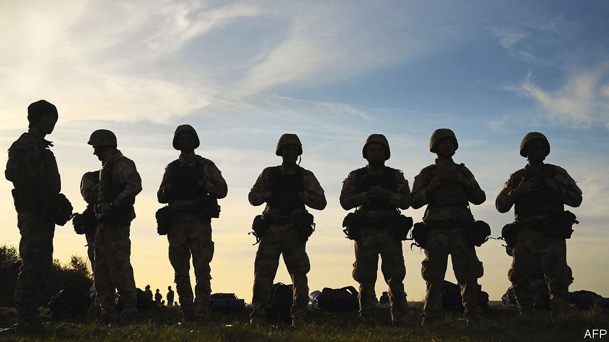
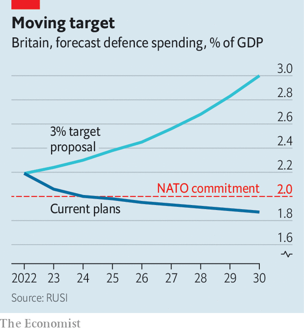

###### Straps around the barrel

# Strategic Command wants to bind Britain’s armed forces 

##### The way armies, air forces and navies collaborate has never been more important 

 

> Nov 13th 2022 

General sir Jim Hockenhull could not have anticipated a public profile when he entered the Intelligence Corps, one of the darker corners of the British armed forces, at the tail end of the cold war in 1986, nor when he was appointed chief of defence intelligence in 2018. But Russia’s war on Ukraine thrust him into the limelight. On February 16th, as Russian tanks massed on Ukraine’s border, he made a rare public statement warning that Russia was not pulling back as it claimed. The next day Defence Intelligence (di) took the unprecedented step of publishing a map depicting Russia’s possible axes of invasion. Eight days later it was vindicated. Its updates on the war are now tweeted daily. 

General Hockenhull’s role in the intelligence war won him admiration in military and political circles. He was already the first career intelligence officer ever to have acquired three stars on his shoulder (making him a lieutenant-general). In April he was handed a fourth (full general) and promoted to run Strategic Command, or stratcom, a youthful branch of the armed forces that began life in 2012 as the Joint Forces Command. It is hardly known outside the defence world. But it embodies an intellectual and practical shift taking place across Western armed forces as they grapple with the changing character of war. 

“We own what I would describe as the jewels in the crown of defence,” says General Hockenhull, in an interview with  at his headquarters in the Northwood suburb of London. The purpose of stratcom is to house, run and modernise “joint” capabilities—those that sit above the three services, or fall between them. That means some of the sexiest units in the armed forces, such as offensive cyber and special forces. It also includes lower-profile ones, like medical services, overseas bases and it, not to mention di itself.

Modern armed forces put a premium on their armies, air forces and navies working seamlessly together, including in new domains of war like cyber and space. This was once called “jointness”; the voguish term used is now “multi-domain integration”. It is jargon—but it matters. Russia’s war in Ukraine offers a cautionary tale:  proved unable to work with ground forces, and its troops have struggled with dull but vital things like logistics and communications. 

General Hockenhull’s job is to provide the connective tissue—a common vision for how the three services need to view and wage future war, and the practical means to integrate them: “It’s the metal straps around the barrel that hold the thing together.” Sometimes this is straightforward. In the build-up to war, British intelligence officers, special forces, defence attachés and other personnel in Ukraine each gathered separate insights into what Russia was up to. So stratcom built a secure communications system to bring those discussions under a single command. 

In other cases it involves bigger reforms. A decade ago DI had only 500 analysts of its own, with the bulk of intelligence capabilities dispersed within the services. The air force controlled geospatial intelligence, such as spy satellites; the army ran human intelligence operations, such as the recruitment of agents, and so on. “Everything was done on a sort of gentleman’s agreement,” says General Hockenhull. But when priorities clashed—if one service wanted intelligence on the Middle East, but the other on Europe—the result was “incoherence” and duplication. Now those capabilities have largely been centralised, with defence intelligence swelling to nearly 6,000 personnel. 

This process of integration is not always popular with the services. General Hockenhull says that stratcom has had to intervene at a number of moments where one service has purchased equipment, such as radios, that would be incompatible with that of another. The army might want to buy the cheapest drone or armoured vehicle; stratcom presses them to buy the one which can plug into wider military networks. Aircraft-carriers might belong to the navy, but they have to be able to serve as platforms for special forces and hubs for command and control. The goal is to “wring absolute maximum value out of all of those assets”, he says, even if it adds cost. “Integration isn’t free.” 

An institution like stratcom is unusual among Western militaries. In many ways, its star has risen in recent years. Five out of seven four-star officers in the British armed forces have a background in stratcom. General Hockenhull’s predecessor, Patrick Sanders, is now head of the army. Many of its constituent elements are becoming more prominent. Defence medical services played a crucial role in the covid-19 pandemic. Overseas bases—like Cyprus, Gibraltar and Diego Garcia—are increasingly viewed as “lily pads” to project power in peacetime. di has never been better known. 

The Chief of Joint Operations, who sits within stratcom at Northwood and oversees key military deployments, has also been unusually busy. Britain now has a pair of ships permanently deployed to Asia as part of its “tilt” to the Indo-Pacific. Britain’s Typhoon fighter jets have seen increasing activity; a squadron is currently in Qatar for the World Cup. Ukraine remains a priority: a new task is to repair British-supplied weapons, some of which have never been used in war before and are wearing out quickly. 

 


Underlying all this is a dramatic shift in risk-tolerance, says General Hockenhull. “Things which were previously deemed to be aggressive or potentially provocative, which would be either self-censored or ruled out in the Ministry of Defence or government” are increasingly on the table. He gives the example of Britain’s decision to send rocket artillery to Ukraine. Others activities, like the use of special forces and offensive cyber capabilities, are not publicly acknowledged. “A big calculation all the time was: this might provoke. The Ukraine experience has shifted the dial on that….people now see the value of action.” 

Not everyone agrees that the stratcom experiment has been a success. Edward Stringer, a retired air marshal who worked there as head of “joint force development” until last year, argues that the decision to exile its functions to the edge of London destroyed its clout in the Ministry of Defence head office—a salutary lesson that, in bureaucracies, geography is power. He notes that, unsurprisingly, a new and influential institution, the Secretary of State’s Office for Net Assessment and Challenge, which answers directly to Ben Wallace, the defence secretary, now does some of the tasks—such as analysing threats, conducting war games and thinking about the future of war—that stratcom was supposed to do.

While General Hockenhull is in charge of working out how British forces should fight in the future, his authority over the services remains limited: he cannot force them to radically change their equipment, exercises and plans to fit with that doctrine. In a recent paper for Policy Exchange, a think-tank, Mr Stringer argues that Britain’s armed forces consequently remain less than the sum of their parts: “the accidents of several, independent sub-forces developed by the three services…with scant ammunition in the magazine”.

Money is also getting tight. A pledge made in October by Liz Truss, the former prime minister, to spend 3% of GDP on defence has been quietly jettisoned by her successor. Mr Wallace says his priority is to prevent inflation and the falling pound from ravaging his budget. Military leaders, buoyant a month ago, are downbeat again. But a fiscal crunch makes integration all the more important. “In times of budget tightening, there’s a tendency to want to squeeze those things that some might see at the periphery,” warns General Hockenhull. “But those specialist capabilities give us the edge in modern operations.”■


