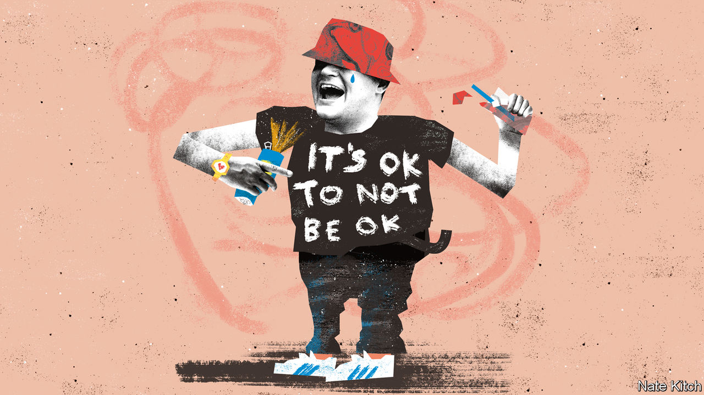

###### Bagehot

# Who speaks for the Great British Lad? 

##### The old lad is dying; the new lad cannot be born 

 

> Nov 17th 2022 

Bagehot woke up fully-clothed, face-down in a Novotel in Leicester on Saturday morning. The curtains were open and the lights were on. An evening in search of the Great British Lad had ended abruptly when two Peronis, four pints of Madri (a trendy lager aimed at middle-class football fans), a daiquiri, a woo-woo, a vodka Red Bull, two vodka lemonades and two rounds of tequila left your correspondent without time to put on his pyjamas. 

The hunt for the Lad is worthy of such in-depth reporting. In the 1990s, the Lad ruled all. There was a tv show called “Men Behaving Badly”. Effigies of England footballers were hanged after they made errors. People now regard that era as if it were as alien as the “Black and White Minstrel Show”, yet it was not long ago. Britain’s largest newspaper, the , had topless women on page three until the mists of 2015. 

Today, a different Lad is on top. Phrases such as “toxic masculinity” have gone from niche academic terms to overused. Prince Harry evolved from a party-animal squaddie into a mental-health advocate. England footballers, once dismissed as thick louts, are now hailed as thoughtful, even rather sweet boys. Advertisements have shifted from lager-soaked legends to real men talking about being depressed. (“It takes big balls to say you’re not ok” is the slogan of Big Balls gin.) As Gramsci did not put it: the old lad is dying and the new lad cannot be born; in this interregnum a great variety of morbid symptoms appear. 

Observing those symptoms is a man known online as Pu55yman_Dan, who has developed a cult following among football fans and was Bagehot’s guide for the evening. While the typical Lad professes progressive values loudly, he argues, “scratch beneath the surface, they’re not”. And so Pu55yman_Dan adopted the online persona of a football fan who tries, but fails, to fit in with the new strain of Lad.

Lads of the old regime have leapt on the new one with dizzying speed. Dapper Laughs, a notorious comedian, now posts videos imploring men to examine their mental health and check in on their mates. “You’re a geezer,” he says in one. “If you needed to hear that, I’m glad I said it.” This is some change from his previous content: among other highlights, he once posted a picture of a pair of testicles in a box of eggs. 

The new masculinity creates a peculiar moral licence. Young men realise that some abusive patter is no longer allowed, although they are not always sure which. In his hit “Doja”, which reached number two this summer thanks to TikTok virility, Central Cee, a rapper from London, attacked homophobia with lashings of misogyny instead: “How I can be homophobic/My bitch is gay”. (The 24-year-old clarified: “It’s literally what I say. I’m not homophobic. My girlfriend is bisexual.”) 

Cynicism about the corporate purveyors of the new masculinity is understandable. Companies have fallen over themselves to raise awareness of men’s mental health. As a result, it risks becoming the next health and safety: a well-meaning and potentially hugely successful policy intervention that ends up mocked. Both are about stopping men dying. It is almost entirely men who die at work; the vast majority of people who kill themselves are male. But it is odd for capital to put its arm around labour and ask “You alright, mate?” Sometimes the messenger is the problem, rather than the message. Or as Pu55yman_Dan put it to the tune of Abba: “Gimme gimme gimme a Madri at midnight/Won’t somebody help me with my men’s mental health.”

Young men are a strange group, in that both left and right see their flaws, whether joblessness or toxic behaviour, as individual failings rather than structural ones. This is unhelpful and unfair, argues Richard Reeves, the author of “Of Boys and Men”, a new book on the state of males. If men are committing suicide in large numbers and are well behind women educationally in almost every country, there may be structural factors at play, which require structural solutions such as letting boys start school a year later.

Lads do not make themselves easy to understand. Politically, the Lad is odd. Age is the main game when it comes to voting, with older voters supporting the Conservatives and younger ones backing Labour, regardless of sex, points out Chris Curtis, a pollster. But not when it comes to the Lad. Nearly 30% of 18- to 24-year-old men voted Conservative at the last election, compared with only 15% of women, says YouGov, a polling organisation. Polling of young men is not gospel. They are difficult to recruit and often give joke answers. A margin of error becomes a margin of banter.

Tomb of the Unknown Lad 

Young people do tend to be more progressive than their parents. When it comes to the Lad, he is less progressive than some might think. In 2016, 39% of 18- to 24-year-old men voted Leave, compared with 20% of women that age; lockdown scepticism was most common among young men. The prevailing portrayal of a young man in the media as a soppy left-wing undergraduate at a protest is misleading. It could just as well be the Lad who, in the words of the , “put flare up bum, drank 20 ciders, snorted coke and then stormed Wembley for England vs Italy Euro 2020 final”. Incidentally, Pu55yman_Dan has a master’s degree, bridging the Lad gap. The Lad is large. He contains multitudes. 

And so in Fan Club, an exceptionally sticky-floored venue in Leicester, a steady stream of young men say hello to Pu55yman_Dan, who is a minor celebrity among men aged between 18 and 35 who like football and live in the East Midlands. A perplexed friend looked on, wondering why strangers demanded photos with his mate and why a journalist had been buying him drinks all night. A little later, Pu55yman_Dan threw up in his vodka lemonade, leaving a streak of yellow in his glass. Nevertheless, he persevered and stayed out until 3am. Bagehot, however, was defeated and went to bed. ■


