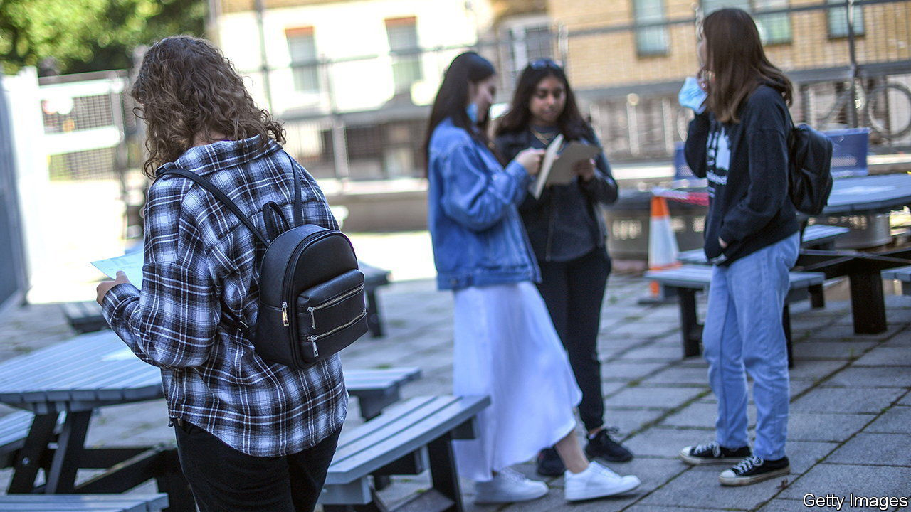

###### Bacc to the future

# Why it’s time for Britain’s schools to kill off A-levels 

##### Britain’s undergraduates are worryingly innumerate 

 

> Nov 17th 2022 

Mick jagger is the best-known alumnus of Dartford Grammar, a secondary school in Kent. Yet the front-man of the Rolling Stones is not its only claim to fame. Dartford is among a tiny bunch of English state schools that decline to enter sixth-form students for A-levels. Instead pupils follow courses set by International Baccalaureate, an exam board headquartered in Switzerland. They study six subjects, when most of their peers usually take only three; these must include maths, English and a foreign language. “We’re not just preparing students for university,” says Julian Metcalf, the head teacher, “but for another 60 years of life beyond that.”

Every few years England’s A-level system comes in for a kicking. Britain’s prime minister is the latest person to give it. Campaigning to lead the Tories in August, Rishi Sunak warned that England was unusual among rich countries in letting youngsters drop maths and their native language at 16. He proposed swapping the present system for a new “British Baccalaureate” that would require pupils to keep up both of those subjects until they are 18. There is no chance of this happening in the two years before Britain’s next election. But Mr Sunak may be thinking of writing such a reform into his party’s manifesto.

Even critics agree that A-levels are, in themselves, rigorous and demanding qualifications, and that they enjoy great prestige abroad. Britain’s universities have traditionally been pickier than those in many other countries. Ambitious sixth-formers have generally been grateful that they are allowed to sweat only the subjects they need for admission. Focused graft in the final years of secondary school helps explain why most students in England can earn bachelor’s degrees in three years, when those in many other countries study for at least four. 

Yet A-levels may not be handing English teenagers the  they need. Their performance in literacy and numeracy tests falls behind those in most other rich countries after they turn 16. One-third of 16- to 19-year-olds in England have “low basic skills”, reckon analysts from the oecd, a club of mostly-rich countries. One in ten  cannot pass basic tests in maths or comprehension. 

There is enough time in the school day to offer extra maths and English classes without greatly crimping other studies. But it would cost money. For no good reason, England’s schools get less funding for pupils aged 16-19 than they do for younger children. Broadening studies would also require more staff. The number of people who began training to be a secondary-school teacher this September was about one-third lower than hoped, the biggest such shortfall in years. Maths teachers are in particularly short supply. 

Shaking things up could involve more than academics. Pupils who do the International Baccalaureate (ib) must not only pass exams but also complete some kind of community service. For many of the IB’s boosters, this is a big part of its appeal. Some argue that a “British Baccalaureate” should mix subjects from academic and vocational paths, which at present are kept far apart. Whatever happens, it will probably give no one complete satisfaction. ■


