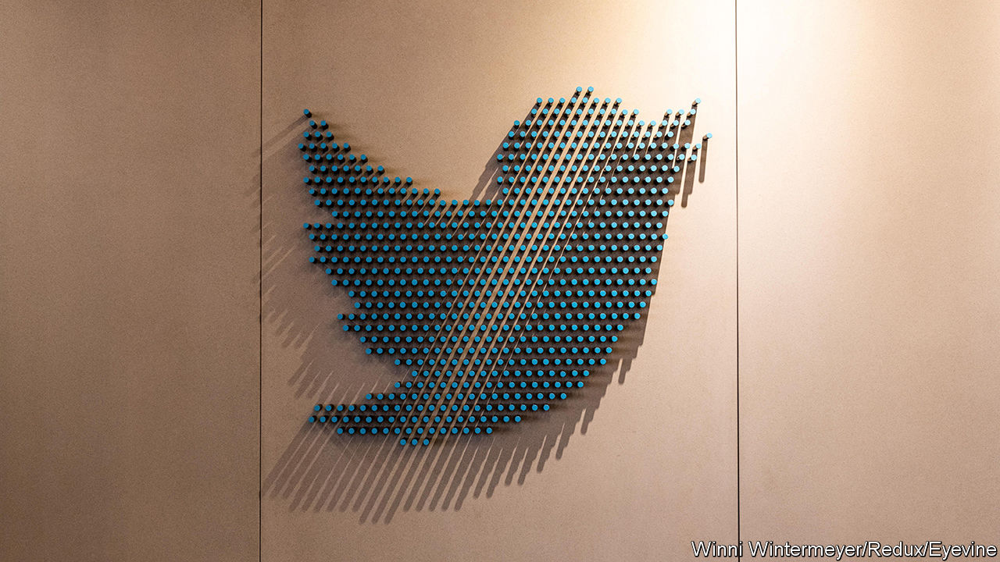

###### Fleeing the nest

# Alternatives to Twitter see an influx of users 

##### Are any a suitable substitute? 

 

> Nov 17th 2022 

“Twitter is the worst! But also the best,” Elon Musk tweeted recently. Not everyone agrees with the second sentiment. Soon after he purchased the social network for $44bn on October 27th, the hashtag #TwitterMigration started trending. Concerned with what Mr Musk has planned for the social-media platform, some are searching for alternative spaces to swap news, views and pictures of pets. Along with renewed interest in established platforms such as Tumblr, Discord and Reddit, newcomers are under consideration. What chance do they have of pecking away at Twitter’s 240m users?

Many are flocking to Mastodon, a decentralised social network founded in 2016 by Eugen Rochko, a German developer and its only employee. The platform feels like Twitter, but positions itself as its antithesis: no ads and no algorithms and “not for sale”, it claims. On November 12th Mastodon said it had added over 1m new members since the Twitter deal closed. But meeting this sudden surge in interest has strained its small, crowdfunded model. Mastodon apparently receives only around $20,000 a month from just over 4,000 donors and some small government grants. It suspended sign-ups to the two servers it maintains after demand rocketed. 

Cohost is also gaining ground. The platform comes across as a cuddlier version of Twitter with its pastel colours, a smiling bug for a mascot and similar values to Mastodon. It is similarly swamped. Its three developers are working flat out to upgrade the site and approve a waiting list of over 17,000 new users. This makes it unlikely to compete with Mastodon, let alone Twitter, and even more unlikely to get its subscription model off the ground. 

Less cosy is Truth Social, Donald Trump’s attempt to compete with the platform that banned him in 2021. It does not look like a serious competitor. Investors seem reluctant to put more money into its loss-making parent company and ad revenues are tiny. Many Twitter users will avoid a platform built for conservatives. Concerns about hate speech also make it an unlikely rival: it was only recently approved to appear on Google’s app store. 

The urgency to find an alternative also depends on what version of Twitter survives Mr Musk’s takeover. Many executives spared the sack in his cull of employees are leaving anyway, robbing it of skilled workers. Advertisers are becoming more cautious, despite the pausing of a service introduced by Mr Musk that allowed anyone to buy a verified account, which led to problems with impersonation. The share price of Eli Lilly, an American drugmaker, tumbled after a fake account in its name tweeted that “insulin is free now”. The head of a rival social network admits to targeting large Twitter advertisers in recent days to tempt them to defect.

Mr Musk meanwhile appears unfazed: “Twitter usage is at an all-time high lol,” he claimed in a tweet on November 7th. “I just hope the servers don’t melt!” Yet three days later he reportedly warned his remaining employees of the possibility of bankruptcy. If Twitter melts away, a decent substitute remains elusive. ■


