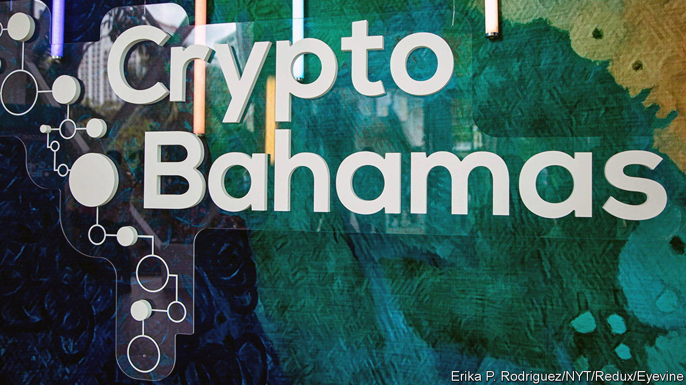

###### After the party

# FTX’s failure and SoftBank’s struggles point to a tech investing hangover 

##### After the turbocharged years, problems may be emerging for venture capitalists 

 

> Nov 17th 2022 

The meeting is a dream come true for the screenwriters who are already said to be at work on the film version of events. In 2021 Sequoia Capital, a large venture-capital (vc) firm, made its first investment in FTX, a now-bankrupt cryptocurrency exchange. To publicise the deal Sequoia published part of the transcript from the virtual pitch meeting on its website. Sam Bankman-Fried, the founder of FTX, explained how he wanted the firm to be a “superapp” where “you can do anything you want with your money from inside FTX”. Sequoia’s investors swooned. “I love this founder,” said one in a chat function; “Yes!!!!” declared another. An FTX executive who sat close to Mr Bankman-Fried during the pitch noticed another detail: “It turns out that that fucker was playing ‘League of Legends’ throughout the entire meeting.”

It also turns out that was doing more with customers’ money than it had promised. Its demise has forced Sequoia to write down its $210m investment. It will also hurt another embattled backer. On November 11th SoftBank, a Japanese conglomerate turned tech investor, reported that its Vision Funds, which focus on vc investments, had lost about $10bn in the three months to September. The firm is expected to write down around $100m from its investment in ftx.

This adds to a string of bad news for tech investors. Since the tech downturn began last December plenty of Silicon Valley darlings have gone bust, including Fast, an online-checkout firm, and LendUp, a purveyor of payday loans. There has been a flurry of other blow-ups in cryptoland too, such as the failure of Three Arrows Capital, a hedge fund, and Voyager Digital, a lender.

VC investing is all about taking risks. An investor may expect only two firms to succeed out of a portfolio of ten, hoping that the supersize returns from the stars make up for the duds. Usually the risk is greatest when firms are young and cheap. But FTX’s valuation in January was $32bn. Many think the industry’s failure to notice that something was wrong is symptomatic of bigger problems. “Venture capital is in la-la land”, says one industry veteran. There are three areas of risk: governance, due diligence and a focus on growth at all costs. 

The problems are a hangover from years of explosive growth. Today the market is sluggish because of high inflation, rising interest rates and the war in Ukraine. But in 2021 vc investment reached a record $630bn, twice the previous record set the year before. Part of the reason for the growth was new entrants. SoftBank raised its first VC fund, worth a whopping $100bn, in 2017. After that crossover investors (which back both public and private firms), such as Tiger Global and Coatue, began to chase more deals with startups, too.

The newcomers created fierce competition and injected far more capital into the market. That meant some investors “began to rationalise a bunch of governance structures that would have previously been unthinkable”, says Eric Vishria of Benchmark, a VC firm. In the past, VC investors were expected to take seats on the boards of firms in which they made sizeable investments. That is no longer the case. FTX had no investors on its board. Tiger, for instance, invested in about 300 firms in 2021 with few board seats in return. 

Due diligence is another issue. Before the boom years, investors had weeks to scrutinise founders and grill a firm’s customers. As competition intensified, deadlines grew shorter. Some red-hot startups gave investors just 24 hours to make an offer. For many the risk of missing out on the next Google was too great. As a result, much due diligence went out of the window. Instead some investors used the involvement of big firms, such as Sequoia or Andreessen Horowitz, as a short-cut test. If a renowned vc outfit was investing in a startup, the theory went, it must be a safe bet. That logic is under review. (Sequoia says that it performs “rigorous” due diligence on all its portfolio companies.)

The industry’s obsessive focus on growth presents the final problem. Many investors push startups to expand at all costs, especially after large funding rounds. But not all companies can actually support this supercharged growth model, argues Mark Goldberg of Index Ventures, another vc firm. Startups that get swept up are at risk of falling flat. That includes firms such as WeWork, a flexible office-rental company that aborted its initial public offering in 2019, and Opendoor, a property firm which got stung by falling house prices this year. “It’s like giving jet fuel to cars,” adds Mr Goldberg. “If you do that, bad things will happen.”

The market downturn has, for now, relieved some of the pressure on the industry. In most cases, investors say they now have more time for due diligence. Governance may improve too, thanks to FTX’s woes and the fact the slump has given investors more bargaining power. But, as the downturn drags on, more Silicon Valley startups will struggle to raise the capital they need. The hangover from 2021 is only just beginning. ■


