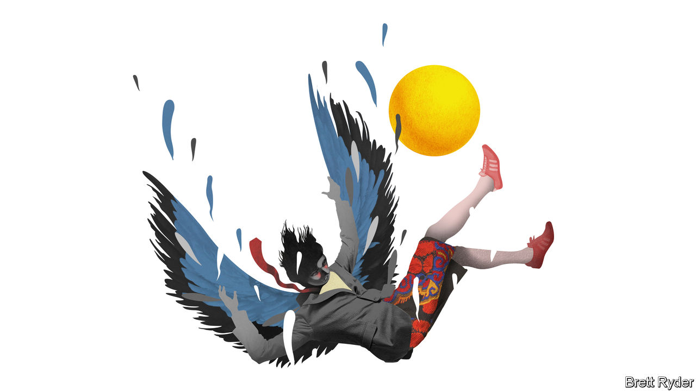

###### Schumpeter

# From GE to FTX, beware the Icarus complex 

##### The guardians of American capitalism too often fall for too-good-to-be true narratives 

 

> Nov 17th 2022 

It is hard to think of two more different firms than GE, a once-exalted symbol of American inventiveness, and FTX, a Bahamas-based fly-by-night crypto exchange. Besides high-pitched voices, it is hard to think of two people with less in common than the late Jack Welch, GE’s legendary former CEO, and Sam Bankman-Fried, FTX’s disgraced founder. The former, son of working-class parents, was fiendishly competitive about profits, had a frat-boy approach to life, and was as much at home on a golf course as he was on the factory floor. The latter, son of Stanford law professors, is scruffy, nerdy, a player of “League of Legends”, and claims to be motivated to make money only so that he can give it away. 

Yet there is one big thing they share, and it’s not just a love of expletives: “I fucked up, I fucked up,” admits Welch, with tears in his eyes, at the start of a monumental new book by William Cohan on the rise and fall of GE, published on November 15th. “I fucked up, and should have done better,” tweeted Mr Bankman-Fried a few days earlier, as his crypto empire, once worth $32bn, crashed around his ears, leaving some 1m creditors out of pocket. 

Both men share the experience of having been considered the corporate messiahs of their generations. Welch was hailed as the greatest CEO of the 20th century. The 30-year-old Mr Bankman-Fried wore a halo of sorts on his mop-haired head not just for trying to bring a semblance of respectability to the chaos of crypto, but for appearing to do it to promote the greater good of humanity (see back Briefing). Yet both saw their reputations crushed as the businesses that they nurtured imploded—agonisingly slowly in the case of GE, which is splitting into three, and at warp speed in the case of FTX. You could call it the Icarus complex. They both flew too close to the sun. But where was Daedalus? Why do the self-interested stewards of American capitalism—Wall Street, venture capitalists, investors, the business press—so often fall victim to too-good-to-be-true corporate narratives?

Read “Power Failure”, Mr Cohan’s 800-page extravaganza on the firm founded in 1892 as the General Electric Company, and it is instantly clear how important brilliant people are to business success—and how their brilliance can become a dangerous vulnerability. GE had not only the inventor, Thomas Edison, to thank for its start in life; Charles Coffin, a visionary businessman, set it on the path to lasting greatness. Welch, who took over as CEO in 1981, stood on a similar pedestal. The author describes in beautifully reported detail Welch’s mastery of the chemistry behind GE’s products, such as plastics, as well as his abilities as a leader to cajole, charm, party with and, yes, annihilate staff. From the point of view of profits, it worked. Under him GE achieved quarter after quarter of earnings growth and a market value that grew from $12bn in 1981 to $400bn when he stepped down in 2001. 

But such success inevitably over-seduces investors. No one, apart from short-sellers, has an interest in peering through the hype. Under Welch, GE’s mythology—and no doubt M&amp;A fees —meant that Wall Street mostly turned a blind eye to the growing role GE Capital, an unregulated bank, played in enabling the firm to meet its “stretch” profit targets. Under Jeff Immelt, his successor (whose appointment caused Welch such bitter regret), its size became an Achilles heel. 

Likewise Mr Bankman-Fried, whose net worth reached $26bn at its peak, played the iconoclastic whizz kid and raised almost $2bn from investors. All appear to have been blindsided by the disastrous relationship between FTX and Alameda Research, his trading firm. The exchange’s balance-sheet, reported in theon November 12th, looks as sophisticated as a household’s spreadsheet. Even now its founder continues to act casually. The  reports that since FTX’s collapse, he is unwinding by playing video games. Perhaps this is multitasking 3.0: blowing enemies to bits while blowing fortunes to smithereens.

Such spectacular failures are more likely in finance because shuffling money around is a confidence game. But in the case of ge, as Mr Immelt sought to wind down the firm’s dependence on ge Capital, he is also accused of bungling the acquisition of the power business of Alstom, a French rival, which brought his firm closer to the brink. It is a reminder that industrial businesses can also hide danger—and that it’s worth peering under the bonnet even of makers of adored products, such as Teslas and iPhones. 

Hagiographies in the financial press add to the risks. Like a modern-day Welch, Mr Bankman-Fried graced the covers of both  (“Only Zuck has been as rich…this young”), and  (“the next Warren Buffett”) in less than a year. No one asked where the money came from when he used FTX and Alameda to bail out struggling crypto firms. Instead, he was compared to John Pierpont Morgan, lender of last resort in the Panic of 1907. Mr Cohan relates how Welch crafted his own media image, too. Not only did he develop close relationships with the journalists who covered GE. He had a “catch-and-kill” approach to problematic stories. One former  reporter, who wrote a book on the underside of Welch’s tenure at GE, was so bruised by the experience that he turned to God.

The baggy shorts 

And yet the truth is, for all their hubris, some business titans are in a league of their own, which is why it is so hard for investors to be dispassionate. Welch’s reputation may have cratered, but a thoughtful book like Mr Cohan’s suggests that in the long run he will be vindicated. As one executive puts it, most of his decisions were the right ones. Most of Mr Immelt’s were wrong. For now, Mr Bankman-Fried’s name is in the dirt. Perhaps a forthcoming tome being pitched by Michael Lewis, author of “The Big Short”, will reveal what caused the house of cards to fall. It will no doubt be riveting. But why weren’t investors, whose money was on the line, the keenest of all to get the inside story? ■


