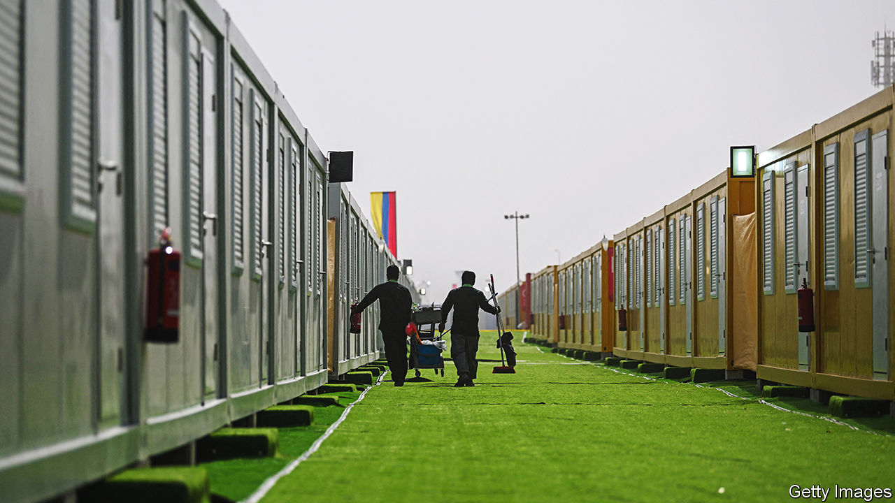

###### Chasing the ball

# India’s hospitality workers head to the World Cup 

##### Jobs serving football fans are drawing them there 

 

> Nov 17th 2022 

As is the fate of anyone running a hotel in Kerala these days, Bijoy George is a man with too much to do. Before pandemic-induced lockdowns began in 2020, he managed 40 employees at the Eighth Bastion Hotel near the old Dutch cemetery in the charming historic quarter of Kochi, a bustling coastal city. Now that business is back to pre-covid levels he needs the same number of staff again. But he has only 20 workers. His plight is shared with every other hotel, café and bar. It is a result of the state’s hospitality employees moving en masse to Qatar, not to watch football but to take up employment tied to the World Cup.

As the start of the competition approaches on November 20th, workers are quitting at a rate Mr George says he has never seen in his 22 years in the business. Qatar, a country with a population of under 3m, will have welcomed more than 1.5m visitors before the matches conclude on December 18th. That means finding staff to run all the new hotels that have been built along with other venues that have been pressed into service to profit from the revelry of raucous sports fans.

Kerala has long been a significant source of hospitality workers for Qatar and other Middle Eastern countries. Its communist state government provides good schools with English-language instruction but few jobs. More than 2m people, 17% of its working population, already work overseas, largely in the Gulf. The $18bn or so they send back each year, is equivalent to around 14% of the state’s output.

The appeal of Qatar is straightforward. Starting salaries approach $1,000 a month, more than six times the level for similar jobs in Kerala. To replace those who have left, Kerala’s employers have been casting their nets wider. Recruiters have been voracious, extending their searches to many other Indian cities, most notably Mumbai. But that means the most common word on name-tags pinned to the breast pockets of workers is “trainee”.

Among the many skills that need to be taught, says Mr George, is smiling at customers—the failure to do so a result of shyness among those new to the workforce. The danger is that after a week or so when confidence grows, even these employees may slip away to the Gulf. Large hotel chains operating in India have added to the flight by sending senior employees to Qatar to get new operations up and running.

Most contracts run for three months, concluding at the end of December, not long after the World Cup final. Returning workers will be welcomed back with open arms. Filling the gaps is even more important as Indian tourism and weddings have resumed. In a bad year for other businesses, the share prices of the country’s local hotel companies have soared. The reunions, though, may be short-lived. The game these workers will have learned from the World Cup is how to be paid better. That means leaving India. ■


