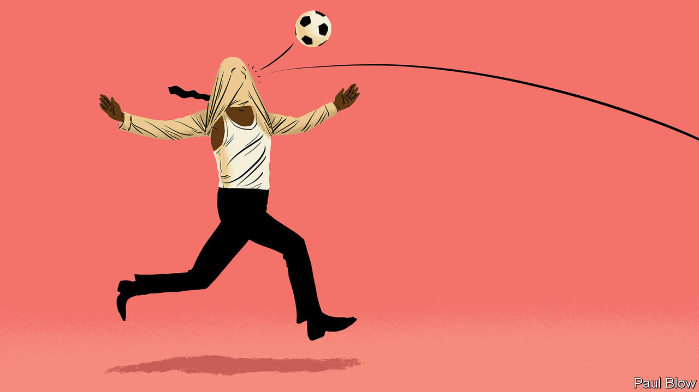

###### Bartleby

# Management lessons from the next World Cup winners 

##### Never mind that the tournament hasn’t started yet 

 

> Nov 17th 2022 

On December 18th the winners of the football World Cup in Qatar will lift the famous golden trophy. Several rituals will then unfold. The final entry will be made on fans’ wall charts. Pundits will share their lists of players of the tournament. In the victors’ home country, cars will clog the streets and drivers will lean on their horns. And in the days that follow, leadership coaches will post drivel about the secrets to be learned from the successful manager. 

But why wait till the end of the World Cup to find out how Hansi Flick of Germany, Didier Deschamps of France or whoever actually wins did it? Why even hang around for the start of the tournament on November 20th? Before a whistle has been blown and a ball has been kicked, here is your cut-out-and-keep guide to what bosses everywhere can learn from the winning manager (WM). All you have to do is delete anything that doesn’t quite fit the narrative. 

 The WM instilled a tight bond among the team by showing them unwavering support/creating an atmosphere of fear. He was known for putting his arms around the shoulders/hands around the necks of underperforming players. His oxytocin-releasing bearhugs/scarlet-faced rages ensured that a group of elite performers relaxed/did not relax. “He showed us love/utter contempt and we all responded to that,” said a man in shorts from the winning team. The power of empathy/barely suppressed terror will surely not be lost on managers in the workplace. 

 The WM obsessively immerses himself in data/does not know how to turn on a computer. In the build-up to each game he took each player through a detailed analysis of his opposite number/encouraged everyone to play table tennis. After the matches were over he watched videos of each game/Netflix. “He planned everything in minute detail/told us to just go out there and have fun,” said another happy man in shorts. In the office, as on the pitch, rigorous analysis/gut instinct is often the difference between success and failure. 

 The choice of Qatar as a venue for the World Cup was mired in controversy from the start; questions have swirled about corruption, human rights and worker safety. The WM turned these concerns to his advantage/seemed totally unaware of them. He made it clear that the team were ambassadors for the sport/only there to win. His decision to always wear a rainbow-coloured wristband/refuse to answer any questions about the host country was incredibly astute. “He gave us a much-needed sense of purpose,” recalled one of his players. “Only an absolute cretin would have wondered what we were in Qatar to do,” said another. 

 The WM built his whole team around/eschewed the very idea of a star player. “A superstar like Neymar/Harry Maguire/someone else has to be given freedom to express himself/realise that the team comes first,” he said afterwards. Every organisation will have its own outstanding performers. The clear message from this World Cup is that they should sometimes/never be given special treatment. 

There is an alternative way of thinking about the lessons for corporate managers from an event like the World Cup: there are none. First, the jobs are wholly different. Football managers don’t need to change strategy because the market is shifting (“we will use our excellence in the field of spherical objects to diversify into basketball”). Corporate bosses do not tend to get customer feedback from people making hand gestures in a crowd. Nor do their career prospects usually rely on the split-second decision-making of a bunch of talented 20-somethings. 

Second, all leadership writing depends on the dubious premise that an entity was successful because a person was in charge, rather than while they were in charge. The “halo effect” is the name given to the tendency for a positive impression in one area to lead to a positive impression in another. But just as a high-flying firm does not necessarily signal a world-beating CEO, so a World Cup winners’ medal does not mean the manager was a genius. 

Just one, Vittorio Pozzo of Italy, has ever successfully defended the World Cup title; only eight countries have ever lifted the trophy in the history of the tournament. Whoever ends up celebrating on December 18th, the pool of people available for selection, the role of luck and the quality of the competition will have mattered at least as much as the person at the top. That is one management lesson worth learning.


