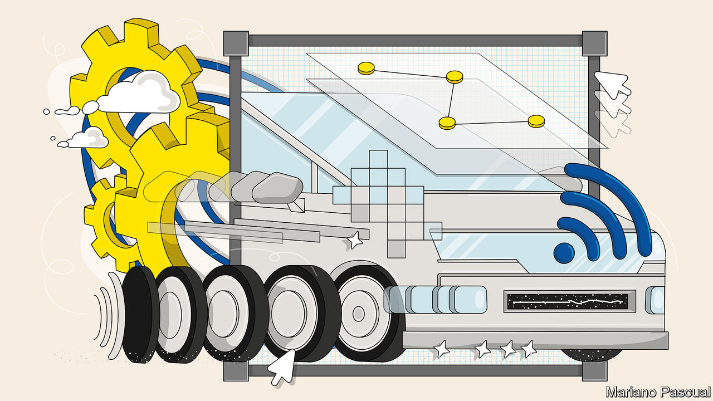
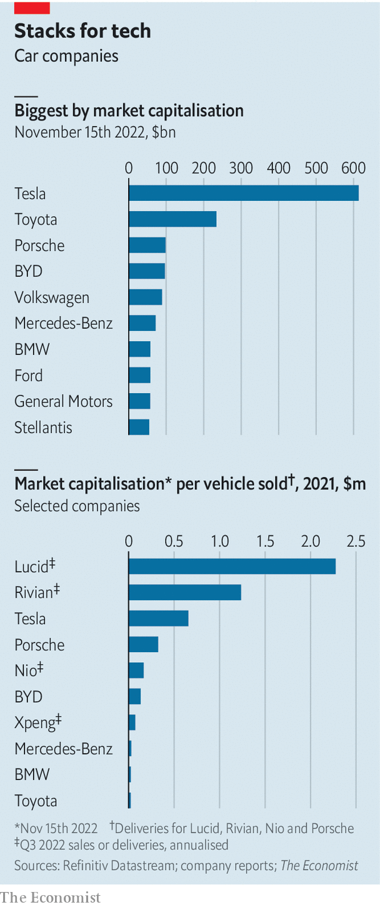

###### Changing the wheels

# The race to reinvent the car industry 

##### Can carmakers catch up with Tesla and pull off the shift to software? 

 

> Nov 14th 2022 

After a day’s work, you are not quite ready to go home. Perhaps you fancy catching a film. You could head to the cinema. Instead, you retreat into your car. A few taps on the touchscreen dashboard and the vehicle turns into a multimedia cocoon. Light trickles down the interior surfaces like a waterfall. Speakers ooze surround-sound. Augmented-reality glasses make a screen appear in front of your eyes.

This immersive experience is at the core of what Nio, a  (EV) company, laid out as the future of the car at a launch party last month in Berlin. The firm wants its high-end evs to be a “second living room”. Forget horsepower, acceleration and design—Nio emphasises the two dozen high-resolution cameras and transistors (of which there are 68bn, about four times as many as in the latest iPhone) in their vehicles. “We have a supercomputer in our cars,” boasts Nio’s boss, William Li. 

Nio is at the forefront of a revolution in the car industry: the archetypal hardware business is becoming ever more about software. Immutable objects that do not change after they leave the factory are turning into dynamic platforms for applications and features which can be updated “over the air”. Rather than deteriorate with age, such “software-defined vehicles” can improve over the years. Brands will become defined less by handling or mechanical excellence, and more by the services they offer, from safety features and infotainment to artificially intelligent driving aids. Nio’s cars come equipped with an ai assistant called Nomi, whose circular interface sits on top of the dashboard and smiles when you ask it questions.

Like all , this one promises to usher in a new world. It will certainly benefit motorists and digitally native carmakers such as Nio or Tesla, America’s EV champion. It will also claim victims, mostly among incumbent carmakers steeped in the culture of mechanical engineering. The boss of Volkswagen, Herbert Diess, recently lost his job after botching the German giant’s software plans. For many of vw’s rivals, too, the shift is proving thornier than managing the other big transition, from the internal-combustion engine to electric power. It may also prove more consequential. Luca de Meo, boss of Renault, a French carmaker, likens the situation to the upheaval wrought on telecommunications by the smartphone. The shift will define the fate of a global industry with revenues of nearly $3trn. 

Cars have been accumulating software for decades. For the most part, however, code was deeply embedded in a car’s parts, powering the “electronic control units” of such things as the ignition, brakes and steering. Most of these programs were developed by the carmakers’ suppliers and came in completed units that were then assembled into a vehicle. Car firms “were mostly integrators”, explains Klaus Schmitz of Arthur D. Little, a consultancy.

In recent years this setup has started to collapse under its own complexity. As more software was added, it became harder to make all the pieces work together, explains Andreas Boes of isf Munich, a think-tank. In June 2020 vw postponed for months the launch of the ID.3, a new ev, because of software troubles. Software engineers like to untangle such messes by creating a “platform”—to equip cars with a central computer powered by an operating system (os) that comes with standardised digital plugs for additional components (application programming interfaces, or APIs, in the jargon) and a connection to the computing clouds. 

 


This technical transformation, in turn, has triggered a knotty cultural one. In the old hardware world, car companies were hierarchical, process-oriented organisations often run by big egos. Launching a new model took around four years and the focus fell on meeting the deadline for the all-important start of production. A new model was much the same as the old one, with precious little innovation, says Henrik Fisker, who once designed Aston Martin and BMW sports cars and now runs an EV startup bearing his name. In the new software world, by contrast, decentralised teams of developers focus more on problem-solving than on execution. Cars are updated in rhythms counted not in years but in days and sometimes hours. Products are never really finished. 

This is second nature to newcomers such as Tesla—which was conceived as a software company that happened to make cars and is now the world’s most valuable carmaker—as well as Nio and others, whose valuations belie their current limited output (see chart). For the incumbents, it requires radical reinvention. Established carmakers are furiously recruiting chief software officers (csos), developing their own oss and holding “software days” to present digital strategy to investors. But most have yet to create an organisation capable of straddling hardware and software; to decide which pieces of software to keep firmly under their control and develop in-house and which to outsource; and to come up with a profitable business model for services made possible by all the code.

Take the organisational challenge first. The trick is to strike a balance between keeping development of software and hardware for different parts of a car in separate vertical groups and getting a “horizontal” software unit to write the programs, says Ondrej Burkacky of McKinsey, another consultancy. Cling too closely to the vertical approach and your software “will look like your org-chart”, he says—something plainly displayed on many incumbents’ car dashboards. Turn too horizontal and your software unit will get overwhelmed. That is what happened at vw, critics say, which installed its Cariad division in Ingolstadt, a six-hour drive from the group’s headquarters in Wolfsburg. 

Gear shift 

Other carmakers are learning from VW’s mistakes and adopting more mixed models. BMW and Stellantis (whose biggest shareholder, Exor, also part-owns ’s parent company) will spread their software teams around the world, closer to where the related hardware is made. Stellantis recently launched a “Data and Software Academy” intended to retrain more than 1,000 of the firm’s existing employees per year, as well as hiring talent worldwide, with the aim of having 4,500 engineers by 2024. Mercedes-Benz has just invested €200m ($206m) in an ultramodern “Electric Software Hub”, which will one day house 1,000 programmers in the middle of its research-and-development campus in Sindelfingen, close to its headquarters in Stuttgart. “Here they can easily work with any department,” explains Magnus Östberg, the firm’s cso. 

Although most carmakers now say they employ several thousand coders, this can be misleading. Many of the programmers are still steeped in the old world of embedded software, not the new one of platforms and cloud computing. And quality is more important than quantity, says Doug Field, who used to work at Apple and Tesla and now oversees software at Ford. The best programmers are not just 20% better than the average, they are ten times better, he points out. Makers of luxury cars, such as Mercedes-Benz and BMW, will always be attractive employers for such brainboxes. For lowlier brands, it can be a struggle to afford the high salaries and cushy work environments. “You have to accept if they want to come to work at 10am wearing bunny slippers,” says Mr Field. 

Moreover, making the mechanical engineers who still dominate the industry work with software engineers, who will increasingly take a lead, will not be easy. One side is trained to achieve the perfect , a German word for the gap between a car’s body panels. The other has no problem putting out half-baked “beta” products and collecting feedback from users. Making these cultures dovetail takes time, says Anja Hendel of Diconium, a firm that helps manufacturers build software divisions. One of the purposes of initiatives like Stellantis’s academy and Mercedes-Benz’s hub is to speed up the process. 

Even with thousands of top-notch programmers, the car firms will not be developing all their software by themselves. Even doing just 60% in-house, vw’s goal with Cariad, looks ambitious. Other carmakers are aiming at closer to 20-30%. That in turn means getting outside help. 

VW tacitly acknowledged as much on October 13th, when it announced that Cariad would invest €2.4bn in a joint venture with Horizon Robotics, a Chinese firm, in part to develop software for the Chinese market. Stellantis has teamed up with Amazon to build a “SmartCockpit” which it can then customise for its brands. BMW is working with Qualcomm, a chip firm, to co-develop parts of a car OS—which Qualcomm will then offer to other carmakers. Mercedes-Benz will reportedly fork out over 40% of the revenues from software and updates to Nvidia in exchange for access to the chipmaker’s processors and programs.

Mass-market firms may opt for Android Automotive, a software package developed by Google. Indeed on November 8th Renault announced a deepening of its relationship with the tech firm to speed its digital transformation by developing a centralised platform. Big technology firms “give us the initial speed”, says Yves Bonnefont, Stellantis’s cso. 

Collaboration presents a dilemma, however: whether to develop a differentiated product over which the car firms have control, or whether to “forgo control and adopt a platform that consumers appear to readily accept”, as Bernstein, a broker, notes. They want to avoid the fate of pc-makers, which the tech giants turned into profitless commoditised businesses by inserting themselves between their products and customers. Most want to keep things such as the “user interface” (what used to be called the dashboard) and safety systems in-house. These are increasingly considered the soul of a brand—as is the overall architecture of a car’s software and the data it generates.

“Any co-operation has to be structured in such a way that we keep control of all the car’s data,” insists Frank Weber, who heads development at BMW. To temper the power of big tech, Mr Weber has long been calling for German carmakers to share costs by jointly developing software that does not differentiate them. So far the industry’s competitive instincts have prevailed. But an open-source project for software-defined vehicles within the Eclipse Foundation, an umbrella organisation for carmakers as well as tech firms for such initiatives, has recently gained momentum. 

Launched by ETAS, the software arm of Bosch, a supplier of car parts, and Microsoft, a software giant, the project makes a stab at becoming to the automotive industry what Android is to smartphones: a platform shared by many manufacturers. It could help create a European “car os”, which might be able to compete better in a world where you can expect a couple of American oss, maybe one from Japan, and another from China. Old brands and new (Gucci-mobile anyone?) could then be built on one of these digital platforms.

Even if the carmakers succeed in creating their software-defined vehicles, they must also work out how to make money from them. Many eye a pot of gold at the end of the digital transition, in the form of margin-boosting revenues from services. These range from streaming entertainment and self-driving add-ons to tailored insurance policies and even temporary hardware features. BMW recently announced a subscription service for heated seats, at a cost of $18 a month. Last year VW said it believed industry revenues from software could hit €1.2trn in 2030, around a quarter of the total market for moving people and things on wheels (or “mobility”, as the industry insists on calling it). Stellantis expects its software and service revenues to reach €4bn a year by 2026 and €20bn by 2030—with tech-like net margins of 20% to boot, twice what even a premium carmaker ekes out at the best of times.

Many analysts are sceptical; they reckon that many of these services will eventually be included free as competitors try to win customers. “There is always that one firm that does it without charging for it,” says Patrick Hummel of UBS, an investment bank. And though features such as “full self-driving”, which Tesla offers for $15,000, may be tempting, it is far from certain that car-owners will part with money for things that once came at no cost, such as keeping their bums warm.

Each of these changes—to digital technology, organisation and business models—is a big shock on its own. Together they amount to a handbrake turn for an industry characterised by inertia. Many established firms still do not seem to accept the scale of the challenge. Digitisation has yet to creep into boardrooms: more than a third of board members at the four big German carmakers are mechanical engineers, and none comes from the tech industry.

For now, though, the digital race is still to be won. Even as the car industry struggles with software, the upstarts have much to learn about getting  right at scale, maintaining complex supply chains and building trust in their brands. “Incumbents are not doomed like Nokia,” says Christoph Bornschein of TLGG, another consultancy, referring to a once-dominant firm caught out by the smartphone revolution. “But they have only a narrow window of opportunity to get their act together.” ■


