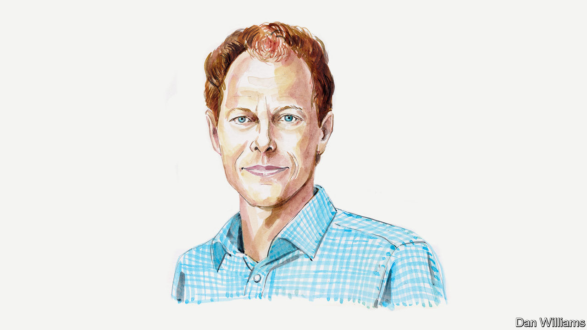

###### COP27

# Pieter Pauw on how rich countries should approach “loss and damage” finance 

##### The climate-finance expert says clear definitions will be critically important 

 

> Nov 17th 2022 

THE DEATH and destruction that result from the climate crisis disproportionally affect the world’s poorest countries and people. Yet they have contributed the least to global greenhouse gas emissions. Climate change is already happening faster than many communities around the world can adapt to its effects, according to the Intergovernmental Panel on Climate Change. That is with a mere 1.1°C of global warming—and we’re heading for 2.8°C.

Developing countries are therefore aiming to put climate-related “loss and damage” at the centre of the UN climate negotiations taking place in Egypt; and to demand support to cope with it. For example, Pakistan suffered devastating floods this year, with economic losses estimated at up to $40bn. Sherry Rehman, the Minister for Climate Change of Pakistan, has been emphatic on this: ‘‘We are on the frontline and intend to keep loss and damage (…) at the core of our arguments and negotiations. There will be no moving away from that.”

The issue of loss and damage was first raised in the UN climate talks more than three decades ago by a group known as Small Island Developing States (SIDS). They requested a global fund or insurance scheme to help them cope with the effects of sea-level rise to which they were (and are) acutely vulnerable. Rich industrialised countries were opposed to that. Yet developing countries have persisted, with loss and damage increasingly under discussion in workshops and dialogues attached to the UN climate negotiations over the past decade. The Paris Agreement in 2015 devoted a separate article to the concept.

That was celebrated as a major breakthrough for the world’s most vulnerable countries—even though it took another seven years for related financing to be added to the official COP agenda. The article says nothing, however, about finance or implementation. Indeed it was included only on the explicit basis that it did not provide a basis for any liability or compensation. That was a red line for developed countries, most of whom are determined not to be held accountable for the damage their historic emissions have done. The article is essentially a commitment to further discussion of the issue. It calls upon countries to enhance understanding, action and support on issues such as sea-level rise.

To the benefit of developed countries, the article describes loss and damage in absurdly ambiguous terms. In fact, there has been no official definition of the term. This leaves some important questions open, including how actions to deal with loss and damage might be distinct from existing climate change adaptation, disaster risk reduction, development and humanitarian work.

The ambiguity allows developed countries to hide behind their pledge to mobilise $100bn per year of climate finance to support developing countries with mitigation and adaptation, as well as the humanitarian aid they provide to respond to extreme weather. That is despite the fact that the pledge is so far unmet; and the aid has fallen short by about $30bn over the past five years. 

In the absence of a clearer definition of loss and damage, it will be hard either to account for it or to earmark appropriate resources. We have experienced this before with financing of climate-change adaptation, which continues to be hard to distinguish from development. Donors often re-label development aid as adaptation, even though adaptation finance is supposed to be new and additional.

The lack of a formal definition of loss and damage can also be used as an argument against setting up a financial facility to take action on it. Providers of loss and damage finance would want to know where their money is heading and that it will be used effectively. This dearth of a definition promises to slow down the negotiations on loss and damage considerably.

Last year developed countries got away with rejecting the proposal of SIDS and other developing countries for a finance facility to deal with loss and damage. The demand for action on loss and damage is now so loud, however, that developed countries can no longer afford to ignore it. Doing so would have derailed the climate negotiations before they had begun. That is partly why loss and damage financing made it onto the COP27 agenda at all.

This year a few developed countries have begun to act, albeit slowly. Denmark has pledged $13m as a loss and damage payment. Scotland made a similar $2.3m commitment last year and it will pledge an additional $5.7m this year. Germany is putting a more substantial $175m into an insurance-based “global shield” to help some countries recover from climate-related disasters. But insurance-based solutions are inappropriate for slow-onset events, such as sea-level rise, or for recurring disasters. 

While these efforts are welcomed and inspiring, developing countries remain wary. They won’t be satisfied with a couple of sops when much larger and more fundamental action on loss and damage finance is required. And even if the UN climate negotiations cannot come up with a suitably ambitious finance mechanism to address loss and damage, that should not be an excuse for not creating a financial mechanism at all.

Global emissions are still increasing, and until they decline rapidly, climate-related damage risks spiralling out of control. The focus in Sharm El-Sheikh should be on reaching an international agreement on paying for loss and damage. In addition, leaders of high-emitting countries should immediately focus on implementing their emissions-reduction plans. Otherwise whatever is discussed or agreed on loss and damage in Egypt, the world will be fighting an increasingly tough battle.■

_______________


