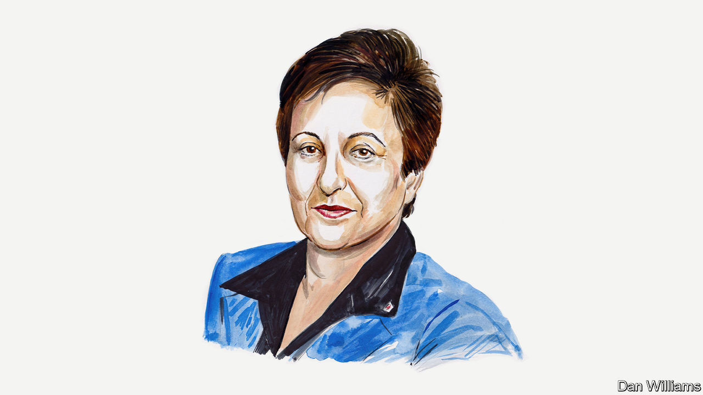

###### Protests in Iran

# Shirin Ebadi on the legal obstacles Iran’s protesters face 

##### The Nobel peace-prize laureate and former judge on the country’s rotten justice system 

 

> Nov 16th 2022 

A YOUNG WOMAN died in hospital in Iran on September 16th after being detained by the morality police for showing too much of her hair. Mahsa Amini’s death ignited protests in more than 100 cities and street protesters openly declare that the Islamic Republic must go. The people of Iran are tired of theocratic tyranny. The movement’s chant is “Women, Life, Freedom.” But the realisation of this slogan will only be possible under a democratic and secular government. 

During the 43 years since the revolution, many Iranian people have lost their lives for opposing the government. The true number killed is not clear as the government never reports such statistics. It is only through family members and through verification by human-rights organisations that we can try to piece together the numbers. In the past eight weeks or so at least 326 Iranians have died at the hands of the regime, including 43 children according to Iran Human Rights, a monitoring organisation. 

The Islamic Republic has no qualms about targeting those who oppose it as they sit in classrooms or lie in hospital beds. Government agents identify wounded protesters in wards and if medical staff resist such efforts, they are arrested. The authorities have also attacked several high schools where pupils were chanting slogans inside buildings. They burst in and beat pupils. To date more than 300 of them have been arrested. Many were released on bail but some are still being detained. Such draconian measures suggest the desperation of the authorities as they will undoubtedly anger Iranians.

In Iran it is impossible either to seek justice for those killed or for protesters to receive a fair trial. For instance, the complaint filed by Mahsa Amini’s family remains unresolved. Two journalists, one of whom may have taken the photo of her in hospital and the other of whom reported from her funeral for the benefit of the Iranian press, now languish in prison for alleged espionage. Dozens of journalists and writers are also in prison, just for speaking and disclosing information that the government does not want public. On November 14th a court in Tehran, the country’s capital, issued the first death sentence to a defendant arrested for taking part in the protests. 

Lawyers do not have the freedom to defend clients who are tried under political charges. Under Iranian law, only after the interrogation and once the verdict has been issued can the accused choose a lawyer in such cases. The lawyers then sometimes face false accusations themselves which lead to arrest. More than 15 lawyers are imprisoned currently for defending a variety of clients, some await trial and others are serving long sentences.

In addition to unsuitable laws, the judiciary is not independent. Particularly in political and religious trials, it is intelligence agents and agents of Iran’s Revolutionary Guard who issue the indictment and even determine the punishment. The prosecutors and judges of the courts merely sign the orders and judgments dictated to them.

International action and pressure can help to keep the focus on prisoners the Iranian state would prefer were forgotten. Marches and mass gatherings in New York, Washington, Los Angeles, London, Paris and many others have amplified the voices of those arrested and killed in Iran.

I am confident that soon we will witness great changes in Iran. Current protests have neither faded away nor been squashed by the authorities. And those marching have a clear, shared goal in a way that they haven’t before: the overthrow of the regime. A very large swathe of society is involved in the current protests, too. Never before have we seen high-school pupils marching.

 Women have been at the forefront of every protest we have had since the revolution. But it is different this time. Men have understood that democracy will only come to Iran if women succeed. Even schoolchildren are protesting alongside their grandparents, and protests are happening across the country. I am confident that soon we will witness great changes in Iran. And a change in Iran’s government will entirely change the Middle East for the better.■

_______________


