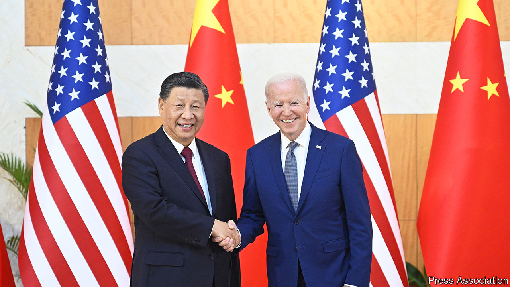

###### Shaky relations

# America and China try to get along 

##### Signs of progress at a meeting between Xi Jinping and Joe Biden 

 

> Nov 17th 2022 

The protocol of encounters between Chinese and American leaders is often a minefield. Advance teams have to thrash out every detail, down to which side leaders stand on when they shake hands for the media. The person pictured on the right, you see, can strike a stronger, more open pose than the one on the left, who must twist awkwardly to extend a right hand while still facing the cameras.

Past slights, perceived or deliberate, are long remembered. Chinese officials were incensed for years after Hu Jintao visited the White House as president in 2006 and the Americans announced China’s national anthem as that of the “Republic of China”—Taiwan’s official name—then let a protester heckle Mr Hu at a news conference. American officials were similarly upset when local authorities failed to provide a staircase for Barack Obama to leave his aeroplane on a visit to China in 2016. 

Hats off, then, to the officials who choreographed what appears to have been a relatively constructive meeting between Joe Biden and his Chinese counterpart, Xi Jinping, on November 14th in Bali. From their deliberate smiles to their carefully chosen words in public, it was clear that both wanted to address widespread concerns over the dangerous downturn in their relationship. There were signs of real progress, too, with both sides committing to resume high-level dialogue on issues including food security and economic affairs. To maintain the momentum, they agreed that Antony Blinken, America’s secretary of state, would soon visit China.

But as both sides fleshed out their respective accounts of the three-hour meeting, a less harmonious picture emerged, one that reflected a hardening of attitudes on the most divisive issues between them, especially Taiwan, the self-governing island that China claims. There were also revealing discrepancies, notably on Ukraine. And in meetings with other leaders at the G20 summit in Bali, Mr Xi and Mr Biden both sought support for initiatives that reflect their sharply conflicting worldviews. The meeting was a “baby step” in stabilising relations between leaders who both face strong domestic pressure not to yield ground, especially on Taiwan, said Yu Jie of the Royal Institute of International Affairs, a British think-tank. “At least the door of communication has not completely shut.”

In American accounts of the meeting, Mr Biden told Mr Xi that he would continue to compete vigorously with China, but wanted to avoid conflict and to co-operate in areas such as climate change. There “need not be a new cold war,” he told a news conference. America’s readout also said that both leaders had expressed opposition to the “use or threat of use of nuclear weapons in Ukraine”—a clear reference to Russia. Yet Mr Biden showed no signs of yielding to Chinese demands that he moderate his restrictions on technology exports to China or provide new assurances on Taiwan. Instead, he reiterated that American policy on Taiwan was unchanged, raised objections to China’s aggression towards the island and expressed concern over Chinese “non-market economic practices” and policies towards Hong Kong, Tibet and Xinjiang. 

Chinese readouts likewise struck a conciliatory tone in parts, saying Mr Xi had pledged not to try to displace America or change the international order. He too called for co-operation in areas of global concern. But he spent considerable time expounding Taiwan’s history, stressing that it was China’s “first red line”. He emphasised ideology, defending China’s political system and rejecting Mr Biden’s portrayal of a global contest between democracy and authoritarianism. On Ukraine, meanwhile, China’s language was more nuanced, calling for peace talks while reiterating Mr Xi’s appeal for the entire international community to oppose the threat or use of nuclear weapons.

Conflicting readouts are a common feature of such meetings, so not necessarily a problem. The concern is that the two sides’ core differences are so great that they will struggle to make progress even in other areas once detailed discussions resume. Talks could also be disrupted if a new Republican speaker of America’s House of Representatives visits Taiwan (China cut all high-level dialogue after Nancy Pelosi, the current speaker, went there in August). 

As for protocol, Mr Biden took the power pose for the handshake. But he had to first walk several steps towards a stationary Mr Xi—a manoeuvre Chinese officials favour as a way to enhance their leader’s stature on video. So call it a draw. For now, that’s a good enough result. ■


