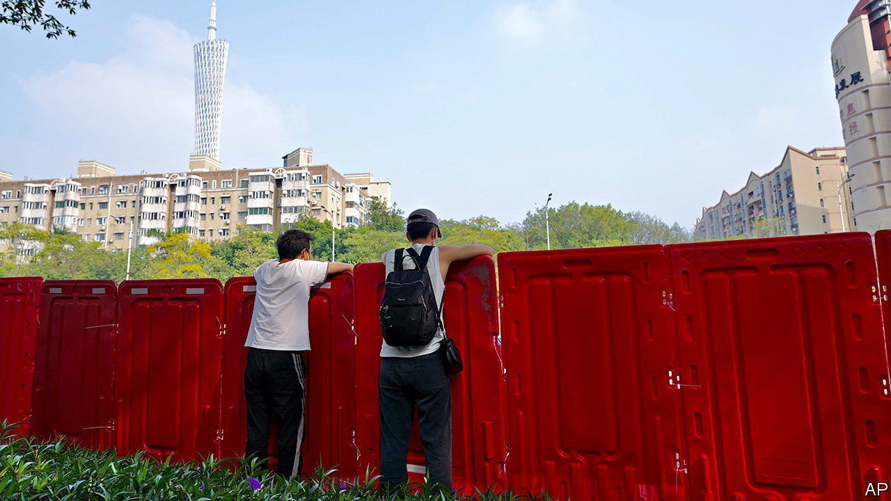
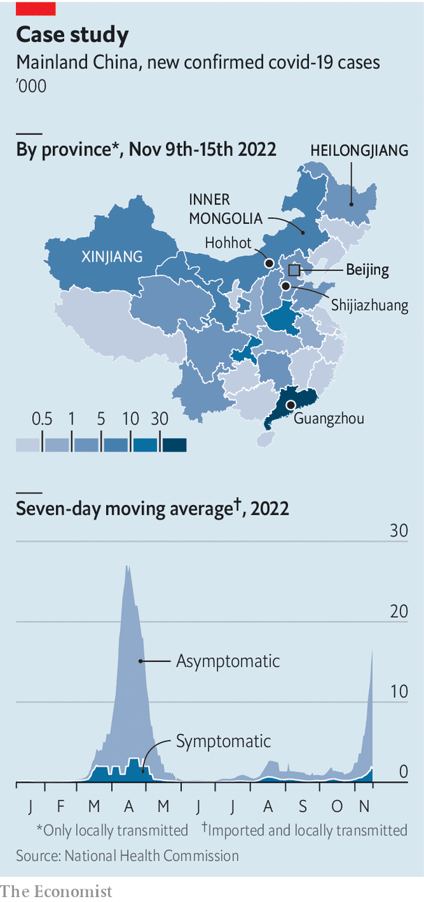

###### Relax a little

# China tweaks its zero-covid policy 

##### As cases rise, the new guidelines will be tested 

 

> Nov 17th 2022 

The Chinese government is loosening up. On November 11th it announced 20 tweaks to its “zero-covid” policy, which relies on mass testing and draconian restrictions to stem outbreaks. Many of those restrictions are now slightly less draconian. Travellers arriving from abroad, for example, will have to quarantine for eight days, down from ten. Airlines will no longer face a suspension of flights if they carry too many covid-infected passengers. Inside China people considered “close contacts of close contacts” of covid carriers will no longer need to quarantine. And the new guidelines forbid mass testing unless it is unclear how infections are spreading in an area. The  welcomed the changes.

 


They come at an odd time. New cases of covid-19 have risen to their highest level since the spring (see chart). After years of treating every infection as a threat, some cities now seem rather tolerant of cases. An outbreak in Beijing has not led to the citywide closure of restaurants and gyms, as one did earlier this year. Under the old playbook, the city of Shijiazhuang would have used mass testing to curb its outbreak. But on November 14th city officials announced that restaurants, malls and public transport would no longer require proof of a recent negative covid test.

Under the new guidelines officials must not “arbitrarily” lock down cities. A big test will come in Guangzhou, a metropolis that is reporting thousands of new cases each day. Officials there have put in place harsh district-level controls, leading to riots in some areas. Migrant workers have pulled down barriers and confronted health workers. Still, some analysts think a citywide lockdown is inevitable.

National officials insist that they are not scrapping the zero-covid policy, just trying to reduce its costs (see Chaguan). The situation is still “severe and complex”, say state media. But the official tone is changing. Some cities are telling residents not to panic about the virus. Zhang Boli, a prominent practitioner of traditional Chinese medicine, said recently that covid was becoming less dangerous, as the public has acquired something like “herd immunity”.

That is a dubious claim. China’s success in suppressing the virus has, in effect, postponed a reckoning. Using infection estimates from Johns Hopkins University in America, fewer than one in a thousand of China’s 1.4bn people have ever had covid. In addition, the Chinese public is undervaccinated. Around a third have not received a third booster shot and many had their last jab months ago. If China were to lift all restrictions immediately, the Omicron variant would cause a wave of serious cases and deaths.

For years the public has been told to fear covid, so many people view the recent moves with trepidation, not excitement. “The virus may not be too terrible for me, but what about my grandad, my grandmother and my child?” asks Liu Jin, a resident of Shijiazhuang. She has kept her daughter out of nursery as a precaution. A popular herbal medicine used against covid (with doubtful effectiveness) has sold out in many drugstores in the city.

Not all of China is easing restrictions. Two days after the new guidelines were announced, a city in Heilongjiang province locked down in response to a single case. Much of Hohhot, the capital of Inner Mongolia, has been closed for weeks. For most of Xinjiang, it has been months. Local officials, told to prevent outbreaks, have long erred on the side of brutality. But the new rules encourage people to report excessive enforcement of the zero-covid policy. ■


