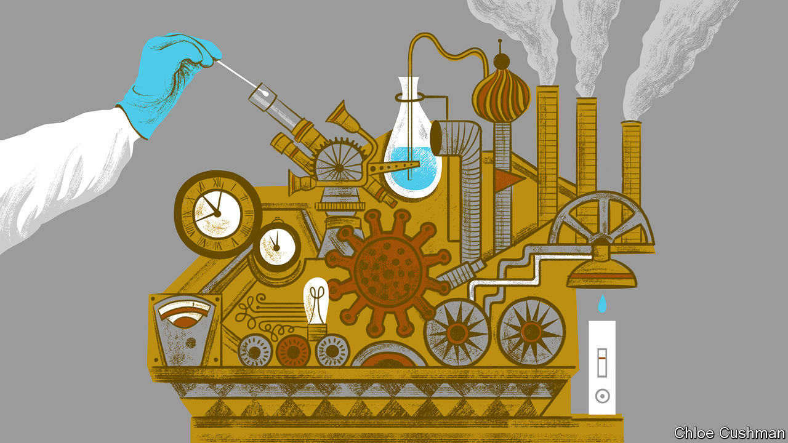

###### Chaguan

# China’s steampunk covid response 

##### How to read the country’s confusing pandemic-policy changes 

 

> Nov 17th 2022 

In the science-fiction genre known as steampunk, impressive feats of creativity are applied to an odd task: imagining a futuristic world that uses only Victorian technology. There are no silicon chips or lithium batteries in steampunk worlds. Instead, heroes in frock-coats pilot steam-powered flying machines made of canvas, wood and hissing copper pipes, or consult clockwork computers of exquisite complexity. To understand China’s “zero-covid” policy, it is surprisingly helpful to think of it as a steampunk pandemic response.

The policy was born in a moment of chaos and danger for Communist Party leaders: the covid outbreak in Wuhan in early 2020. Despite the censors’ best efforts, all of China saw online videos of gravely ill patients in hospital corridors and body bags in car parks. Horrified leaders knew that many places in their country had weaker hospitals than Wuhan, a city of 14m. Swiftly, officials locked China down and closed its borders. Pop-up isolation hospitals rose across the country. A growing array of smartphone apps were rolled out to trace the public’s movements and covid status in real time. Restrictions were enforced by millions of pandemic guards. High and low technologies were combined to build something remarkable: a modern-day version of a 19th-century quarantine system, of the sort that Victorian doctors might have used to tackle a tuberculosis outbreak in an age before antibiotics.

From the start, China’s zero-covid response followed a logic of its own. In places like America or Europe, governments struggled to “flatten the curve” of infections. Their aim was to slow the growth of each fresh covid wave to keep hospitals from being overwhelmed. China’s ambition was to have no cases, and no curve. 

In the first phase of the zero-covid policy, officials used travel curbs, mass testing and quarantines to keep the virus out. Given China’s large population and poor health-care system, this was a rational if costly policy and prevented many deaths. It was popular, too, for life was relatively normal for many inside this China-size bubble. Propaganda chiefs highlighted the contrast with soaring casualty counts in America, Britain and other rich countries.

Early on Australia, New Zealand and Singapore also followed covid-elimination policies, but with a difference. Those countries used their zero-covid policies to buy time until they were ready to live with the virus, with the help of effective vaccines and potent new antiviral drugs. China did not use its policy to buy time.

Instead, once the virus breached China’s defences and many areas saw outbreaks, the country switched to a second phase, dubbed “dynamic zero-covid”. China built nationwide systems to find each infected person and isolate them within hours, before tracing and isolating hundreds or even thousands of their close contacts. The “dynamic” bit nods to the impossibility of avoiding cases altogether. The ambition, rather, is to crush waves rapidly.

Alas, more contagious variants have tested this approach to breaking point. Facing the sack for outbreaks on their watch, officials have locked down some regions for months. Mass PCR tests have been imposed on cities with millions of residents, as often as every day. The economic and human costs are crippling. A broker, Soochow Securities, has estimated China’s bill for covid testing alone at 1.7trn yuan ($240bn) this year, or around 1.5% of GDP. That number, which one expert calls an underestimate, equates to nearly half of all China’s public spending on education in 2020.

On November 11th the government announced 20 changes to make zero-covid policies more precise and less costly, and to ease international travel a bit. Local officials were warned not to impose excessive, indiscriminate policies. In the next days, several cities seemed to experiment with reduced mass testing and laxer controls on movement. Some propaganda messaging started to downplay covid’s seriousness. That sparked speculation, at home and abroad, that China is about to ditch the zero-covid policy, despite denials in the  and other official news outlets.

Three main explanations for these changes suggest themselves. The first, call it Plan A, is that Chinese leaders are trying to make the zero-covid policy more sustainable. Plan B is that an organised exit from the policy is quietly under way, despite those official denials. Plan C is no plan at all; it posits that China has lost control and is crashing towards opening.

Plan B is least likely. An orderly exit requires long preparations. Instead China has squandered 2022. All-out vaccination campaigns should have started months ago, notably for older people. A course of three locally made shots offers reasonable protection against covid; only 68% of over-60s have had the full three. Giving everyone a fourth booster would allow for a much safer exit, but work on that has barely begun. Authorities should have stockpiled antiviral drugs and published protocols for handling an inevitable surge in infections, clarifying who should be admitted to hospital or receive antiviral treatments. As for giving China’s people the most effective, foreign mRNA shots, Mr Xi showed little interest when this was suggested by Germany’s chancellor, Olaf Scholz, recently. Instead, China’s leader hinted at approving foreign shots for German expatriates. Finally, winter (when people huddle indoors and viruses multiply) would be a daft time to start opening. 

Still clanking away

Current outbreaks are alarming, but China has managed higher case numbers before, suggesting that Plan C is not yet at hand. To spot a big shift in approach, watch what happens to mass testing, suggests Ben Cowling of the University of Hong Kong, for that is one of two pillars of the zero-covid policy, along with quarantining positive cases. That leaves Plan A. Party bosses appear to be tweaking their intricate zero-covid machine to keep it going, though new scientific tools render it obsolete and it may not survive coming virus waves. This would be an act of self-harm. Steampunk makes for pretty stories, but bad public policy. ■


