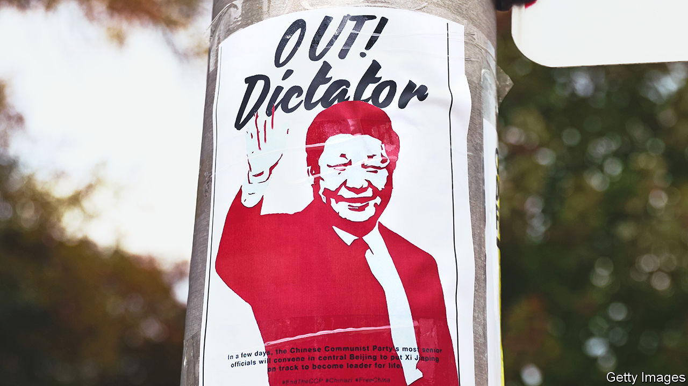

###### Posters of protest

# Chinese students abroad take on their government 

##### But there are reasons such protests are rare 

 

> Nov 17th 2022 

A few days ago Ming, a student from mainland China, experienced what she calls a “wow moment”. For an online workshop about protest art, Ming had submitted photographs of posters denouncing the Chinese Communist Party and the country’s leader, Xi Jinping. The “wow” came when a fellow Chinese student posted a sympathetic comment about the submission. “You tend to assume that other Chinese students are pro-Communist Party and pro-Xi Jinping,” says Ming, who is 20 and has been studying in Britain for three years (like the names of others who are quoted in this article, Ming’s has been changed to conceal her identity). “It was surprising and encouraging to find people who support what you do.” 

During the past month other Chinese students on Western campuses have been making similar discoveries. They have been meeting in chat groups on Telegram, a messaging app, and organising protests against their government. This has mainly involved putting up posters like the ones Ming uploaded for the workshop and posting pictures of them to Instagram, a video- and photo-sharing app. Related posters have appeared on 350 campuses in more than 30 countries, according to an administrator of Citizens Daily CN, an Instagram account to which people send sightings. 

Such activism is rare among the hundreds of thousands of Chinese who study overseas. Still rarer are anti-party rallies by Chinese citizens abroad. Yet in several Western cities, mainland Chinese—mostly students—have staged small demonstrations in recent weeks. More are planned, including in Toronto on November 19th and in London on December 10th. 

The trigger for all this was a display of banners on a flyover spanning one of Beijing’s ring roads on October 13th. Their red slogans challenged pandemic restrictions: “I don’t want lockdown; I want freedom.” But the hardest punch was thrown at Mr Xi: “Go on strike at school and work; remove the dictator and national traitor, Xi Jinping!” Not since the pro-democracy upheaval of 1989 had a leader been attacked so prominently on a busy road in the Chinese capital. Police swiftly removed the banners and detained a man deemed responsible. Censors deleted online references to the incident and disabled the social-media accounts of those who had posted them.

The banners’ appearance must have been a shock to the police, who had tightened security in preparation for a five-yearly party congress. Right after the meeting Mr Xi was to be given new terms as party chief and military commander (these reappointments were announced on October 23rd). Only adulation was permitted. 

Among Chinese students abroad, control has proved far more difficult. Many of the posters that began to appear on Western campuses repeated the slogans that the protester in Beijing had used. They were put up by individuals, acting without direction from any organisation, according to several people involved. The students often wore disguises or operated at night. Even when they responded to online calls to join a demonstration, they usually did so with their faces covered. 

One participant was Helen, a 33-year-old from the central province of Henan who now lives in Sydney, Australia. In May she finished a degree in accounting there. When she and a Chinese friend went out to put up posters around the city, she wore a black mask. They feared they might be attacked by Chinese nationalists, “but nothing happened—most Chinese witnesses were nice.” Helen, too, is surprised by the way the poster movement has developed. “People like me who are pro-democracy were very rare,” she says. “This movement helps people like me find each other.” 

The Telegram group that is the main forum in Britain for poster-movement activists has about 1,300 members. It is difficult to know how many are mainland Chinese. Even if most of them are, they would represent only about 1% of the Chinese students in Britain. A demonstration on October 29th in London drew about 100 people. It was a big number for a protest by mainland students abroad, but probably not enough to alarm China’s leaders.

On campuses abroad, much still works in the party’s favour. The only student organisations that have widespread reach among mainland Chinese at Western universities are the Chinese Students and Scholars Associations (CSSAs). These have close ties with Chinese diplomatic missions and help to propagate the party’s views. Some Chinese are wary of the CSSAs, fearing they may report those with dissident tendencies to the Chinese authorities.

The party’s views are also spread on WeChat, an omnipurpose app that Chinese students use for messaging and sharing news reports. Mainland students abroad usually keep the same accounts that they used in China. These are subject to more intense censorship than ones opened abroad. A Chinese student in her final year at Durham University in Britain says it is “quite normal” for first-year students from China “not to understand what’s going on”. All the information they receive, she says, is “from the Chinese propaganda system”.

Racism is another impediment to the spread of liberal values. In a paper published in 2020, scholars at Stanford University in California and Sun Yat-sen University in China argued that Chinese students in America are “more predisposed to favour liberal democracy than their peers in China.” But anti-Chinese discrimination “significantly reduces” the belief among Chinese students in America that political reform is desirable, while increasing their support for authoritarian rule.

Chinese nationalism further complicates things. Those involved in the poster movement are as critical of the party as activists from Hong Kong, Xinjiang and Taiwan. But some of them worry about being accused of supporting those other campaigns, tainted as they are by separatism in the eyes of many mainland Chinese. Xiong, a student who attended the demonstration in London, says he felt uncomfortable about the presence of Hong Kongers there. He wondered whether they just wanted independence. Many Hong Kongers would say they just want democracy.

Chinese officials still worry. Last year a researcher at China’s National Defence University lamented the involvement of Chinese students abroad in (unspecified) “threats to state security”. Such cases, he wrote in state media, had “exposed the shortcomings and weaknesses that still exist in the training of young students, especially overseas students.” He urged diplomats and student groups to improve “ideological education” among them. 

Such work may get easier now that China has begun to relax some of its draconian measures aimed at crushing covid-19. Chinese students abroad have chafed at the “zero-covid” policy, which has made it difficult for them to visit their families. But those involved in the poster movement insist their campaign is about far more than frustration with covid controls. 

Still, several of them said they did not expect the campaign to grow. “As for other Chinese students, they will not look for information” about the protests, says a Chinese student in Utah. “They just want to stick to their comfort zone. They are too afraid to know about politics.” ■


