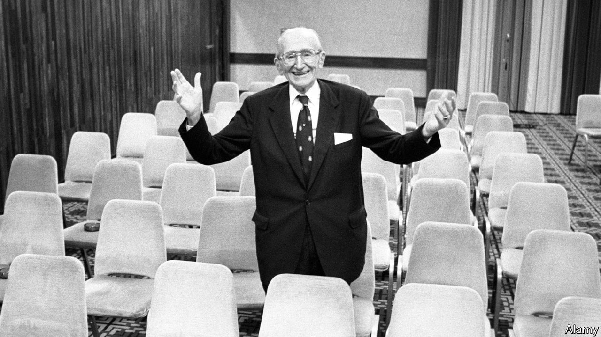

###### Economic thought

# A fascinating, readable biography of Friedrich Hayek 

##### Bruce Caldwell and Hansjoerg Klausinger puncture some long-standing myths about the Austrian economist 

 

> Nov 17th 2022 

By Bruce Caldwell and Hansjoerg Klausinger. 

Robert Skidelsky’s  of John Maynard Keynes achieved something few histories of economic thought can do: it was well written, packed with interesting detail and offered enough—but not too much—theory. Now Keynes’s great rival, Friedrich Hayek, is the subject of a biography comparable to Lord Skidelsky’s. It is certainly on a similar scale. The first volume is more than 800 pages, and a second is on the way. Bruce Caldwell’s and Hansjoerg Klausinger’s work also has the makings of something just as good.

Keynes and Hayek had radically different outlooks on economics. “Maynard”, as he was known, argued that when a recession loomed, people and the government ought to be encouraged to spend, giving the economy some oomph. “Fritz”, in books, newspaper articles and his teaching, was the most dogmatic representative of the opposite view. He thought that Keynesian ideas represented “an extremely dangerous popular delusion” and argued that his counterpart’s solutions would not only fail to solve economic problems, but would make them worse. 

The rivalry was often heated. Keynes described one of Hayek’s efforts as “one of the most frightful muddles I have ever read”. Hayek, for his part, suggested Keynes “knew very little economics”. (In 2010 their mutual antipathy was immortalised in “Fear the Boom and Bust”, a comedy rap battle on YouTube.)

Messrs Caldwell and Klausinger are not interested in adjudicating which of Keynes and Hayek was ultimately right. They are more interested in Hayek the man. It turns out that, despite their professional differences, he and Keynes shared many traits. Both were born into respectable families. Both were too clever for school and so got bored. Both liked holidaying in Cornwall. Both, in their economic theorising, used little mathematics. And, in their personal interactions, there was tremendous mutual respect, even if not always warmth. Keynes arranged for Hayek to spend time with him at King’s College, Cambridge, during the second world war. 

The book offers wonderful descriptions of the  in which Hayek moved. After fighting in the first world war—though he saw little action—he fell under the spell of Ludwig von Mises, a fellow Austrian economist. Over time he became more and more convinced of the futility of state intervention. Hayek moved to Britain in 1931, and events there reinforced his belief that governments were clueless. Stopping in Paris en route to London, he learned that Britain had gone off the gold standard “and 30% was off the magnificent annual salary of £1,000 to which I had been looking forward”.

Governments, he believed, could not know better than millions of individuals when it came to distributing resources. Published in 1944, “The Road to Serfdom” argued that state intervention often produced the need for further state intervention and, with it, raised the chances of fascism. The book was a sensation in America, having been condensed in . Yet the German translation was banned in early post-war East Germany, on the insistence of the Russians, one of the four occupying powers, who did not like its anti-state message. Incidents such as these solidified in Hayek’s mind the idea that his work mattered. 

The book punctures some long-standing myths about Hayek. He did not, as many of his acolytes believe, predict the Depression. The Austrian Institute for Business Cycle Research, of which Hayek was director between 1927 and 1931, did not produce its own forecasts of the American economy; and indeed Hayek was sceptical of forecasting in general. The story that Keynes and Hayek once did air-raid duty together at King’s also, unfortunately, appears to be untrue. 

Yet the book does in large part confirm the popular notion that Hayek was a rather strange, and not always very nice, man. For someone who believed so passionately in free markets, he seemed obsessed with class and despised America for its vulgarity when he visited in the early 1920s. He joked that he had never seen the inside of his own kitchen, leaving such tasks to his wife, Hella. He concocted an elaborate scheme, involving moving to America, to divorce Hella and be with someone else.

The second volume will cover the period after which Hayek moved to America, his association with the  of economics, his growing influence on the political right and the hardening of his pro-market views as he aged. That there is still so much to learn about Hayek hints at the biggest problem with this biography: its size. The prose is jargon-free and elegant, making it easy enough for the non-specialist to understand. But it would still require a commitment on a Hayekian scale to try to read it all. Perhaps, then, following what Lord Skidelsky did in 2003, the authors might consider condensing their work into a single, smaller book. Their biography deserves a wide audience. ■

