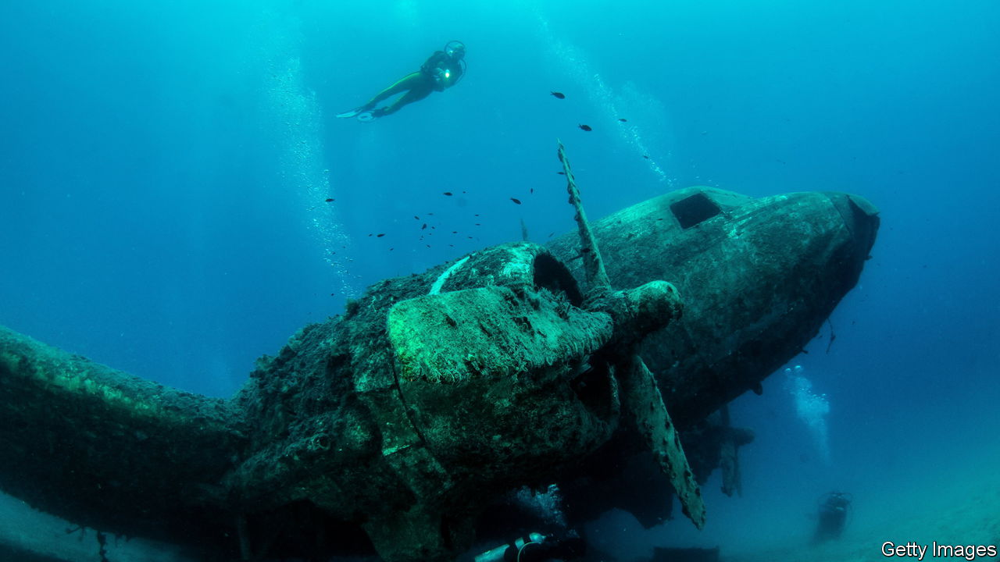

###### End of the road

# Cormac McCarthy returns with two new novels 

##### Unfortunately both are bewildering 

 

> Nov 17th 2022 

By Cormac McCarthy. 

By Cormac McCarthy. 

In 1992 Cormac McCarthy published his sixth novel, “All the Pretty Horses”. The first volume of what came to be known as “The Border Trilogy”, “All the Pretty Horses” told the story of a boy from Texas who rides to Mexico with a friend shortly after the death of his grandfather. Mr McCarthy’s earlier works had drawn on history, physics and philosophy, and depicted almost biblical cruelty in an arid Western landscape. His language was as grand as it was dry; rarely did he write about women or domesticity. Mr McCarthy’s fans were devoted, but limited in number.

“All the Pretty Horses” changed that. It established him as the heir to William Faulkner, Truman Capote and other masters of the American Southern Gothic tradition. Mr McCarthy became a bestselling author and a household name. Thereafter he earned a whole new generation of readers. In 2006 he published , a post-apocalyptic novel which followed a dying man and his young son; it won a Pulitzer prize and was adapted into a film. In 2007 Javier Bardem starred in a screen version of “No Country for Old Men”, Mr McCarthy’s ninth novel. It won four Oscars, including Best Picture, and sealed the author’s critical and commercial success.

He was recently divorced at the time; for the next 15 years, he published no more fiction. Instead he focused on working with the Santa Fe Institute, an arcane research centre in New Mexico, where he concentrated on his interests in science and human consciousness. The announcement earlier this year that Mr McCarthy was about to bring out not one but two novels in quick succession raised cheers. The author is now 89, and few thought he had another book in him.

The problem is that the new work is a mess. “The Passenger” begins well. A small jet has crashed and sunk into the Gulf of Mexico. The passengers are “sitting in their seats, their hair floating. Their mouths open, their eyes devoid of speculation.” The pilot’s flight bag is missing, as is a panel from the instrumentation. One of the passengers cannot be accounted for. 

A salvage diver considers the job at hand. He is the son of a man who worked with Robert Oppenheimer to develop the nuclear bomb. He is afraid of the deep and in love with his sister, who has been dead for ten years. Not surprisingly, his musings are both random and complicated. 

The story of the watery grave is soon abandoned as the salvage diver heads landward to make a long road trip to visit his grandmother. Along the way, the book meanders through string theory, the founding of quantum mechanics, Arthur Schopenhauer’s philosophy and whether God exists. There is the odd distraction about a hoard of gold coins and the theft of a rare 16th-century Italian violin. 

Mr McCarthy’s thirst for language is unquenched, and the literary vista of his sentences stretches out towards the horizon. Yet the story barely hangs together. “Stella Maris”, a 200-page coda, inexplicably published as a separate book six weeks after the first, is the transcript of a conversation between two people: the diver’s sister (and obsessive love interest), a former mathematician who is now a paranoid schizophrenic in a hospital in Wisconsin, and her doctor. It adds little clarity to the whole enterprise, and much confusion. Most of the time Mr McCarthy forgoes quotation marks; indeed he avoids punctuation in general. Many readers will be bewildered.

Mr McCarthy’s publishers have packaged the two volumes into a handsome set in time for the festive season. In America Knopf has elegantly bedecked the books in sunset gold and underwater blue; Picador, its British equivalent, is releasing a “beautiful, limited-edition slipcase”. These efforts could be seen as a fetching tribute to the elderly author. More likely, given the hefty price tag of $56, or £50, they will be perceived as an experiment in shameless commercial cynicism. ■

