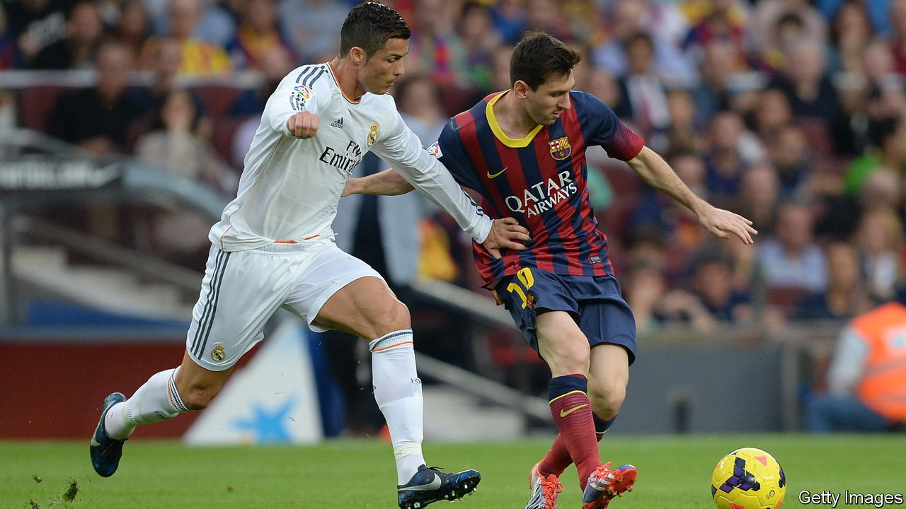

###### Sporting rivalries

# Lionel Messi and Cristiano Ronaldo have forged modern football 

##### A new book explores their influence on and off the pitch 

 

> Nov 17th 2022 

By Joshua Robinson and Jonathan Clegg. 

Winning the Ballon d’Or, an award given to the best male footballer in the world, is considered one of the crowning glories of a player’s career. Only a handful of athletes have won the prize twice; Marco van Basten, Johan Cruyff and Michel Platini each prevailed three times. For a decade,  and Cristiano Ronaldo turned the Ballon d’Or into a duopoly. Between 2008—when Mr Ronaldo first won the award—and 2017, the pair claimed every Ballon d’Or between them. 

Never have the highest reaches of football been dominated by the same two men for so long. In “Messi vs Ronaldo”, Joshua Robinson and Jonathan Clegg, two journalists at the , attempt to understand how they have done it. Talent is part of the story. Both players combine —they are the all-time top goalscorers in La Liga, Spain’s top division, and the Champions League, the leading European club competition—with brilliant passing. At their best, they function both as their side’s main creator of goals and the main scorer of them.

The pair’s influence also reflects globalisation, modern technology and football’s growing clout. When Mr Messi played for Barcelona, he had a say in transfers and even managerial appointments. His sway was such that, when a club employee argued that Mr Messi “would not be as good” without the help of his team-mates, the staff member was quickly dismissed “for having publicly expressed a personal opinion that does not match that of the club”. Mr Messi’s salary—€555m ($577m) over his last four years—almost bankrupted Barcelona. When Mr Ronaldo moved from Real Madrid to Juventus in 2018, his new club gained a vast number of  while his old one lost hundreds of thousands. Traditionally, fandom means following a particular team regardless of its squad; for many in the age of Mr Messi and Mr Ronaldo, it has become about following players instead.

From 2009 to 2018, when both men played for Spanish teams, every clash doubled up as a referendum on which man was the superior star. If Mr Messi—for his grace in playing the game and sense of play—was football’s Roger Federer, then Mr Ronaldo was its Rafael Nadal: less artistic, more physical, his career a triumph of sheer bloody-mindedness. Mr Messi has eschewed publicity and Mr Ronaldo has embraced it. (See the recent interview in which he criticised his current club, Manchester United.) But the authors argue that such contrasts overlook the players’ “mutual understanding”: “that their most important business partner is the other”. If there is no friendship between the two, neither is there real animosity. 

There has been a dark side to their sporting excellence. Both players allowed themselves to be courted by intolerant regimes—the United Arab Emirates in Mr Ronaldo’s case and Saudi Arabia in Mr Messi’s. They have largely kept politics and sport separate, in the manner of the quip uttered by Michael Jordan, a basketball player: “Republicans buy sneakers, too.” Both had to repay millions to the Spanish tax authorities. Mr Ronaldo has been accused of sexual assault. (He denies the allegations and has never been charged.)

Coverage of such matters ensures that this rigorously researched book avoids becoming hagiography. The result is an ambitious and valuable study for all those who want to understand the modern world of football that Mr Messi and Mr Ronaldo have helped forge. Yet the authors might have examined the endurance of these star athletes in greater depth. 

Aged 35 and 37, Mr Messi and Mr Ronaldo, albeit a little diminished, continue to play on, apparently motivated less by what they can achieve at their clubs than on the international stage, for Argentina and Portugal. Both have won one major international tournament. The weeks ahead offer the tantalising possibility that one of the pair might win the prize both covet most: the World Cup. ■

