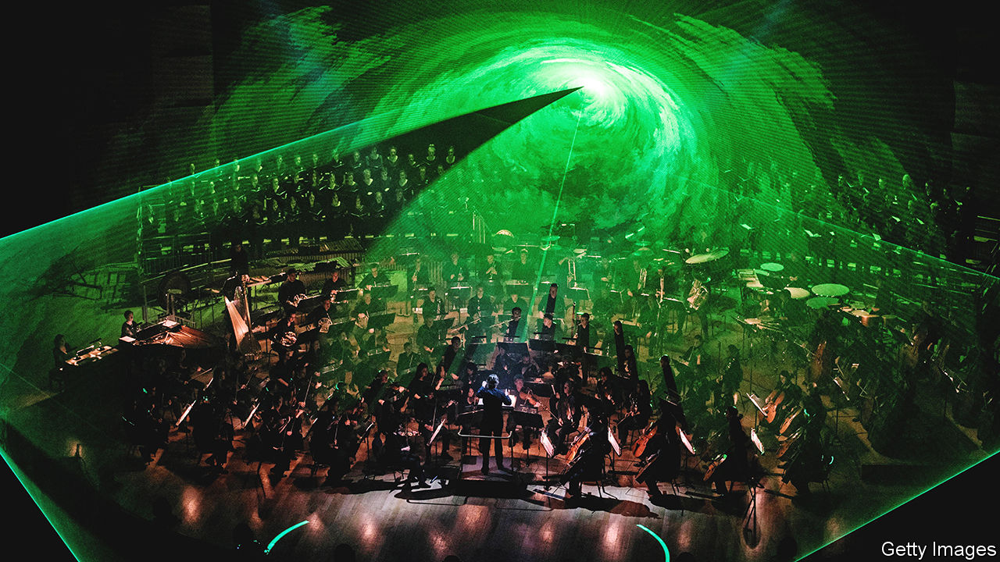

###### Airs and graces

# The classical-music world is grappling with accessibility 

##### It is possible to make the art form less intimidating without lowering artistic standards 

 

> Nov 17th 2022 

“Live and love with open mind/Let our cultures intertwine.” In April, at a performance by the Baltimore Symphony Orchestra (BSO), the bass sang that ode to mutual understanding by Wordsmith, a rapper, in the final movement of Beethoven’s ninth symphony. The original text, by Friedrich Schiller, begins: “Joy, bright spark of divinity/Daughter of Elysium.”

Classical music is often thought to be intimidating. Performed by white men in white bow ties, the art form is perceived to exemplify snobbery, stuffiness and racial privilege. Ensembles such as the BSO want to change that. Some groups are taking classical music from hushed concert halls to car parks and trendy nightclubs; many orchestras are performing film scores as well as symphonies (the Lyon National Orchestra, pictured, among them). The Pierre Boulez Saal, a hall in Berlin, invites parents to morning chamber-music concerts—baby, not jacket, required. 

To many in the classical-music world, increasing accessibility is a way of staving off irrelevance. Just 1% of music sales and streams in America are of classical pieces, according to MRC Data, a research company. Before the pandemic 58% of concertgoers in Britain were aged 65 or older, reports a study commissioned by the BBC. The BSO’s main hall was more than 60% full on average before the pandemic; recently it has been 40% full.

Many people have not felt that they belong in a concert hall. Black Britons were less than 1% of the pre-pandemic audience. Reginald Mobley, a black American countertenor, says that when he was growing up in Florida his family thought of classical music as the music of cross-burners. Some scholars view the Western canon—roughly the masterworks of composers from Josquin des Prez in the 15th century to Igor Stravinsky in the 20th—as a product of privilege. Beethoven, an “above-average composer”, has been “propped up by whiteness and maleness”, contends Philip Ewell, an American musicologist.

Such notions did not deter Mr Mobley. A professor who heard him singing in a barbershop quartet identified him as a countertenor. Now Mr Mobley sings baroque and other music with major ensembles in Europe and America. “People of colour coming into the arts should not be a fluke like it was for me,” he says. 

Cultural gatekeepers increasingly agree with him. In July the BSO appointed Jonathan Heyward as its first black music director. Mr Mobley is the first programming consultant of the Handel and Haydn Society in Boston, with a mission to diversify its repertoire. Works by neglected black composers, such as  are heard ever more often.

In some ways the pandemic helped pry classical music open. It prompted Wigmore Hall, a chamber-music venue in London, to stream free concerts. This “democratised” its audience, says its director, John Gilhooly. When the hall reopened in September 2020, younger folk filled more seats. On streaming platforms, classical music is “finding a way to people who don’t think of themselves as classical-music lovers”, says Tom Lewis, co-president of Decca Records. A third of classical-music streaming is by 18- to 25-year-olds; some are mixing it with other genres.

Such enthusiasm is to be celebrated, but eagerness to expand the audience can come at a cost. The issue of accessibility is “an absolute minefield”, says Paul McCreesh, artistic director of the Gabrieli Consort &amp; Players, a choir and orchestra. That is because the clamour for classical music to be more approachable and relevant risks drowning out the music itself. There is also now an added expectation that it will promote social justice. Classical music must respond. Its artistic health depends on how it does so.

One concern is that classical music’s civic mission will overshadow its cultural one. In a recent radio interview , music director laureate of the San Francisco Symphony, worried that many young musicians’ commitment to social causes was not matched by their dedication to music. Anthony Tommasini, formerly the ’s chief classical-music critic, has proposed that orchestras stop “blind auditions”. He hopes that making visible the race of musicians applying for jobs will increase the number of non-white performers, but this would mean, as he acknowledged, ending a practice that from the 1970s helped raise the number of women in orchestras. 

“Powerbrokers” such as funders and broadcasters are a big source of “extra-musical concepts”, thinks Mr McCreesh. The consequences of that came to seem more alarming this month when the Arts Council England, which distributes money from the government and the lottery, ended grants to some top-flight groups in London, such as the English National Opera, as part of a policy to boost the arts outside the capital. Jennifer Johnston, an opera singer, spoke for many classical musicians when she lamented on Twitter the “permanent watering down of our industry so [that] the government can say it’s not ‘elitist’”. 

The quest for accessibility can add to other forces that push classical music, perhaps the form that most rewards concentrated listening, to the periphery of people’s attention. They are not new. Popularisers have long recognised that getting people to sit still and silently is at odds with getting them to show up. When the “promenade concerts” that became the BBC Proms, Britain’s big summer classical-music festival, began in London in 1895,  was played “to an accompaniment of popping corks”. In his day,  expected audiences to be boisterous. 

Eager as musicians are to broaden their audience, there’s no getting around the fact that many classical works demand patience, especially in live performance. “In a classical concert, you just sit in a rather uncomfortable seat and you try not to make too much noise for two hours,” says Sir Stephen Hough, a British pianist, composer and author, “but you should leave feeling a different person.” Even Mozart lamented playing to a salon of aristocrats who were making sketches of one another: “I had to play to the chairs, tables and walls.”

To present classical music as hard work risks keeping audiences away, but suggesting that it is easier listening than it is risks disappointing them. It is best, both for audiences and the art itself, when accessibility is paired with ambition. Robert Newman, the impresario who helped launch the Proms, wanted to guide listeners up to Olympus, not to bring the music down. His grandiose aim was to “train the public by easy stages. Popular at first, gradually raising the standard until I have  a public for classical and modern music.” The Pierre Boulez Saal calls its fare “music for the thinking ear”. 

There are ways to make classical music more accessible without compromising it. Sir Stephen suggests shorter concerts without intervals. #SingTheScore, a series of videos by I Fagiolini, a British choral group, mixes silliness and sophistication. Good music education is crucial to diversifying both audiences and ensembles. The skills required to sing in the Gabrieli Consort are nurtured mainly in fee-charging schools, says Mr McCreesh. That mostly leaves out white working-class children as well as those from ethnic minorities. Gabrieli Roar, which works with state-school and other youth choirs in Britain, tries to correct that.

If every school offered such teaching, more children would cherish the hush that comes when a conductor raises the baton, knowing that the music that follows will transmute life in ways that hold in suspense their own lives. When it falls, after a moment, the ovation can begin. ■

