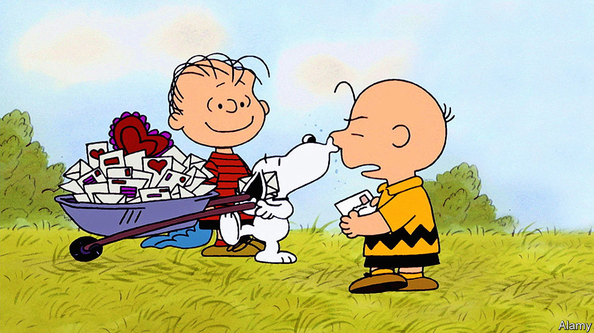

###### Home Entertainment

# “Peanuts”, Charles Schulz’s cartoon, probed the human condition 

##### And with Snoopy, he showed how to imbue animal characters with psychological depth 

 

> Nov 17th 2022 

“In all of mankind’s history, there has never been more damage done than by people who ‘thought they were doing the right thing’.” So says Lucy after her friend, Charlie Brown, reveals that he has replaced her little brother Linus’s much-nuzzled security blanket. It’s a remark that captures the spirit of , Charles Schulz’s long-running cartoon strip, in which children, free from adult intervention, confront uncomfortable truths.

“Peanuts” celebrates the pleasures of friendship, but also registers the pain of unrequited love and the gulf between fantasy and reality. Each instalment, drawn with crisp simplicity, provides a brief lesson in the elusive nature of happiness. With their large heads and tiny torsos, the characters look vulnerable, and though the setting may be wholesomely suburban, the tone is mostly downbeat. 

, born 100 years ago this month, could trace the bleakness of his worldview to a dour childhood in St Paul, Minnesota. His family considered his endless doodling dim-witted at best and degenerate at worst. His first steps as a commercial artist were halted by the second world war. When he returned from serving in Germany he began a strip called “Li’l Folks”, a perceptive portrait of antagonism between girls and boys. 

It was the embryo of “Peanuts”, the first instalment of which appeared in October 1950. He would draw another 17,897, the last appearing the day after his death in February 2000, by which time the strip had graced 2,000 newspapers in 72 countries. The name was never to Schulz’s taste: foisted on him by his publisher, it apparently derived from “peanut gallery”, slang for the cheapest seats in a vaudeville theatre. But the world of the cartoon was entirely his own, with each character embodying a different aspect of his personality and revealing some larger paradox of humanity.

Charlie Brown, who suffers one setback after another, pickles in self-doubt yet remains determined to succeed. Linus, a sensitive boy, seeks to answer loss and loneliness with philosophy. Schroeder is a piano prodigy and a perfectionist, isolated by his obsession with Beethoven. Lucy runs a pop-up psychiatric clinic where her standard remedy is a brisk “Snap out of it!” For , an Italian novelist and philosopher, these li’l folks were nothing less than “monstrous infantile reductions of all the neuroses of a modern citizen of industrial civilisation”.

Schulz’s most famous creation, however, is not a child. Snoopy, Charlie’s pet beagle, is sunny yet meditative, selfish but loyal; he dreams of success as a novelist and of being a British flying ace. Trivia fans may be glad to know that he is the only “Peanuts” character permitted to kiss and that the reader never sees inside his kennel. He has inspired many to own a dog, though his influence has extended far beyond this—as a mascot for aerospace safety and a pioneer of the rewards of cartoon merchandise. Most of all, he is a lasting example to other artists of the possibilities of imbuing animals with psychological depth. ■

