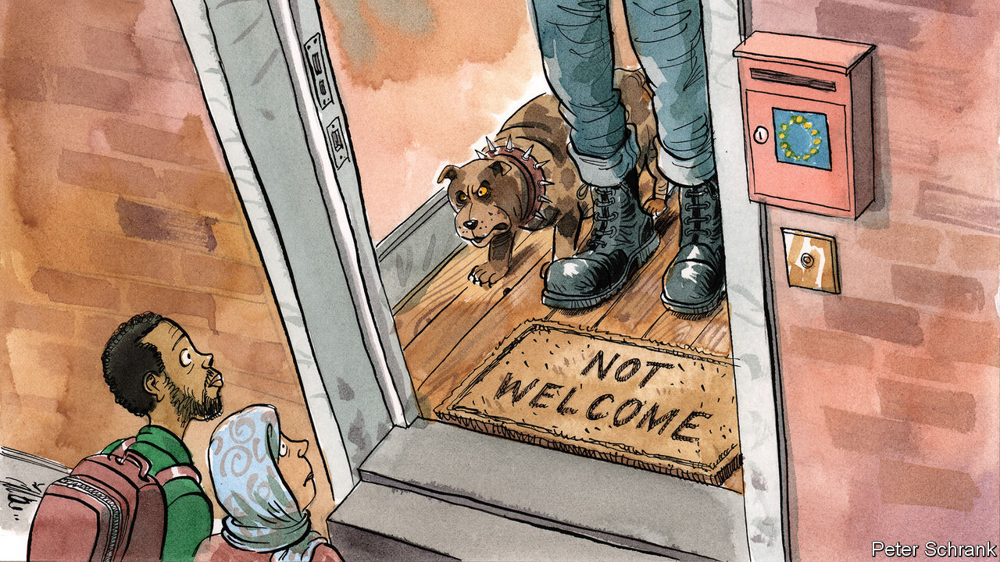

###### Charlemagne

# A new migration crisis is brewing in Europe 

##### Prepare for populists offering bad solutions 

 

> Nov 17th 2022 

Lovely place, Belgrade. The Serbian capital attracts many tourists from far and wide, there to enjoy its diverse architecture and meat-heavy cuisine. One recent batch of arrivals has raised eyebrows, however. Few would have expected citizens of Burundi, the poorest country in the world, to plump for a Balkan holiday. And yet thousands have flown there since Serbia announced in 2018 that Burundians could visit without a visa—a rare privilege for Africans travelling to Europe. To nobody’s surprise the unexpected tourists were not there to admire Belgrade’s fine opera house. The European Union’s border force has reported a surge of Burundians arriving illegally in the bloc, bits of which border Serbia (as people-smugglers charging $3,000 a head to cross that border well know). Authorities in Belgrade, which had nixed visa requirements for Burundi as thanks for it withdrawing diplomatic recognition of neighbouring Kosovo, are in the process of closing the loophole after the EU threatened to make it harder for Serbians themselves to enter.

Burundian fake tourists are not the only ones trying for a better life in Europe. Illegal entries into the EU have surged of late. Some 281,000 have been logged since the start of the year, up by 77% since 2021. The latest available figures show that in August alone some 84,500 asylum applications were lodged in the EU and its neighbours (this excludes Ukrainians, who need not apply for asylum to live in the EU for up to three years). That is the most in any month since a  caused a migration crisis that roiled the continent. Back then, the picture of a drowned Syrian toddler whose body had drifted onto a beach was seared into the public mind and prompted a generous—if belated and uneven—response which included Germany taking in more than 1m refugees. So far this year 1,811 deaths have occurred in the Mediterranean, a grim tally. Amid war in Ukraine and an energy crisis across Europe, few seem to have much noticed.

A political spat may change that. On November 11th French authorities reluctantly provided a berth for the , a rescue boat carrying 230 migrants picked up trying to cross the Mediterranean. Italy had for weeks refused to let the boat near its shores; France stepped in to avoid loss of life and denounced its neighbour as behaving “irresponsibly” and in breach of legal norms. Giorgia Meloni, Italy’s new prime minister, had spent her first weeks in office trying to reassure EU partners worried about her hard-right platform and past praise of Mussolini. Unexpectedly, it had once looked as if she might form an opposites-attract duo with Emmanuel Macron, France’s president, or at least manage a civil relationship. That seems unlikely now. 

More migrants will undoubtedly land on Europe’s shores, and with them more such tensions. Afghans and Syrians are still fleeing desperate situations in their countries. Joining them are Asians and Africans who have fallen into poverty because of soaring food and fuel prices, both linked to the war in Ukraine. Covid-19 seems to have caused migrants to delay their attempts at reaching Europe, not abated them. Climate change will no doubt prompt more to try their luck. For now it is causing unseasonably warm weather, helping keep sea- and land-crossing routes open for longer, points out Hugo Brady of the International Centre for Migration Policy Development in Vienna.

Europe is in little mood to take them in. What generosity of spirit might exist has been soaked up by the arrival of  recorded as having received asylum-like protection in the EU since the start of the war. In contrast to 2015, the economy is heading for recession, crimping both potential job opportunities for migrants and the tax receipts to support them. Some places are already struggling. In Austria asylum-seekers have been put up in tents, to the dismay of NGOs. In the Netherlands, a baby died in a migrant-reception centre in August. An increase in small boats crossing the Channel prompted Britain to agree to pay France to patrol its beaches to detect and prevent migrants setting off.

Wir schaffen das nicht

The revival of the migrant crisis, even if on a smaller scale than the previous one, poses two problems for Europe. The first is at national level. Helping Ukrainian women and children flee Russia’s bombs is popular enough with voters. Taking in what are often male economic migrants from farther afield is not. Angela Merkel, then German chancellor, in 2015 said that “Wir schaffen das”—we can manage. Few share that sentiment today. Populist politicians have gained ground across the bloc. Take Sweden, once relatively welcoming to asylum-seekers: it is now run by a government that relies on support from an anti-migrant party.

The second problem is one of co-ordination. Europe’s approach to dealing with migration is a mess of national and EU policies. Southern Europeans resent rules that force potential refugees to apply for asylum in the first country they arrive at, often a coastal one like Greece and Italy. They would like their fellow EU members to share the burden by agreeing to resettle migrants (most of whom would rather end up in places like Germany anyway). Northerners will agree only to a voluntary scheme, which has not worked well. That has eroded trust. Southerners for their part are accused of flouting the rules, by mistreating asylum-seekers and nudging them to travel to other EU countries to seek refuge. As a result border controls that were once abolished within the bloc have made an unwelcome return in many countries. 

Improvements since 2015 have largely focused on keeping migrants out. Frontex, the EU’s border agency, has been bolstered. Countries such as Libya and Turkey, through which many migrants come to Europe, have been paid to help stem the flow—even at the cost of supporting dodgy regimes. But having failed to block migrant arrivals, Europe will now have to deal with them. That is where it failed in 2015, and it still does not have a plan. ■


